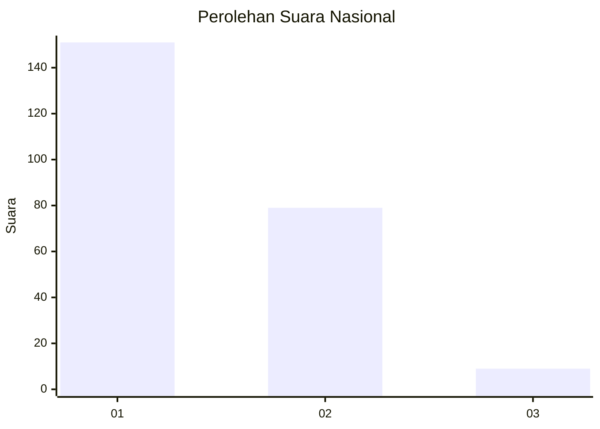
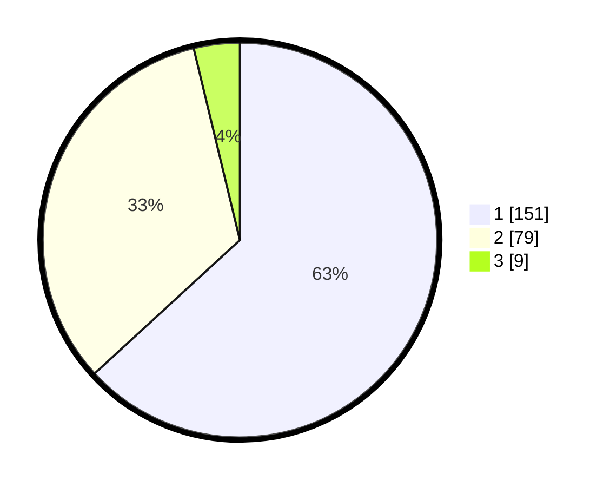

# Hasil

## Grafik

## Tabel

| No.    | Nama Paslon    | Suara | Suara (raw) | Persentase |
|:------ |:-------------- | -----:| -----------:| ----------:|
| 100025 | ANIES MUHAIMIN | 151   | [151][p-1]  | 63,18      |
| 100026 | PRABOWO GIBRAN | 79    | [79][p-2]   | 33,05      |
| 100027 | GANJAR MAHFUD  | 9     | [9][p-3]    | 3,77       |

[p-1]: https://github.com/gigit-pemilu/pemilu-2024/blob/main/pilpres/hitung-suara/sub/31-dki-jakarta/sub/74-jakarta-selatan/sub/04-pasar-minggu/sub/1005-pejaten-timur/sub/189-tps/sub/paslon-1.txt
[p-2]: https://github.com/gigit-pemilu/pemilu-2024/blob/main/pilpres/hitung-suara/sub/31-dki-jakarta/sub/74-jakarta-selatan/sub/04-pasar-minggu/sub/1005-pejaten-timur/sub/189-tps/sub/paslon-2.txt
[p-3]: https://github.com/gigit-pemilu/pemilu-2024/blob/main/pilpres/hitung-suara/sub/31-dki-jakarta/sub/74-jakarta-selatan/sub/04-pasar-minggu/sub/1005-pejaten-timur/sub/189-tps/sub/paslon-3.txt

## Foto C Plano

https://sirekap-obj-formc.kpu.go.id/5722/pemilu/ppwp/31/74/04/10/05/3174041005189-20240214-222406--db7a6d40-575b-4685-8005-f52995ec7483.jpg

https://sirekap-obj-formc.kpu.go.id/5722/pemilu/ppwp/31/74/04/10/05/3174041005189-20240214-222519--214b018d-1a90-4cf4-af0a-5b755cc8ff2b.jpg

https://sirekap-obj-formc.kpu.go.id/5722/pemilu/ppwp/31/74/04/10/05/3174041005189-20240214-222619--9d5d6d28-6710-4c89-afb4-dbcf07b6bc55.jpg

## Metadata

| Key        | Value               |
| ---------- | ------------------- |
| Time Stamp | 2024-02-24 22:31:28 |

