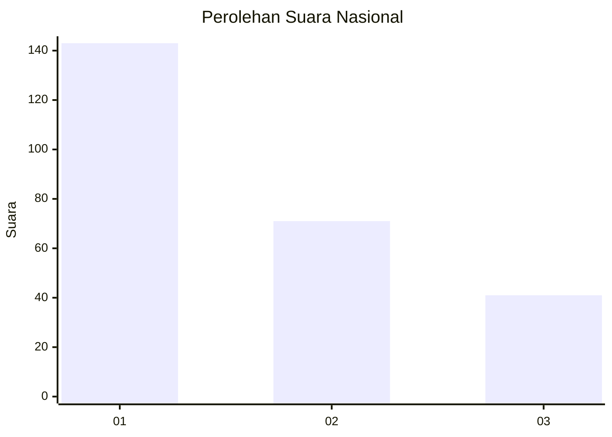
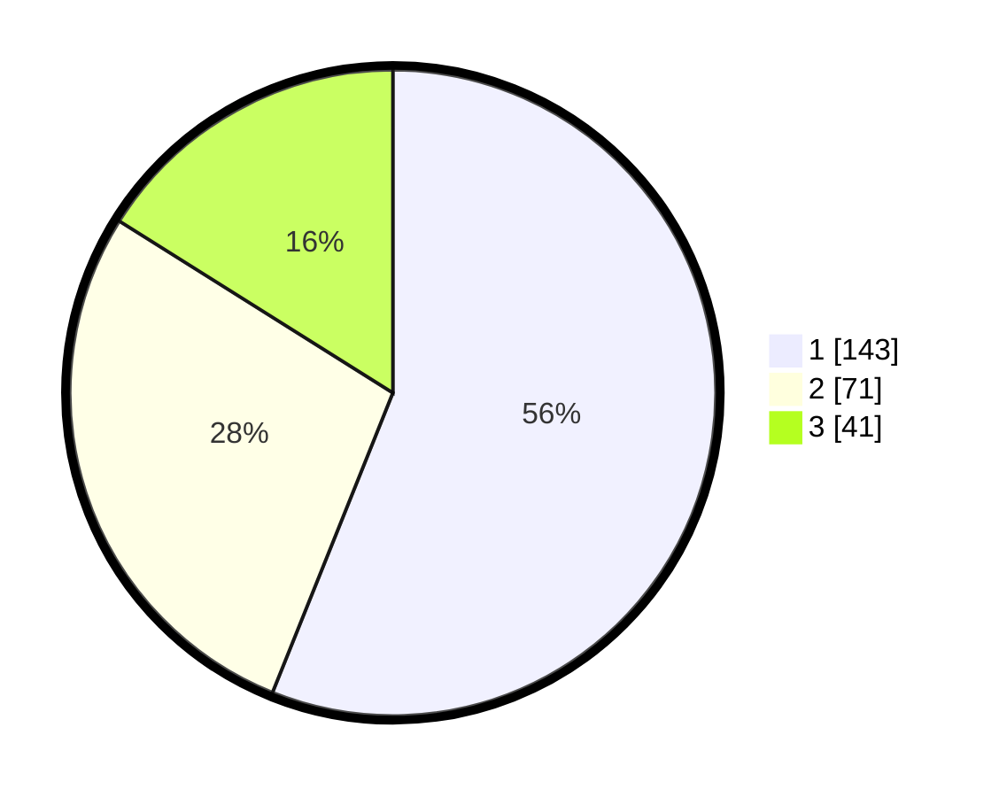

# Hasil

## Grafik

## Tabel

| No.    | Nama Paslon    | Suara | Suara (raw) | Persentase |
|:------ |:-------------- | -----:| -----------:| ----------:|
| 100025 | ANIES MUHAIMIN | 143   | [143][p-1]  | 56,08      |
| 100026 | PRABOWO GIBRAN | 71    | [71][p-2]   | 27,84      |
| 100027 | GANJAR MAHFUD  | 41    | [41][p-3]   | 16,08      |

[p-1]: https://github.com/gigit-pemilu/pemilu-2024/blob/main/pilpres/hitung-suara/sub/31-dki-jakarta/sub/74-jakarta-selatan/sub/04-pasar-minggu/sub/1005-pejaten-timur/sub/193-tps/sub/paslon-1.txt
[p-2]: https://github.com/gigit-pemilu/pemilu-2024/blob/main/pilpres/hitung-suara/sub/31-dki-jakarta/sub/74-jakarta-selatan/sub/04-pasar-minggu/sub/1005-pejaten-timur/sub/193-tps/sub/paslon-2.txt
[p-3]: https://github.com/gigit-pemilu/pemilu-2024/blob/main/pilpres/hitung-suara/sub/31-dki-jakarta/sub/74-jakarta-selatan/sub/04-pasar-minggu/sub/1005-pejaten-timur/sub/193-tps/sub/paslon-3.txt

## Foto C Plano

https://sirekap-obj-formc.kpu.go.id/560b/pemilu/ppwp/31/74/04/10/05/3174041005193-20240214-221028--cfdc2c68-39f1-4a8e-b588-4cd6035400a2.jpg

https://sirekap-obj-formc.kpu.go.id/560b/pemilu/ppwp/31/74/04/10/05/3174041005193-20240214-221158--e04c9935-f8c3-4f11-8d77-2ecdb2483391.jpg

https://sirekap-obj-formc.kpu.go.id/560b/pemilu/ppwp/31/74/04/10/05/3174041005193-20240214-221349--6224dab9-3405-440e-b86b-83bdc600c534.jpg

## Metadata

| Key        | Value               |
| ---------- | ------------------- |
| Time Stamp | 2024-02-24 22:31:28 |

