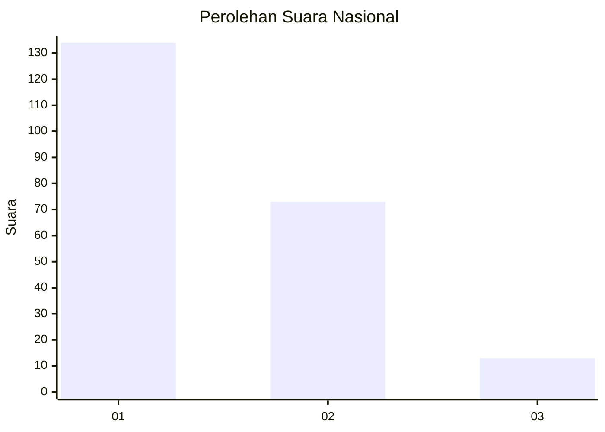
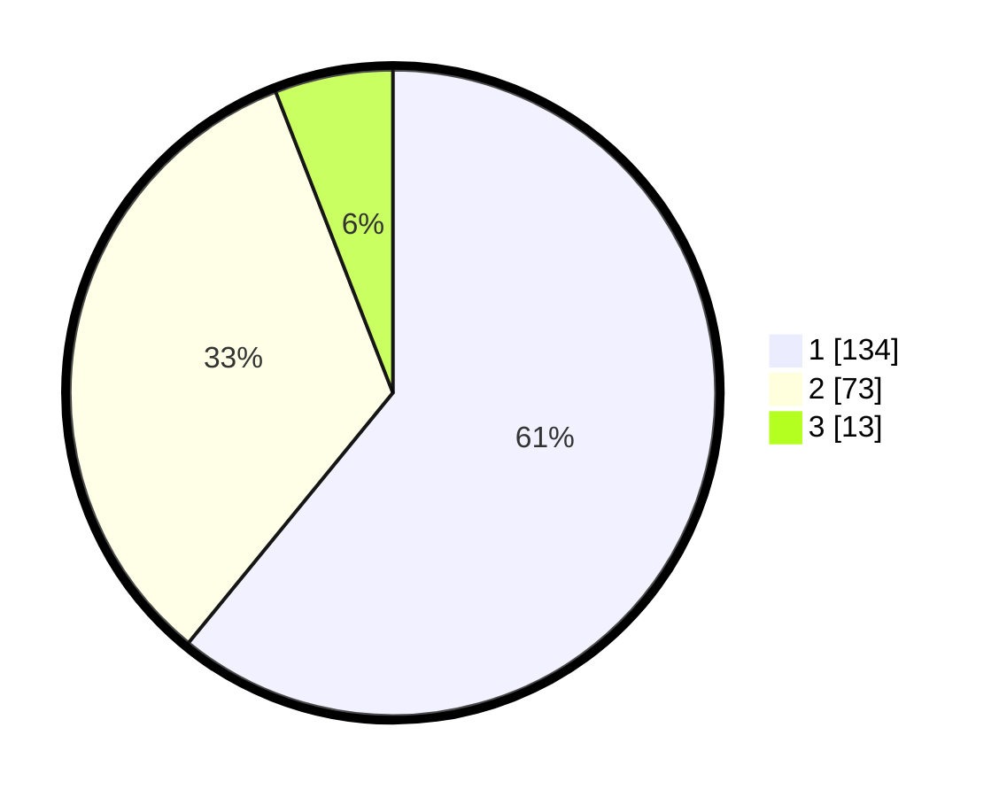

# Hasil

## Grafik

## Tabel

| No.    | Nama Paslon    | Suara | Suara (raw) | Persentase |
|:------ |:-------------- | -----:| -----------:| ----------:|
| 100025 | ANIES MUHAIMIN | 134   | [134][p-1]  | 60,91      |
| 100026 | PRABOWO GIBRAN | 73    | [73][p-2]   | 33,18      |
| 100027 | GANJAR MAHFUD  | 13    | [13][p-3]   | 5,91       |

[p-1]: https://github.com/gigit-pemilu/pemilu-2024/blob/main/pilpres/hitung-suara/sub/31-dki-jakarta/sub/74-jakarta-selatan/sub/04-pasar-minggu/sub/1005-pejaten-timur/sub/195-tps/sub/paslon-1.txt
[p-2]: https://github.com/gigit-pemilu/pemilu-2024/blob/main/pilpres/hitung-suara/sub/31-dki-jakarta/sub/74-jakarta-selatan/sub/04-pasar-minggu/sub/1005-pejaten-timur/sub/195-tps/sub/paslon-2.txt
[p-3]: https://github.com/gigit-pemilu/pemilu-2024/blob/main/pilpres/hitung-suara/sub/31-dki-jakarta/sub/74-jakarta-selatan/sub/04-pasar-minggu/sub/1005-pejaten-timur/sub/195-tps/sub/paslon-3.txt

## Foto C Plano

https://sirekap-obj-formc.kpu.go.id/f19e/pemilu/ppwp/31/74/04/10/05/3174041005195-20240214-215026--50e3a134-592b-4557-9516-f1426610c844.jpg

https://sirekap-obj-formc.kpu.go.id/f19e/pemilu/ppwp/31/74/04/10/05/3174041005195-20240214-215206--2a4805dd-5777-4a9d-b17d-34bf039bbae6.jpg

https://sirekap-obj-formc.kpu.go.id/f19e/pemilu/ppwp/31/74/04/10/05/3174041005195-20240214-215316--b7a8fb94-3768-47fb-a292-76807a36d70e.jpg

## Metadata

| Key        | Value               |
| ---------- | ------------------- |
| Time Stamp | 2024-02-24 22:31:28 |

