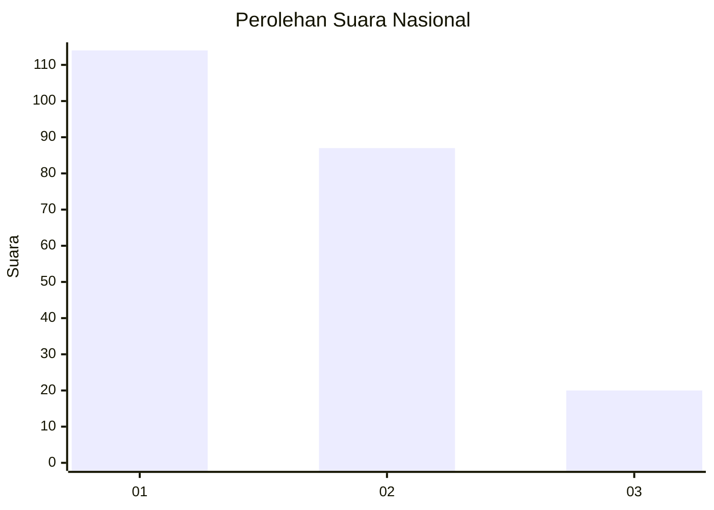
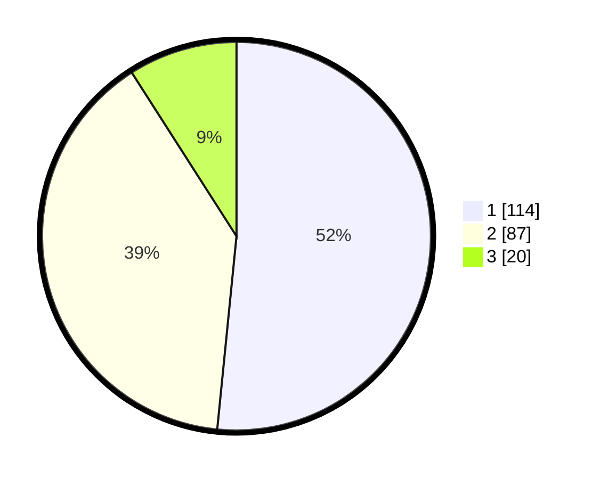

# Hasil

## Grafik

## Tabel

| No.    | Nama Paslon    | Suara | Suara (raw) | Persentase |
|:------ |:-------------- | -----:| -----------:| ----------:|
| 100025 | ANIES MUHAIMIN | 114   | [114][p-1]  | 51,58      |
| 100026 | PRABOWO GIBRAN | 87    | [87][p-2]   | 39,37      |
| 100027 | GANJAR MAHFUD  | 20    | [20][p-3]   | 9,05       |

[p-1]: https://github.com/gigit-pemilu/pemilu-2024/blob/main/pilpres/hitung-suara/sub/31-dki-jakarta/sub/74-jakarta-selatan/sub/04-pasar-minggu/sub/1006-pejaten-barat/sub/009-tps/sub/paslon-1.txt
[p-2]: https://github.com/gigit-pemilu/pemilu-2024/blob/main/pilpres/hitung-suara/sub/31-dki-jakarta/sub/74-jakarta-selatan/sub/04-pasar-minggu/sub/1006-pejaten-barat/sub/009-tps/sub/paslon-2.txt
[p-3]: https://github.com/gigit-pemilu/pemilu-2024/blob/main/pilpres/hitung-suara/sub/31-dki-jakarta/sub/74-jakarta-selatan/sub/04-pasar-minggu/sub/1006-pejaten-barat/sub/009-tps/sub/paslon-3.txt

## Foto C Plano

https://sirekap-obj-formc.kpu.go.id/12b3/pemilu/ppwp/31/74/04/10/06/3174041006009-20240215-023748--50ab2fea-d47d-492a-b430-df295f5bdb1f.jpg

https://sirekap-obj-formc.kpu.go.id/12b3/pemilu/ppwp/31/74/04/10/06/3174041006009-20240215-023934--d0e6c8d2-6251-4fe1-ab71-db13bcab0931.jpg

https://sirekap-obj-formc.kpu.go.id/12b3/pemilu/ppwp/31/74/04/10/06/3174041006009-20240215-024030--05f4fce7-b5e7-4059-bffc-91f3ed2705c0.jpg

## Metadata

| Key        | Value               |
| ---------- | ------------------- |
| Time Stamp | 2024-02-24 22:31:28 |

