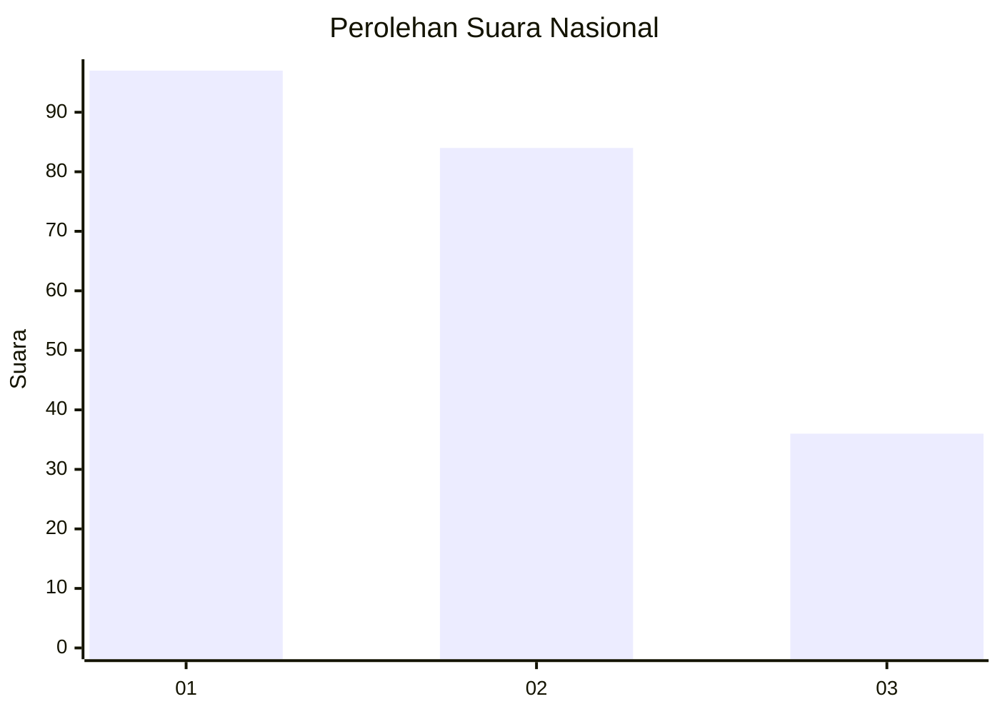
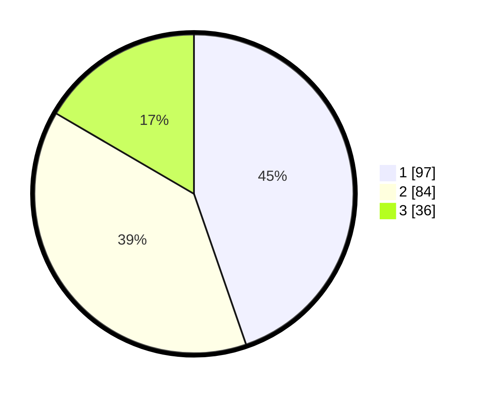

# Hasil

## Grafik

## Tabel

| No.    | Nama Paslon    | Suara | Suara (raw) | Persentase |
|:------ |:-------------- | -----:| -----------:| ----------:|
| 100025 | ANIES MUHAIMIN | 97    | [97][p-1]   | 44,70      |
| 100026 | PRABOWO GIBRAN | 84    | [84][p-2]   | 38,71      |
| 100027 | GANJAR MAHFUD  | 36    | [36][p-3]   | 16,59      |

[p-1]: https://github.com/gigit-pemilu/pemilu-2024/blob/main/pilpres/hitung-suara/sub/31-dki-jakarta/sub/74-jakarta-selatan/sub/04-pasar-minggu/sub/1006-pejaten-barat/sub/010-tps/sub/paslon-1.txt
[p-2]: https://github.com/gigit-pemilu/pemilu-2024/blob/main/pilpres/hitung-suara/sub/31-dki-jakarta/sub/74-jakarta-selatan/sub/04-pasar-minggu/sub/1006-pejaten-barat/sub/010-tps/sub/paslon-2.txt
[p-3]: https://github.com/gigit-pemilu/pemilu-2024/blob/main/pilpres/hitung-suara/sub/31-dki-jakarta/sub/74-jakarta-selatan/sub/04-pasar-minggu/sub/1006-pejaten-barat/sub/010-tps/sub/paslon-3.txt

## Foto C Plano

https://sirekap-obj-formc.kpu.go.id/7261/pemilu/ppwp/31/74/04/10/06/3174041006010-20240215-013707--f3340f2d-d48b-4f6b-93d1-59bc42d3b5cd.jpg

https://sirekap-obj-formc.kpu.go.id/7261/pemilu/ppwp/31/74/04/10/06/3174041006010-20240215-014644--e1c2bfa3-3ade-49c4-bfb4-5b264e382dca.jpg

https://sirekap-obj-formc.kpu.go.id/7261/pemilu/ppwp/31/74/04/10/06/3174041006010-20240215-014733--6eb9c365-557e-44a0-8bd2-2bcc3f2e416a.jpg

## Metadata

| Key        | Value               |
| ---------- | ------------------- |
| Time Stamp | 2024-02-24 22:31:28 |

