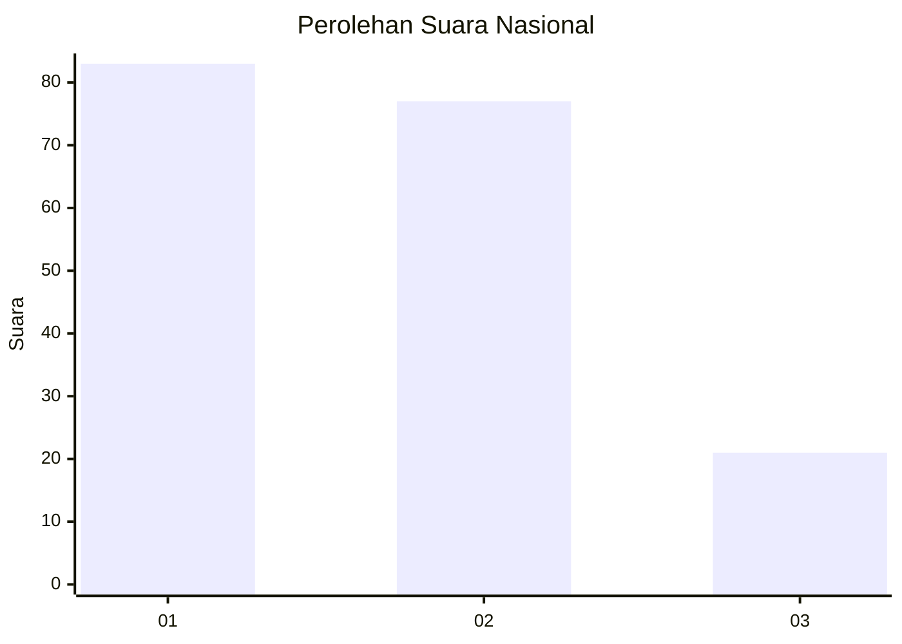
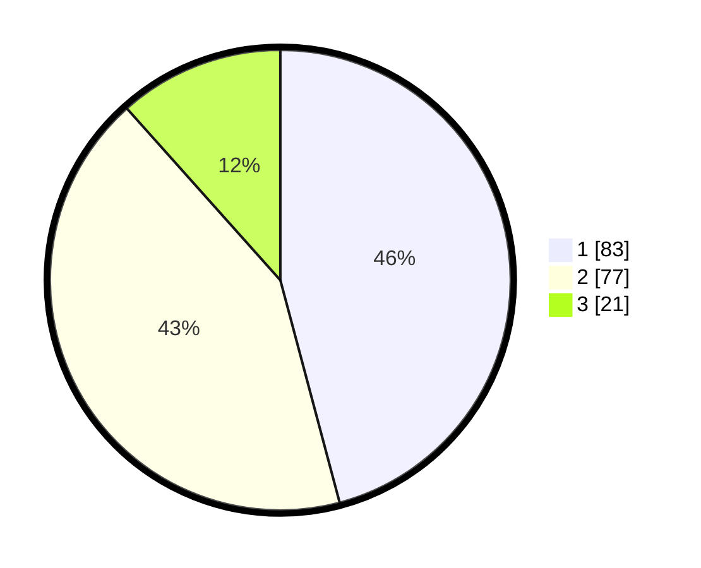

# Hasil

## Grafik

## Tabel

| No.    | Nama Paslon    | Suara | Suara (raw) | Persentase |
|:------ |:-------------- | -----:| -----------:| ----------:|
| 100025 | ANIES MUHAIMIN | 83    | [83][p-1]   | 45,86      |
| 100026 | PRABOWO GIBRAN | 77    | [77][p-2]   | 42,54      |
| 100027 | GANJAR MAHFUD  | 21    | [21][p-3]   | 11,60      |

[p-1]: https://github.com/gigit-pemilu/pemilu-2024/blob/main/pilpres/hitung-suara/sub/31-dki-jakarta/sub/74-jakarta-selatan/sub/04-pasar-minggu/sub/1006-pejaten-barat/sub/016-tps/sub/paslon-1.txt
[p-2]: https://github.com/gigit-pemilu/pemilu-2024/blob/main/pilpres/hitung-suara/sub/31-dki-jakarta/sub/74-jakarta-selatan/sub/04-pasar-minggu/sub/1006-pejaten-barat/sub/016-tps/sub/paslon-2.txt
[p-3]: https://github.com/gigit-pemilu/pemilu-2024/blob/main/pilpres/hitung-suara/sub/31-dki-jakarta/sub/74-jakarta-selatan/sub/04-pasar-minggu/sub/1006-pejaten-barat/sub/016-tps/sub/paslon-3.txt

## Foto C Plano

https://sirekap-obj-formc.kpu.go.id/37e9/pemilu/ppwp/31/74/04/10/06/3174041006016-20240217-210615--f76a1df1-c930-4b4f-aff6-5beff1e06f40.jpg

https://sirekap-obj-formc.kpu.go.id/37e9/pemilu/ppwp/31/74/04/10/06/3174041006016-20240217-224651--bb4c6a6d-19a0-4af7-a441-fa20b47156d5.jpg

https://sirekap-obj-formc.kpu.go.id/37e9/pemilu/ppwp/31/74/04/10/06/3174041006016-20240217-211106--d3ba39cb-63b8-4df4-9e07-3c53dc89d9b5.jpg

## Metadata

| Key        | Value               |
| ---------- | ------------------- |
| Time Stamp | 2024-02-24 22:31:28 |

