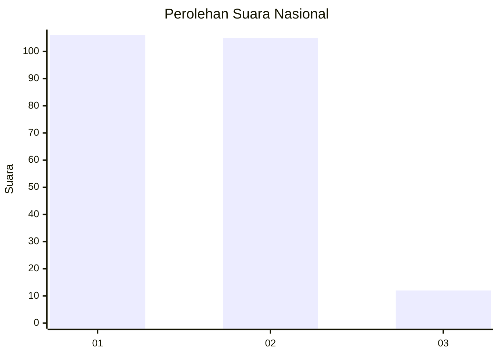
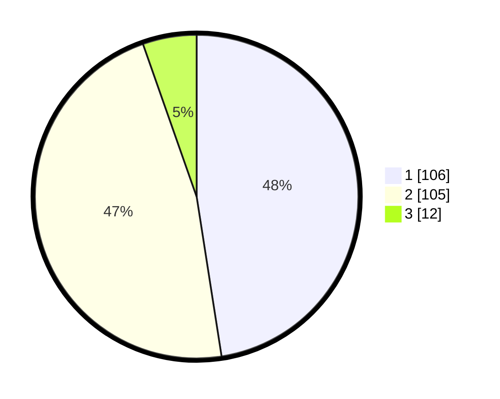

# Hasil

## Grafik

## Tabel

| No.    | Nama Paslon    | Suara | Suara (raw) | Persentase |
|:------ |:-------------- | -----:| -----------:| ----------:|
| 100025 | ANIES MUHAIMIN | 106   | [106][p-1]  | 47,53      |
| 100026 | PRABOWO GIBRAN | 105   | [105][p-2]  | 47,09      |
| 100027 | GANJAR MAHFUD  | 12    | [12][p-3]   | 5,38       |

[p-1]: https://github.com/gigit-pemilu/pemilu-2024/blob/main/pilpres/hitung-suara/sub/31-dki-jakarta/sub/74-jakarta-selatan/sub/04-pasar-minggu/sub/1006-pejaten-barat/sub/017-tps/sub/paslon-1.txt
[p-2]: https://github.com/gigit-pemilu/pemilu-2024/blob/main/pilpres/hitung-suara/sub/31-dki-jakarta/sub/74-jakarta-selatan/sub/04-pasar-minggu/sub/1006-pejaten-barat/sub/017-tps/sub/paslon-2.txt
[p-3]: https://github.com/gigit-pemilu/pemilu-2024/blob/main/pilpres/hitung-suara/sub/31-dki-jakarta/sub/74-jakarta-selatan/sub/04-pasar-minggu/sub/1006-pejaten-barat/sub/017-tps/sub/paslon-3.txt

## Foto C Plano

https://sirekap-obj-formc.kpu.go.id/794b/pemilu/ppwp/31/74/04/10/06/3174041006017-20240216-224712--967300a5-d929-4736-8790-7837ee9ac5ea.jpg

https://sirekap-obj-formc.kpu.go.id/794b/pemilu/ppwp/31/74/04/10/06/3174041006017-20240216-224805--863e154e-acd8-4525-82e7-b1811b4b8341.jpg

https://sirekap-obj-formc.kpu.go.id/794b/pemilu/ppwp/31/74/04/10/06/3174041006017-20240216-231140--553bb307-64b8-4704-8405-837e07cd9f96.jpg

## Metadata

| Key        | Value               |
| ---------- | ------------------- |
| Time Stamp | 2024-02-17 01:00:00 |

