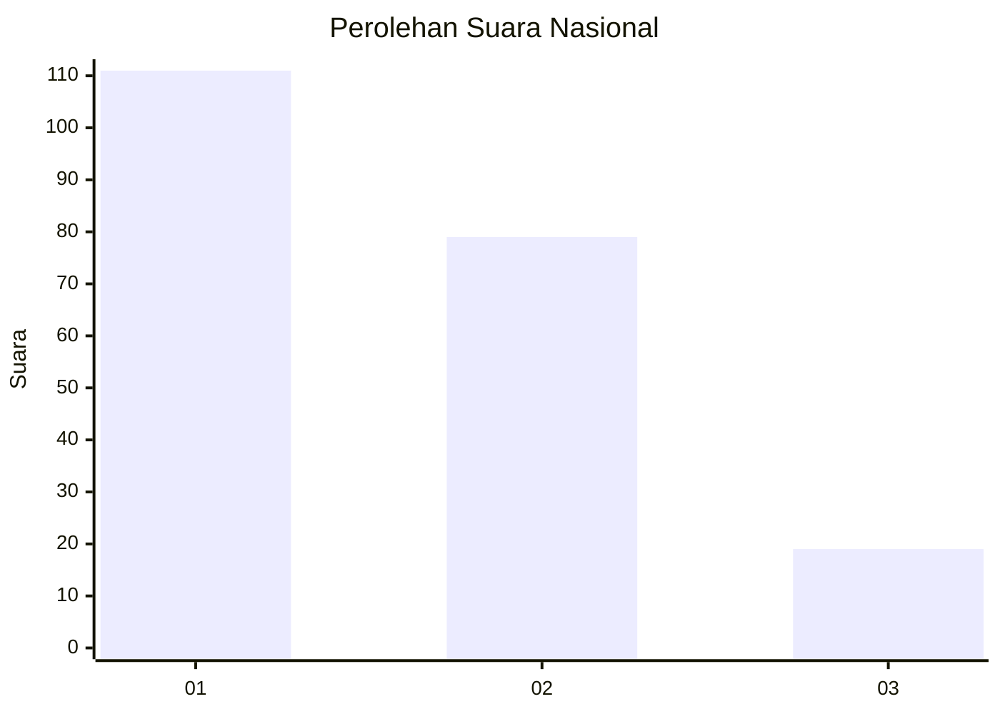
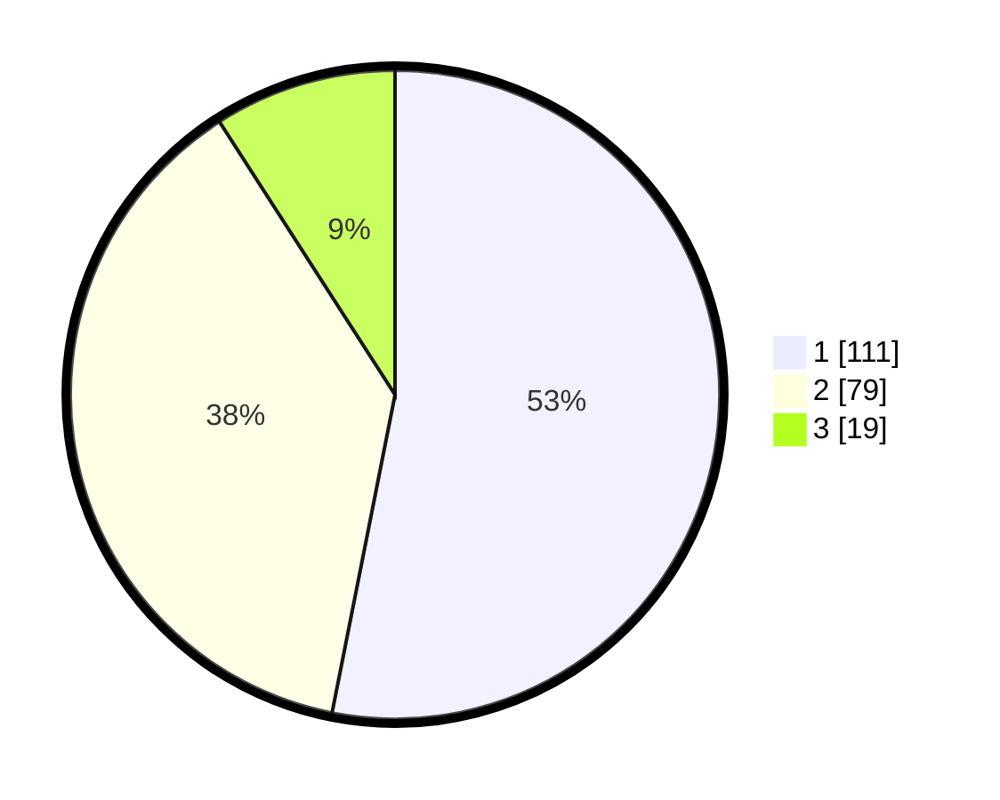

# Hasil

## Grafik

## Tabel

| No.    | Nama Paslon    | Suara | Suara (raw) | Persentase |
|:------ |:-------------- | -----:| -----------:| ----------:|
| 100025 | ANIES MUHAIMIN | 111   | [111][p-1]  | 53,11      |
| 100026 | PRABOWO GIBRAN | 79    | [79][p-2]   | 37,80      |
| 100027 | GANJAR MAHFUD  | 19    | [19][p-3]   | 9,09       |

[p-1]: https://github.com/gigit-pemilu/pemilu-2024/blob/main/pilpres/hitung-suara/sub/31-dki-jakarta/sub/74-jakarta-selatan/sub/04-pasar-minggu/sub/1006-pejaten-barat/sub/023-tps/sub/paslon-1.txt
[p-2]: https://github.com/gigit-pemilu/pemilu-2024/blob/main/pilpres/hitung-suara/sub/31-dki-jakarta/sub/74-jakarta-selatan/sub/04-pasar-minggu/sub/1006-pejaten-barat/sub/023-tps/sub/paslon-2.txt
[p-3]: https://github.com/gigit-pemilu/pemilu-2024/blob/main/pilpres/hitung-suara/sub/31-dki-jakarta/sub/74-jakarta-selatan/sub/04-pasar-minggu/sub/1006-pejaten-barat/sub/023-tps/sub/paslon-3.txt

## Foto C Plano

https://sirekap-obj-formc.kpu.go.id/635a/pemilu/ppwp/31/74/04/10/06/3174041006023-20240214-220644--578b559b-3000-41e3-af1e-578ca9447b62.jpg

https://sirekap-obj-formc.kpu.go.id/635a/pemilu/ppwp/31/74/04/10/06/3174041006023-20240214-220651--d442a7cc-824f-4a62-b984-fa67d8701ad1.jpg

https://sirekap-obj-formc.kpu.go.id/635a/pemilu/ppwp/31/74/04/10/06/3174041006023-20240214-220656--ecb5ba04-e0ad-45d1-bce4-1a40afb857ff.jpg

## Metadata

| Key        | Value               |
| ---------- | ------------------- |
| Time Stamp | 2024-02-24 22:31:28 |

