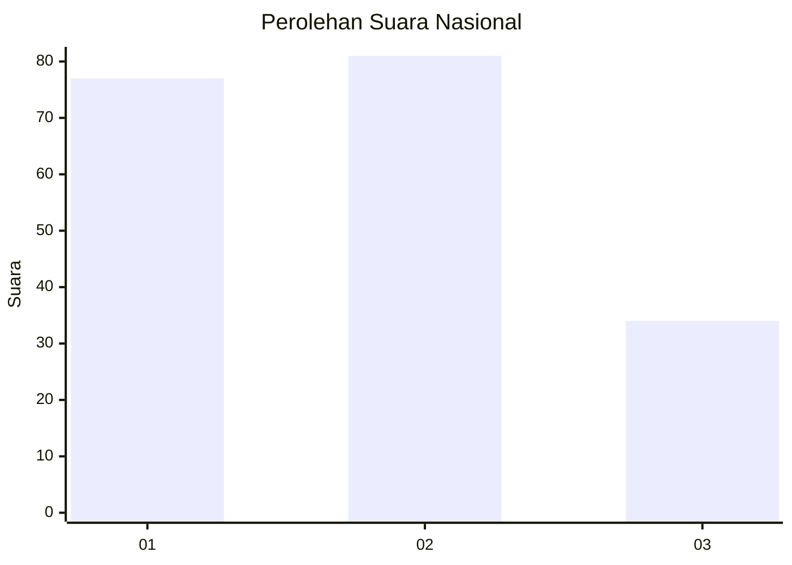
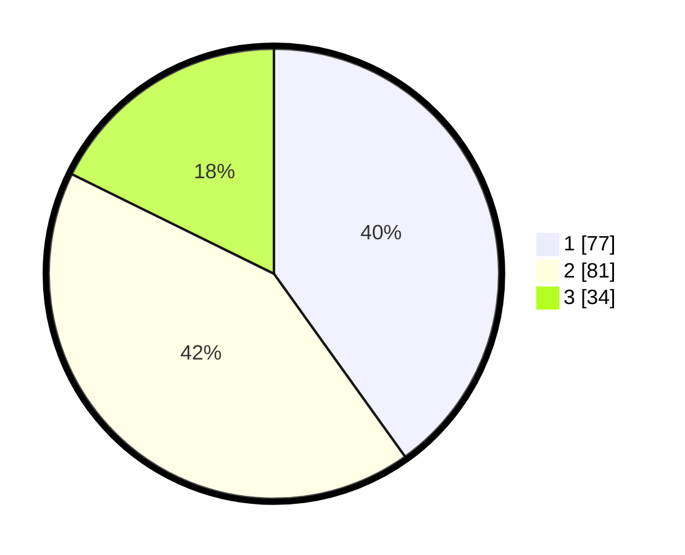

# Hasil

## Grafik

## Tabel

| No.    | Nama Paslon    | Suara | Suara (raw) | Persentase |
|:------ |:-------------- | -----:| -----------:| ----------:|
| 100025 | ANIES MUHAIMIN | 77    | [77][p-1]   | 40,10      |
| 100026 | PRABOWO GIBRAN | 81    | [81][p-2]   | 42,19      |
| 100027 | GANJAR MAHFUD  | 34    | [34][p-3]   | 17,71      |

[p-1]: https://github.com/gigit-pemilu/pemilu-2024/blob/main/pilpres/hitung-suara/sub/31-dki-jakarta/sub/74-jakarta-selatan/sub/04-pasar-minggu/sub/1006-pejaten-barat/sub/024-tps/sub/paslon-1.txt
[p-2]: https://github.com/gigit-pemilu/pemilu-2024/blob/main/pilpres/hitung-suara/sub/31-dki-jakarta/sub/74-jakarta-selatan/sub/04-pasar-minggu/sub/1006-pejaten-barat/sub/024-tps/sub/paslon-2.txt
[p-3]: https://github.com/gigit-pemilu/pemilu-2024/blob/main/pilpres/hitung-suara/sub/31-dki-jakarta/sub/74-jakarta-selatan/sub/04-pasar-minggu/sub/1006-pejaten-barat/sub/024-tps/sub/paslon-3.txt

## Foto C Plano

https://sirekap-obj-formc.kpu.go.id/3f68/pemilu/ppwp/31/74/04/10/06/3174041006024-20240215-015207--0f39ced7-b6ad-444f-9dc0-11857c6484d8.jpg

https://sirekap-obj-formc.kpu.go.id/3f68/pemilu/ppwp/31/74/04/10/06/3174041006024-20240214-193307--b700230e-4f16-40fe-a9bd-f7213fcb75ad.jpg

https://sirekap-obj-formc.kpu.go.id/3f68/pemilu/ppwp/31/74/04/10/06/3174041006024-20240214-221926--9a6c1ef9-b2b5-4cfd-8bad-8e44c9709075.jpg

## Metadata

| Key        | Value               |
| ---------- | ------------------- |
| Time Stamp | 2024-02-16 02:00:27 |

