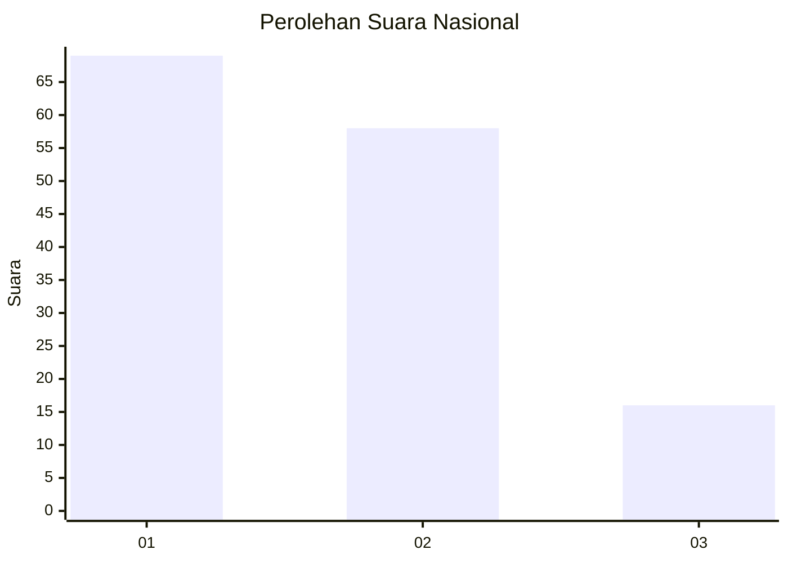
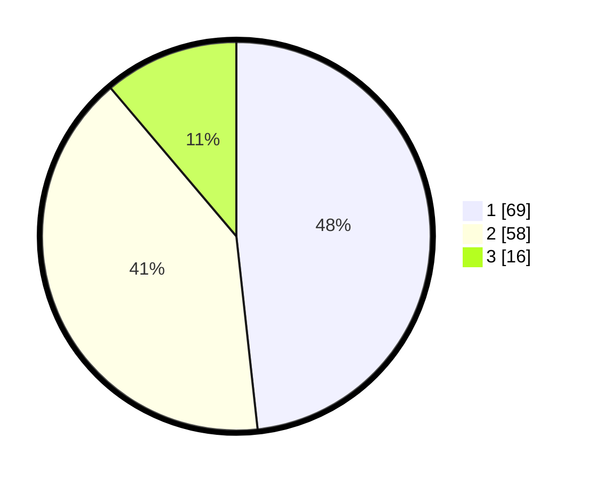

# Hasil

## Grafik

## Tabel

| No.    | Nama Paslon    | Suara | Suara (raw) | Persentase |
|:------ |:-------------- | -----:| -----------:| ----------:|
| 100025 | ANIES MUHAIMIN | 69    | [69][p-1]   | 48,25      |
| 100026 | PRABOWO GIBRAN | 58    | [58][p-2]   | 40,56      |
| 100027 | GANJAR MAHFUD  | 16    | [16][p-3]   | 11,19      |

[p-1]: https://github.com/gigit-pemilu/pemilu-2024/blob/main/pilpres/hitung-suara/sub/31-dki-jakarta/sub/74-jakarta-selatan/sub/04-pasar-minggu/sub/1006-pejaten-barat/sub/033-tps/sub/paslon-1.txt
[p-2]: https://github.com/gigit-pemilu/pemilu-2024/blob/main/pilpres/hitung-suara/sub/31-dki-jakarta/sub/74-jakarta-selatan/sub/04-pasar-minggu/sub/1006-pejaten-barat/sub/033-tps/sub/paslon-2.txt
[p-3]: https://github.com/gigit-pemilu/pemilu-2024/blob/main/pilpres/hitung-suara/sub/31-dki-jakarta/sub/74-jakarta-selatan/sub/04-pasar-minggu/sub/1006-pejaten-barat/sub/033-tps/sub/paslon-3.txt

## Foto C Plano

https://sirekap-obj-formc.kpu.go.id/56ca/pemilu/ppwp/31/74/04/10/06/3174041006033-20240215-133220--15ce0392-1914-4e98-80e5-4239f71b401d.jpg

https://sirekap-obj-formc.kpu.go.id/56ca/pemilu/ppwp/31/74/04/10/06/3174041006033-20240215-133234--3ac1dedb-246f-4d3e-b698-105ddb156580.jpg

https://sirekap-obj-formc.kpu.go.id/56ca/pemilu/ppwp/31/74/04/10/06/3174041006033-20240215-133240--9a0e4044-7a7d-4404-94b2-02ca4922b2ca.jpg

## Metadata

| Key        | Value               |
| ---------- | ------------------- |
| Time Stamp | 2024-02-24 22:31:28 |

