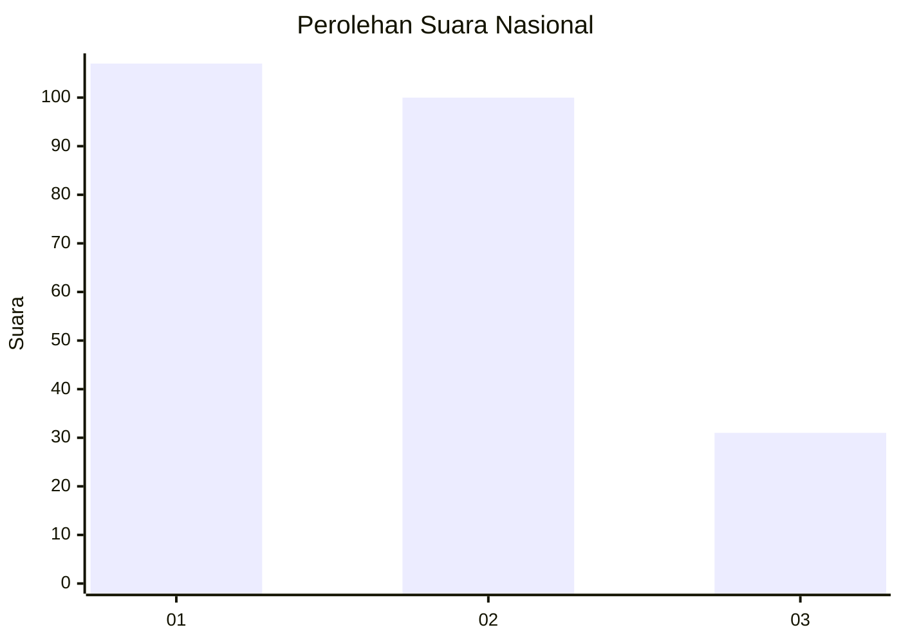
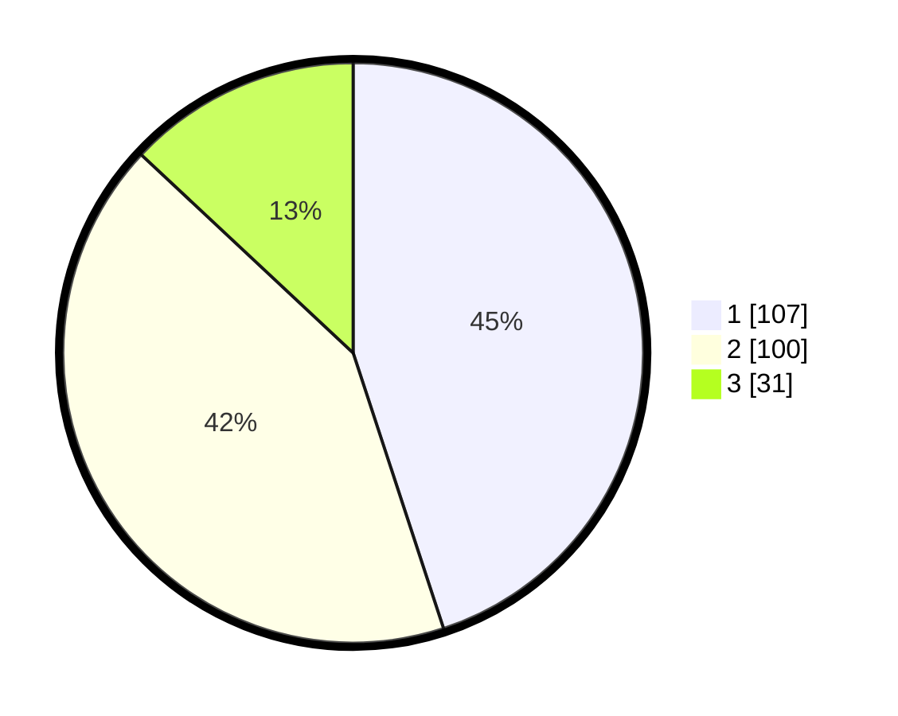

# Hasil

## Grafik

## Tabel

| No.    | Nama Paslon    | Suara | Suara (raw) | Persentase |
|:------ |:-------------- | -----:| -----------:| ----------:|
| 100025 | ANIES MUHAIMIN | 107   | [107][p-1]  | 44,96      |
| 100026 | PRABOWO GIBRAN | 100   | [100][p-2]  | 42,02      |
| 100027 | GANJAR MAHFUD  | 31    | [31][p-3]   | 13,03      |

[p-1]: https://github.com/gigit-pemilu/pemilu-2024/blob/main/pilpres/hitung-suara/sub/31-dki-jakarta/sub/74-jakarta-selatan/sub/04-pasar-minggu/sub/1006-pejaten-barat/sub/034-tps/sub/paslon-1.txt
[p-2]: https://github.com/gigit-pemilu/pemilu-2024/blob/main/pilpres/hitung-suara/sub/31-dki-jakarta/sub/74-jakarta-selatan/sub/04-pasar-minggu/sub/1006-pejaten-barat/sub/034-tps/sub/paslon-2.txt
[p-3]: https://github.com/gigit-pemilu/pemilu-2024/blob/main/pilpres/hitung-suara/sub/31-dki-jakarta/sub/74-jakarta-selatan/sub/04-pasar-minggu/sub/1006-pejaten-barat/sub/034-tps/sub/paslon-3.txt

## Foto C Plano

https://sirekap-obj-formc.kpu.go.id/9e31/pemilu/ppwp/31/74/04/10/06/3174041006034-20240214-233407--f622ba71-4ff8-4006-b6a7-13d25c80de30.jpg

https://sirekap-obj-formc.kpu.go.id/9e31/pemilu/ppwp/31/74/04/10/06/3174041006034-20240214-233806--37b760ce-c967-45d5-91da-b7bca0025a1a.jpg

https://sirekap-obj-formc.kpu.go.id/9e31/pemilu/ppwp/31/74/04/10/06/3174041006034-20240214-233914--77125f99-c47d-45db-bfe2-ab686b28aa26.jpg

## Metadata

| Key        | Value               |
| ---------- | ------------------- |
| Time Stamp | 2024-02-24 22:31:28 |

