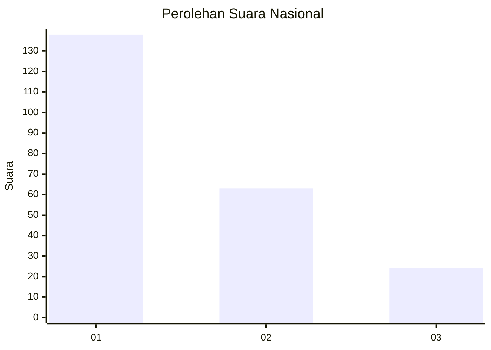
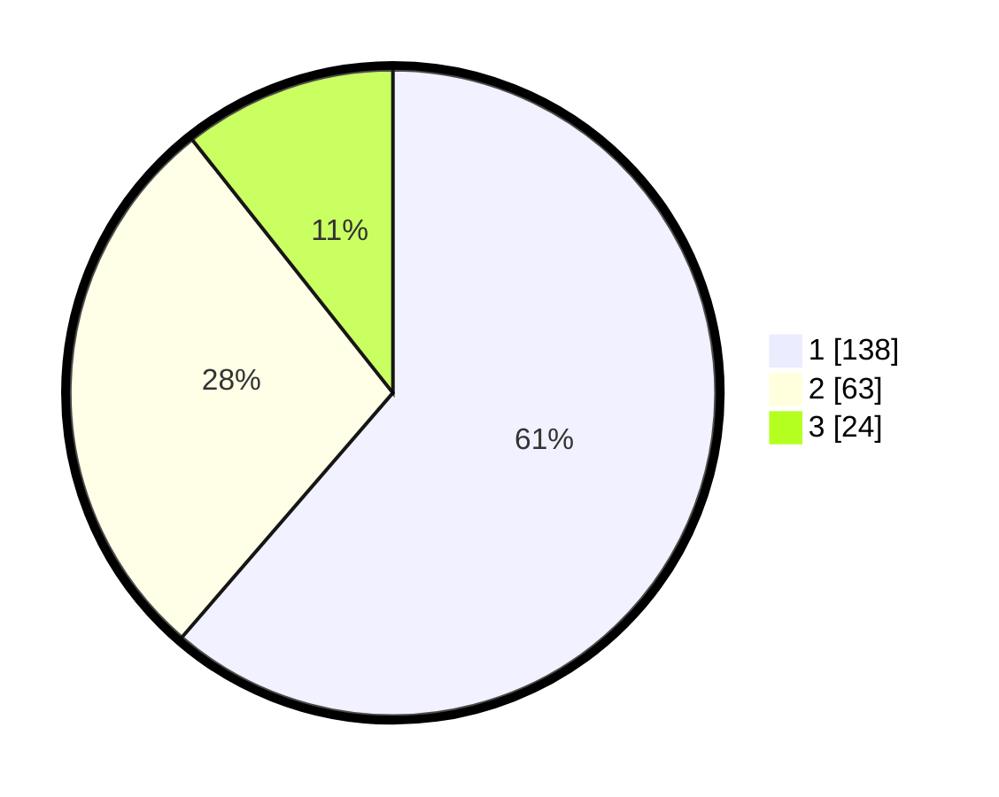

# Hasil

## Grafik

## Tabel

| No.    | Nama Paslon    | Suara | Suara (raw) | Persentase |
|:------ |:-------------- | -----:| -----------:| ----------:|
| 100025 | ANIES MUHAIMIN | 138   | [138][p-1]  | 61,33      |
| 100026 | PRABOWO GIBRAN | 63    | [63][p-2]   | 28,00      |
| 100027 | GANJAR MAHFUD  | 24    | [24][p-3]   | 10,67      |

[p-1]: https://github.com/gigit-pemilu/pemilu-2024/blob/main/pilpres/hitung-suara/sub/31-dki-jakarta/sub/74-jakarta-selatan/sub/04-pasar-minggu/sub/1006-pejaten-barat/sub/044-tps/sub/paslon-1.txt
[p-2]: https://github.com/gigit-pemilu/pemilu-2024/blob/main/pilpres/hitung-suara/sub/31-dki-jakarta/sub/74-jakarta-selatan/sub/04-pasar-minggu/sub/1006-pejaten-barat/sub/044-tps/sub/paslon-2.txt
[p-3]: https://github.com/gigit-pemilu/pemilu-2024/blob/main/pilpres/hitung-suara/sub/31-dki-jakarta/sub/74-jakarta-selatan/sub/04-pasar-minggu/sub/1006-pejaten-barat/sub/044-tps/sub/paslon-3.txt

## Foto C Plano

https://sirekap-obj-formc.kpu.go.id/f3d3/pemilu/ppwp/31/74/04/10/06/3174041006044-20240214-222758--118359be-66e0-4189-9fab-f433b8ae581a.jpg

https://sirekap-obj-formc.kpu.go.id/f3d3/pemilu/ppwp/31/74/04/10/06/3174041006044-20240214-210306--bc1fa761-58a0-47b9-8a2a-006eb120e7f2.jpg

https://sirekap-obj-formc.kpu.go.id/f3d3/pemilu/ppwp/31/74/04/10/06/3174041006044-20240214-202554--68305a26-4f89-422a-aeb3-eedb3464f7cb.jpg

## Metadata

| Key        | Value               |
| ---------- | ------------------- |
| Time Stamp | 2024-02-15 00:41:44 |

