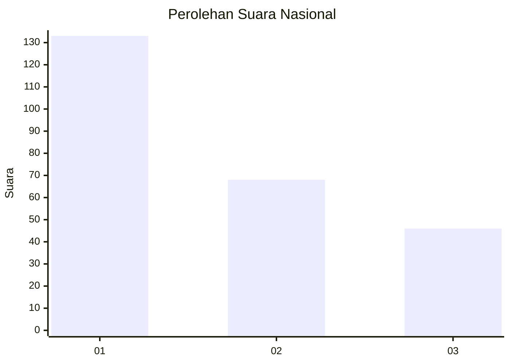
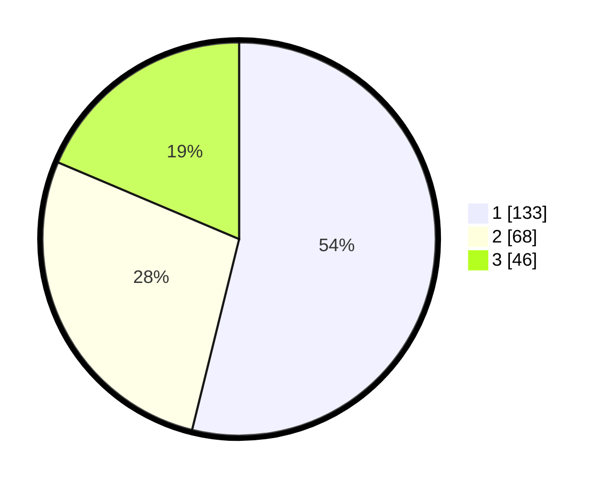

# Hasil

## Grafik

## Tabel

| No.    | Nama Paslon    | Suara | Suara (raw) | Persentase |
|:------ |:-------------- | -----:| -----------:| ----------:|
| 100025 | ANIES MUHAIMIN | 133   | [133][p-1]  | 53,85      |
| 100026 | PRABOWO GIBRAN | 68    | [68][p-2]   | 27,53      |
| 100027 | GANJAR MAHFUD  | 46    | [46][p-3]   | 18,62      |

[p-1]: https://github.com/gigit-pemilu/pemilu-2024/blob/main/pilpres/hitung-suara/sub/31-dki-jakarta/sub/74-jakarta-selatan/sub/04-pasar-minggu/sub/1006-pejaten-barat/sub/046-tps/sub/paslon-1.txt
[p-2]: https://github.com/gigit-pemilu/pemilu-2024/blob/main/pilpres/hitung-suara/sub/31-dki-jakarta/sub/74-jakarta-selatan/sub/04-pasar-minggu/sub/1006-pejaten-barat/sub/046-tps/sub/paslon-2.txt
[p-3]: https://github.com/gigit-pemilu/pemilu-2024/blob/main/pilpres/hitung-suara/sub/31-dki-jakarta/sub/74-jakarta-selatan/sub/04-pasar-minggu/sub/1006-pejaten-barat/sub/046-tps/sub/paslon-3.txt

## Foto C Plano

https://sirekap-obj-formc.kpu.go.id/a15c/pemilu/ppwp/31/74/04/10/06/3174041006046-20240215-020628--a2879620-34ee-4a66-a955-ecb3562e6cda.jpg

https://sirekap-obj-formc.kpu.go.id/a15c/pemilu/ppwp/31/74/04/10/06/3174041006046-20240215-001921--20c844de-c801-4a88-ac1c-b676ceaf3143.jpg

https://sirekap-obj-formc.kpu.go.id/a15c/pemilu/ppwp/31/74/04/10/06/3174041006046-20240215-002033--b0a05364-733e-45b5-9c29-cc26d3779fa0.jpg

## Metadata

| Key        | Value               |
| ---------- | ------------------- |
| Time Stamp | 2024-02-24 22:31:28 |

