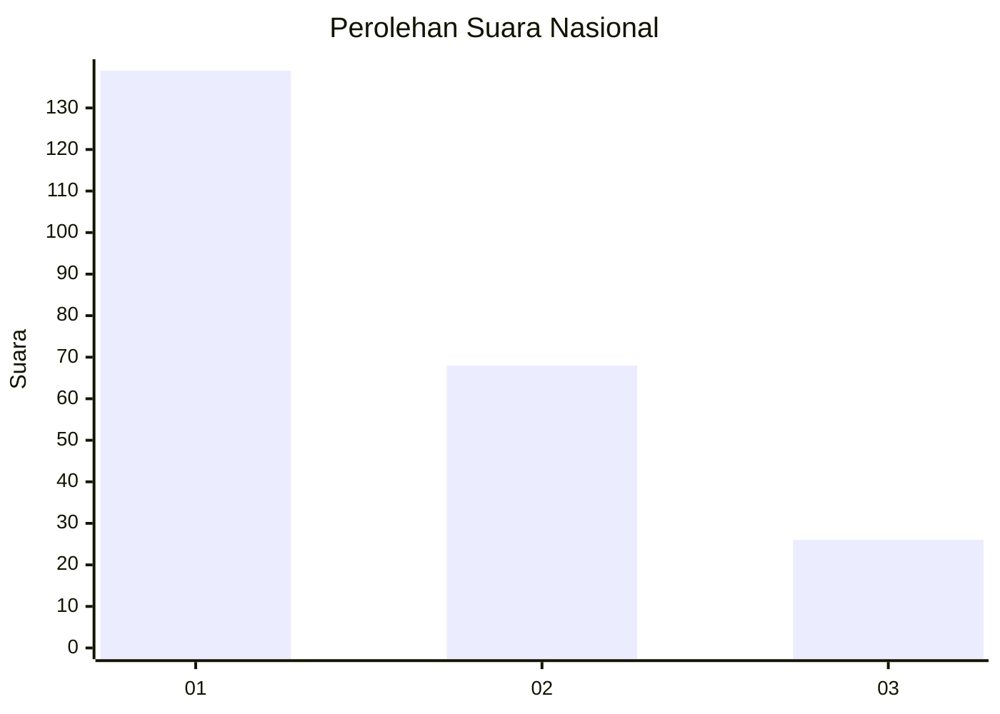
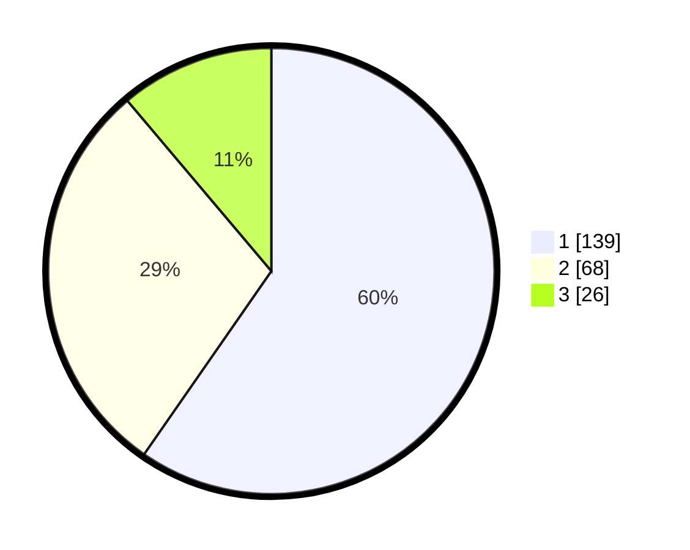

# Hasil

## Grafik

## Tabel

| No.    | Nama Paslon    | Suara | Suara (raw) | Persentase |
|:------ |:-------------- | -----:| -----------:| ----------:|
| 100025 | ANIES MUHAIMIN | 139   | [139][p-1]  | 59,66      |
| 100026 | PRABOWO GIBRAN | 68    | [68][p-2]   | 29,18      |
| 100027 | GANJAR MAHFUD  | 26    | [26][p-3]   | 11,16      |

[p-1]: https://github.com/gigit-pemilu/pemilu-2024/blob/main/pilpres/hitung-suara/sub/31-dki-jakarta/sub/74-jakarta-selatan/sub/04-pasar-minggu/sub/1006-pejaten-barat/sub/048-tps/sub/paslon-1.txt
[p-2]: https://github.com/gigit-pemilu/pemilu-2024/blob/main/pilpres/hitung-suara/sub/31-dki-jakarta/sub/74-jakarta-selatan/sub/04-pasar-minggu/sub/1006-pejaten-barat/sub/048-tps/sub/paslon-2.txt
[p-3]: https://github.com/gigit-pemilu/pemilu-2024/blob/main/pilpres/hitung-suara/sub/31-dki-jakarta/sub/74-jakarta-selatan/sub/04-pasar-minggu/sub/1006-pejaten-barat/sub/048-tps/sub/paslon-3.txt

## Foto C Plano

https://sirekap-obj-formc.kpu.go.id/3082/pemilu/ppwp/31/74/04/10/06/3174041006048-20240214-225257--032cd3e7-b25d-4f87-a965-034c1b0eb496.jpg

https://sirekap-obj-formc.kpu.go.id/3082/pemilu/ppwp/31/74/04/10/06/3174041006048-20240214-225322--4008a3db-a847-4c90-b987-d615b8418980.jpg

https://sirekap-obj-formc.kpu.go.id/3082/pemilu/ppwp/31/74/04/10/06/3174041006048-20240214-225357--166e7dba-4b1f-4617-b75a-d9a2a36092d0.jpg

## Metadata

| Key        | Value               |
| ---------- | ------------------- |
| Time Stamp | 2024-02-24 22:31:28 |

