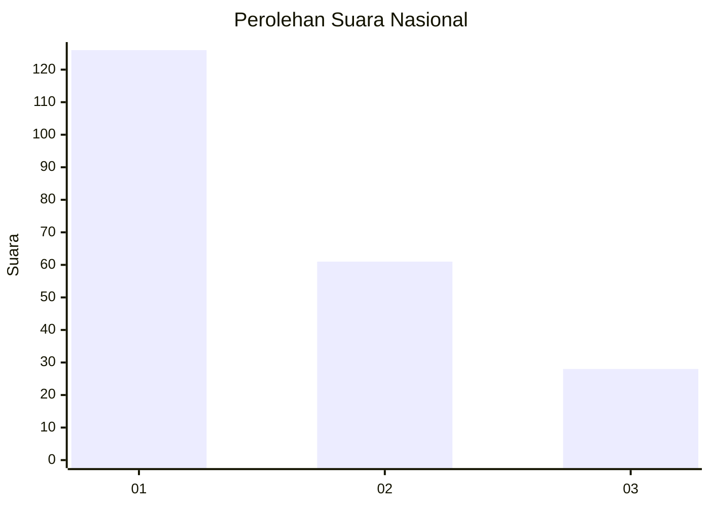
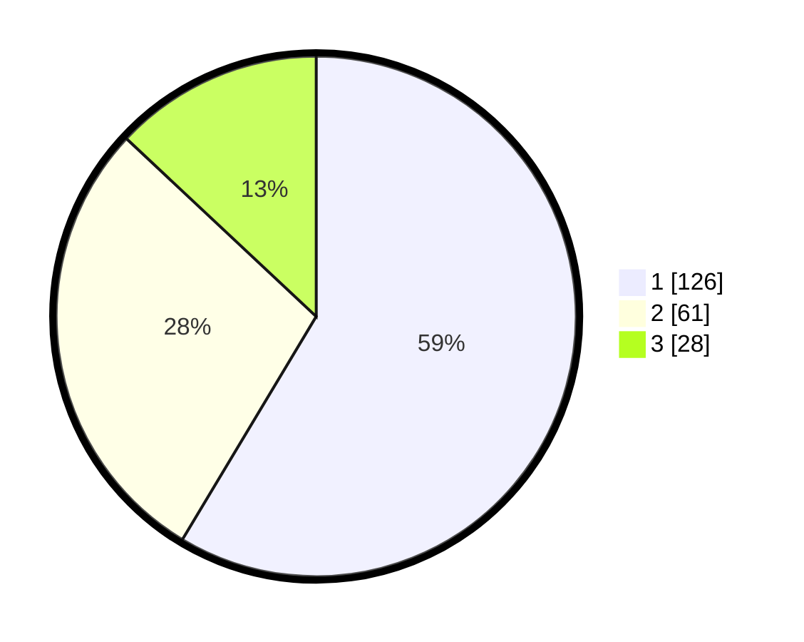

# Hasil

## Grafik

## Tabel

| No.    | Nama Paslon    | Suara | Suara (raw) | Persentase |
|:------ |:-------------- | -----:| -----------:| ----------:|
| 100025 | ANIES MUHAIMIN | 126   | [126][p-1]  | 58,60      |
| 100026 | PRABOWO GIBRAN | 61    | [61][p-2]   | 28,37      |
| 100027 | GANJAR MAHFUD  | 28    | [28][p-3]   | 13,02      |

[p-1]: https://github.com/gigit-pemilu/pemilu-2024/blob/main/pilpres/hitung-suara/sub/31-dki-jakarta/sub/74-jakarta-selatan/sub/04-pasar-minggu/sub/1006-pejaten-barat/sub/049-tps/sub/paslon-1.txt
[p-2]: https://github.com/gigit-pemilu/pemilu-2024/blob/main/pilpres/hitung-suara/sub/31-dki-jakarta/sub/74-jakarta-selatan/sub/04-pasar-minggu/sub/1006-pejaten-barat/sub/049-tps/sub/paslon-2.txt
[p-3]: https://github.com/gigit-pemilu/pemilu-2024/blob/main/pilpres/hitung-suara/sub/31-dki-jakarta/sub/74-jakarta-selatan/sub/04-pasar-minggu/sub/1006-pejaten-barat/sub/049-tps/sub/paslon-3.txt

## Foto C Plano

https://sirekap-obj-formc.kpu.go.id/7c3f/pemilu/ppwp/31/74/04/10/06/3174041006049-20240214-204929--06e57923-6bc2-4d2c-85e2-eaccc5fa0735.jpg

https://sirekap-obj-formc.kpu.go.id/7c3f/pemilu/ppwp/31/74/04/10/06/3174041006049-20240214-205042--1903c8fc-e9bf-4acf-953a-910bf8e99641.jpg

https://sirekap-obj-formc.kpu.go.id/7c3f/pemilu/ppwp/31/74/04/10/06/3174041006049-20240214-205131--87dac36b-0ed7-47c2-9d0b-d9d97d9df73c.jpg

## Metadata

| Key        | Value               |
| ---------- | ------------------- |
| Time Stamp | 2024-02-25 15:00:00 |

