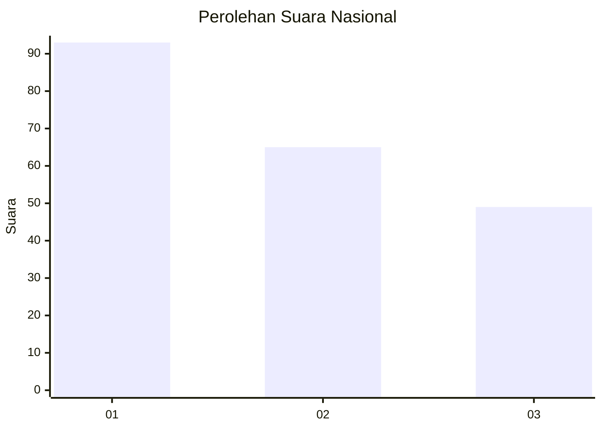
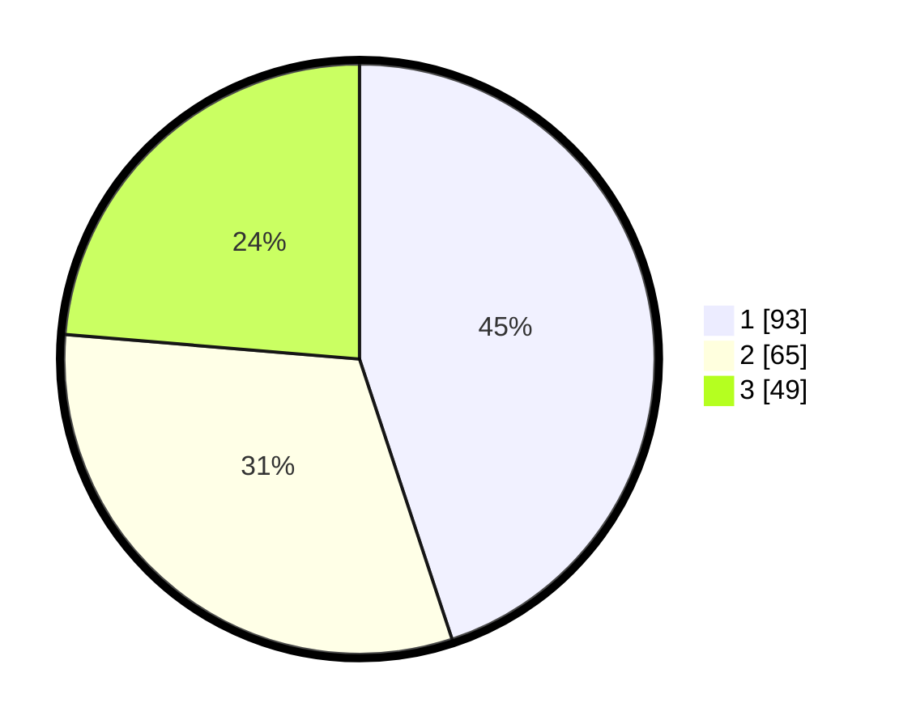

# Hasil

## Grafik

## Tabel

| No.    | Nama Paslon    | Suara | Suara (raw) | Persentase |
|:------ |:-------------- | -----:| -----------:| ----------:|
| 100025 | ANIES MUHAIMIN | 93    | [93][p-1]   | 44,93      |
| 100026 | PRABOWO GIBRAN | 65    | [65][p-2]   | 31,40      |
| 100027 | GANJAR MAHFUD  | 49    | [49][p-3]   | 23,67      |

[p-1]: https://github.com/gigit-pemilu/pemilu-2024/blob/main/pilpres/hitung-suara/sub/31-dki-jakarta/sub/74-jakarta-selatan/sub/04-pasar-minggu/sub/1006-pejaten-barat/sub/061-tps/sub/paslon-1.txt
[p-2]: https://github.com/gigit-pemilu/pemilu-2024/blob/main/pilpres/hitung-suara/sub/31-dki-jakarta/sub/74-jakarta-selatan/sub/04-pasar-minggu/sub/1006-pejaten-barat/sub/061-tps/sub/paslon-2.txt
[p-3]: https://github.com/gigit-pemilu/pemilu-2024/blob/main/pilpres/hitung-suara/sub/31-dki-jakarta/sub/74-jakarta-selatan/sub/04-pasar-minggu/sub/1006-pejaten-barat/sub/061-tps/sub/paslon-3.txt

## Foto C Plano

https://sirekap-obj-formc.kpu.go.id/06e7/pemilu/ppwp/31/74/04/10/06/3174041006061-20240214-225534--96d2d6c1-e999-47d6-9924-c42bd00c17a3.jpg

https://sirekap-obj-formc.kpu.go.id/06e7/pemilu/ppwp/31/74/04/10/06/3174041006061-20240214-225621--1db4f96d-33b2-4e7a-802a-939019f03e40.jpg

https://sirekap-obj-formc.kpu.go.id/06e7/pemilu/ppwp/31/74/04/10/06/3174041006061-20240214-225658--52abf5dd-6e31-4b5d-9270-94c537981caf.jpg

## Metadata

| Key        | Value               |
| ---------- | ------------------- |
| Time Stamp | 2024-02-25 15:00:00 |

