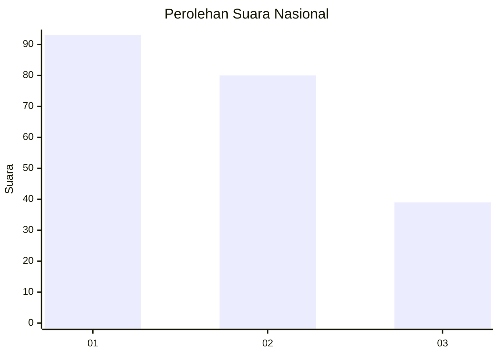
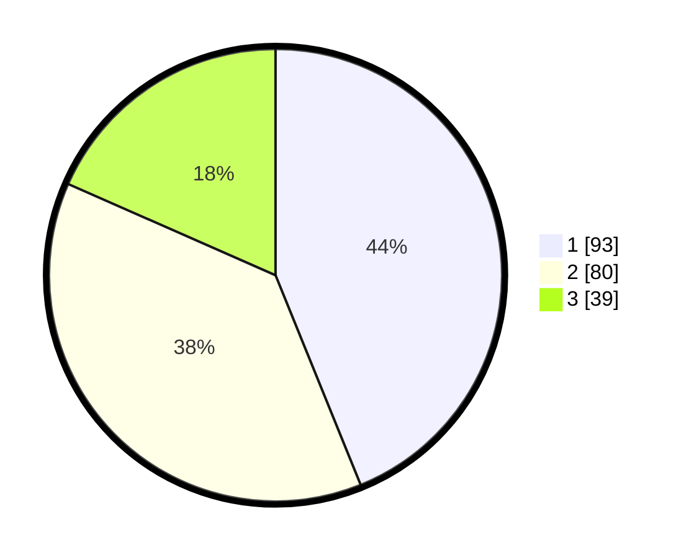

# Hasil

## Grafik

## Tabel

| No.    | Nama Paslon    | Suara | Suara (raw) | Persentase |
|:------ |:-------------- | -----:| -----------:| ----------:|
| 100025 | ANIES MUHAIMIN | 93    | [93][p-1]   | 43,87      |
| 100026 | PRABOWO GIBRAN | 80    | [80][p-2]   | 37,74      |
| 100027 | GANJAR MAHFUD  | 39    | [39][p-3]   | 18,40      |

[p-1]: https://github.com/gigit-pemilu/pemilu-2024/blob/main/pilpres/hitung-suara/sub/31-dki-jakarta/sub/74-jakarta-selatan/sub/04-pasar-minggu/sub/1006-pejaten-barat/sub/062-tps/sub/paslon-1.txt
[p-2]: https://github.com/gigit-pemilu/pemilu-2024/blob/main/pilpres/hitung-suara/sub/31-dki-jakarta/sub/74-jakarta-selatan/sub/04-pasar-minggu/sub/1006-pejaten-barat/sub/062-tps/sub/paslon-2.txt
[p-3]: https://github.com/gigit-pemilu/pemilu-2024/blob/main/pilpres/hitung-suara/sub/31-dki-jakarta/sub/74-jakarta-selatan/sub/04-pasar-minggu/sub/1006-pejaten-barat/sub/062-tps/sub/paslon-3.txt

## Foto C Plano

https://sirekap-obj-formc.kpu.go.id/eb36/pemilu/ppwp/31/74/04/10/06/3174041006062-20240215-153835--f18cd723-4cd6-4268-b425-553938082856.jpg

https://sirekap-obj-formc.kpu.go.id/eb36/pemilu/ppwp/31/74/04/10/06/3174041006062-20240215-154020--aa9367f9-ec67-4f14-a209-603d480ee2d6.jpg

https://sirekap-obj-formc.kpu.go.id/eb36/pemilu/ppwp/31/74/04/10/06/3174041006062-20240215-154112--ca4f3461-4b67-42d2-b9eb-300c346361f6.jpg

## Metadata

| Key        | Value               |
| ---------- | ------------------- |
| Time Stamp | 2024-02-24 22:31:28 |

