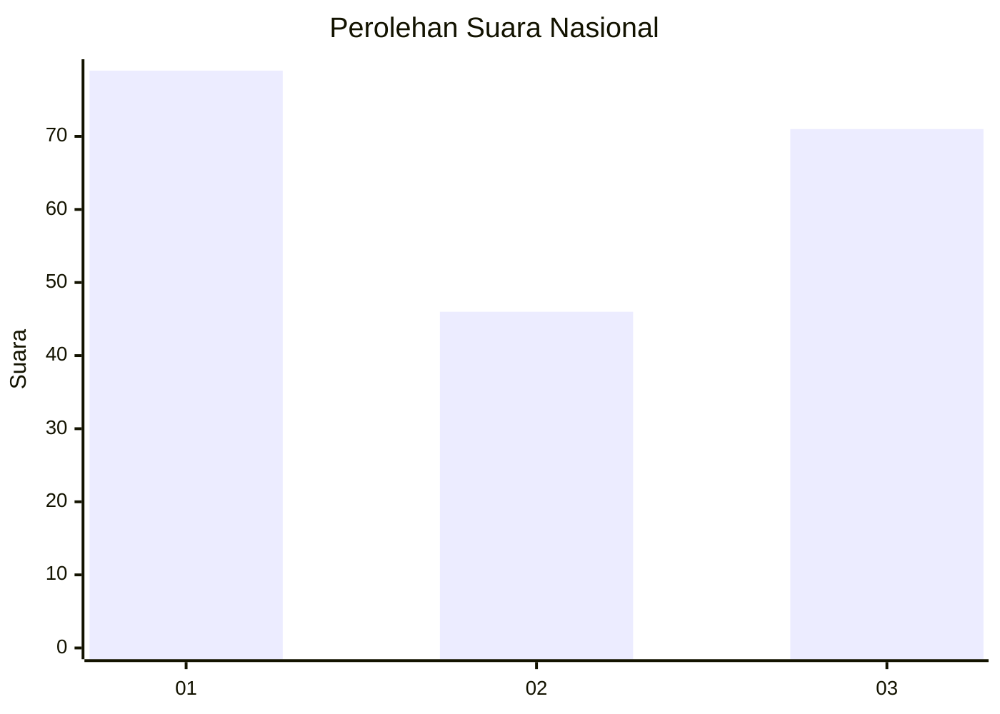
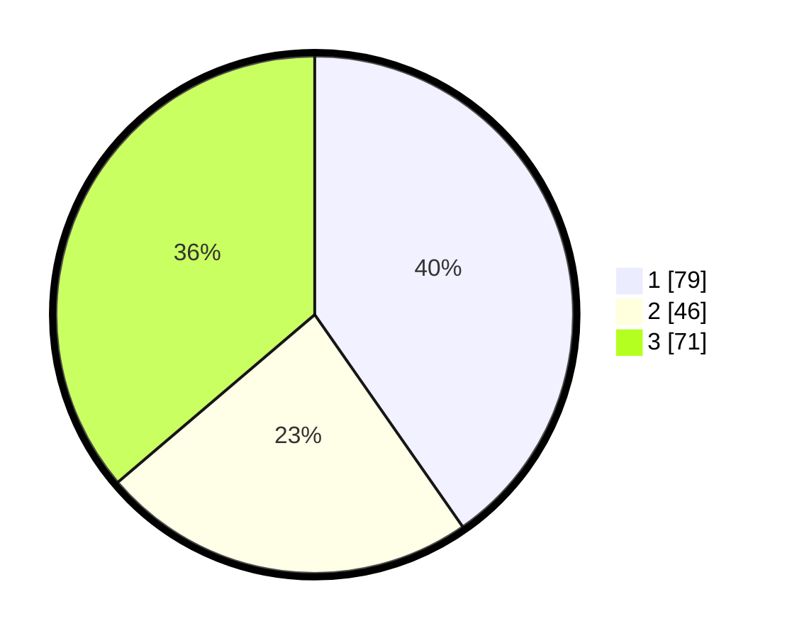

# Hasil

## Grafik

## Tabel

| No.    | Nama Paslon    | Suara | Suara (raw) | Persentase |
|:------ |:-------------- | -----:| -----------:| ----------:|
| 100025 | ANIES MUHAIMIN | 79    | [79][p-1]   | 40,31      |
| 100026 | PRABOWO GIBRAN | 46    | [46][p-2]   | 23,47      |
| 100027 | GANJAR MAHFUD  | 71    | [71][p-3]   | 36,22      |

[p-1]: https://github.com/gigit-pemilu/pemilu-2024/blob/main/pilpres/hitung-suara/sub/31-dki-jakarta/sub/74-jakarta-selatan/sub/04-pasar-minggu/sub/1006-pejaten-barat/sub/083-tps/sub/paslon-1.txt
[p-2]: https://github.com/gigit-pemilu/pemilu-2024/blob/main/pilpres/hitung-suara/sub/31-dki-jakarta/sub/74-jakarta-selatan/sub/04-pasar-minggu/sub/1006-pejaten-barat/sub/083-tps/sub/paslon-2.txt
[p-3]: https://github.com/gigit-pemilu/pemilu-2024/blob/main/pilpres/hitung-suara/sub/31-dki-jakarta/sub/74-jakarta-selatan/sub/04-pasar-minggu/sub/1006-pejaten-barat/sub/083-tps/sub/paslon-3.txt

## Foto C Plano

https://sirekap-obj-formc.kpu.go.id/6d5c/pemilu/ppwp/31/74/04/10/06/3174041006083-20240214-190020--d4786e2b-140d-4a77-9930-d72a350906a5.jpg

https://sirekap-obj-formc.kpu.go.id/6d5c/pemilu/ppwp/31/74/04/10/06/3174041006083-20240214-184535--44915c39-09f1-4a40-b752-61feb8c1d22e.jpg

https://sirekap-obj-formc.kpu.go.id/6d5c/pemilu/ppwp/31/74/04/10/06/3174041006083-20240214-184518--8055b8e4-4303-47fb-91c4-e890c86269b1.jpg

## Metadata

| Key        | Value               |
| ---------- | ------------------- |
| Time Stamp | 2024-02-15 17:30:25 |

