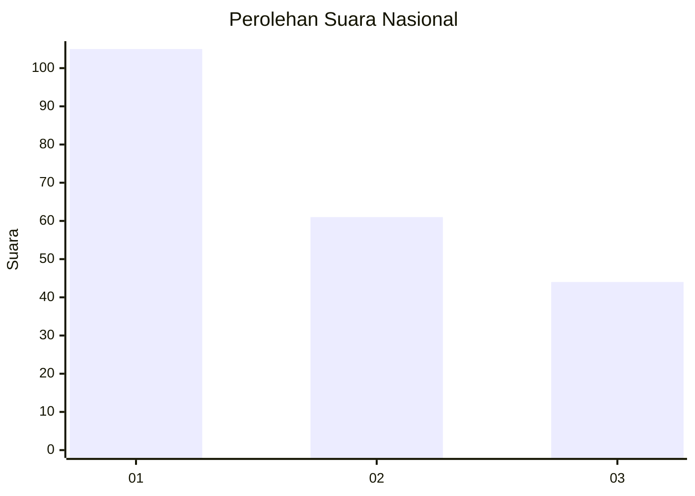
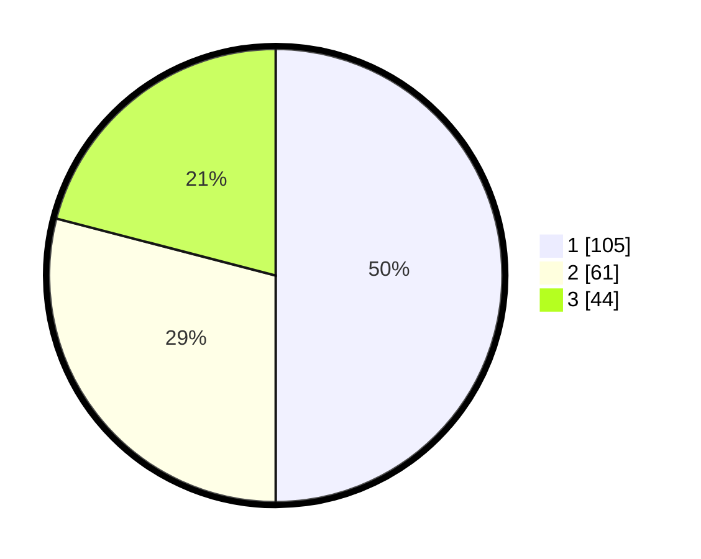

# Hasil

## Grafik

## Tabel

| No.    | Nama Paslon    | Suara | Suara (raw) | Persentase |
|:------ |:-------------- | -----:| -----------:| ----------:|
| 100025 | ANIES MUHAIMIN | 105   | [105][p-1]  | 50,00      |
| 100026 | PRABOWO GIBRAN | 61    | [61][p-2]   | 29,05      |
| 100027 | GANJAR MAHFUD  | 44    | [44][p-3]   | 20,95      |

[p-1]: https://github.com/gigit-pemilu/pemilu-2024/blob/main/pilpres/hitung-suara/sub/31-dki-jakarta/sub/74-jakarta-selatan/sub/04-pasar-minggu/sub/1006-pejaten-barat/sub/090-tps/sub/paslon-1.txt
[p-2]: https://github.com/gigit-pemilu/pemilu-2024/blob/main/pilpres/hitung-suara/sub/31-dki-jakarta/sub/74-jakarta-selatan/sub/04-pasar-minggu/sub/1006-pejaten-barat/sub/090-tps/sub/paslon-2.txt
[p-3]: https://github.com/gigit-pemilu/pemilu-2024/blob/main/pilpres/hitung-suara/sub/31-dki-jakarta/sub/74-jakarta-selatan/sub/04-pasar-minggu/sub/1006-pejaten-barat/sub/090-tps/sub/paslon-3.txt

## Foto C Plano

https://sirekap-obj-formc.kpu.go.id/004a/pemilu/ppwp/31/74/04/10/06/3174041006090-20240214-204213--fd70d4e3-183e-42ce-abb0-8fa712e0ed7a.jpg

https://sirekap-obj-formc.kpu.go.id/004a/pemilu/ppwp/31/74/04/10/06/3174041006090-20240214-194511--cfb426fd-75b6-4e6a-bdf7-21226b5e00d2.jpg

https://sirekap-obj-formc.kpu.go.id/004a/pemilu/ppwp/31/74/04/10/06/3174041006090-20240214-194613--d895c408-6cf1-4d10-9bcc-90af24225748.jpg

## Metadata

| Key        | Value               |
| ---------- | ------------------- |
| Time Stamp | 2024-02-15 17:30:25 |

