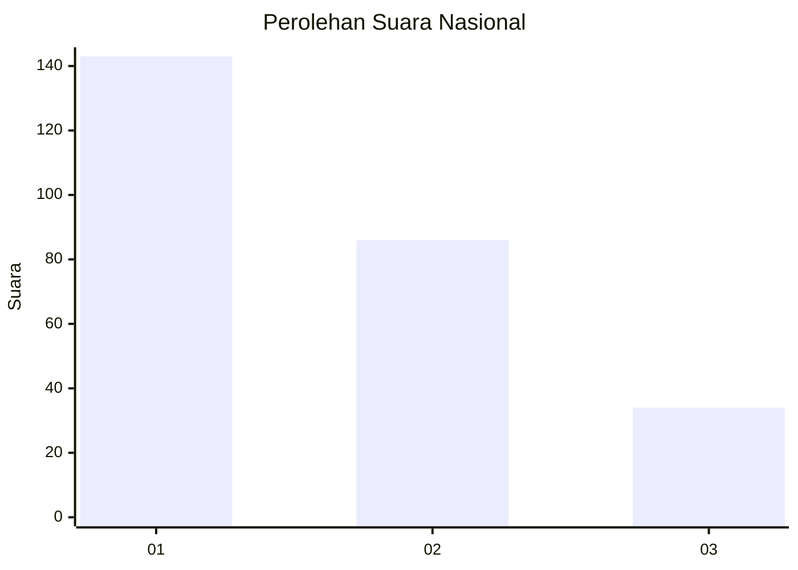
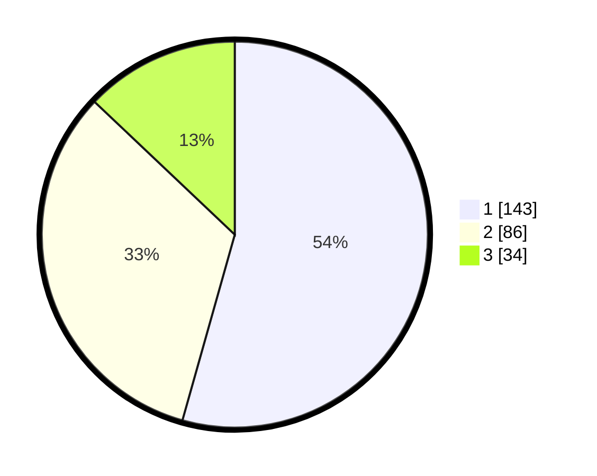

# Hasil

## Grafik

## Tabel

| No.    | Nama Paslon    | Suara | Suara (raw) | Persentase |
|:------ |:-------------- | -----:| -----------:| ----------:|
| 100025 | ANIES MUHAIMIN | 143   | [143][p-1]  | 54,37      |
| 100026 | PRABOWO GIBRAN | 86    | [86][p-2]   | 32,70      |
| 100027 | GANJAR MAHFUD  | 34    | [34][p-3]   | 12,93      |

[p-1]: https://github.com/gigit-pemilu/pemilu-2024/blob/main/pilpres/hitung-suara/sub/31-dki-jakarta/sub/74-jakarta-selatan/sub/04-pasar-minggu/sub/1006-pejaten-barat/sub/098-tps/sub/paslon-1.txt
[p-2]: https://github.com/gigit-pemilu/pemilu-2024/blob/main/pilpres/hitung-suara/sub/31-dki-jakarta/sub/74-jakarta-selatan/sub/04-pasar-minggu/sub/1006-pejaten-barat/sub/098-tps/sub/paslon-2.txt
[p-3]: https://github.com/gigit-pemilu/pemilu-2024/blob/main/pilpres/hitung-suara/sub/31-dki-jakarta/sub/74-jakarta-selatan/sub/04-pasar-minggu/sub/1006-pejaten-barat/sub/098-tps/sub/paslon-3.txt

## Foto C Plano

https://sirekap-obj-formc.kpu.go.id/954b/pemilu/ppwp/31/74/04/10/06/3174041006098-20240214-185755--d4af1190-69fb-46ff-ae9b-b81fda695773.jpg

https://sirekap-obj-formc.kpu.go.id/954b/pemilu/ppwp/31/74/04/10/06/3174041006098-20240214-185241--15dc4c70-ec95-44e5-9a78-eebfbe0c8bc9.jpg

https://sirekap-obj-formc.kpu.go.id/954b/pemilu/ppwp/31/74/04/10/06/3174041006098-20240214-192400--dc265631-8d1e-4dce-8ca1-c06a94b4df1b.jpg

## Metadata

| Key        | Value               |
| ---------- | ------------------- |
| Time Stamp | 2024-02-24 22:31:28 |

