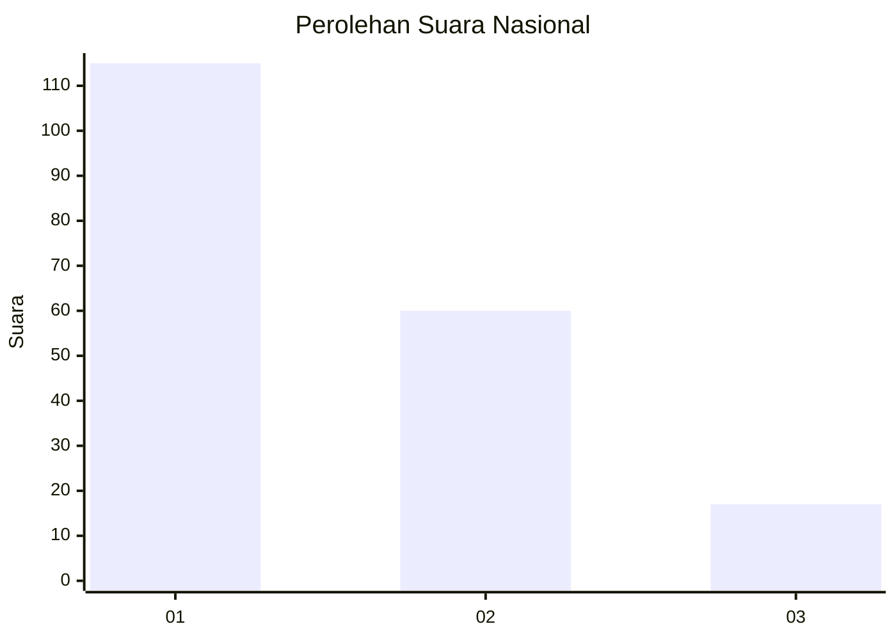
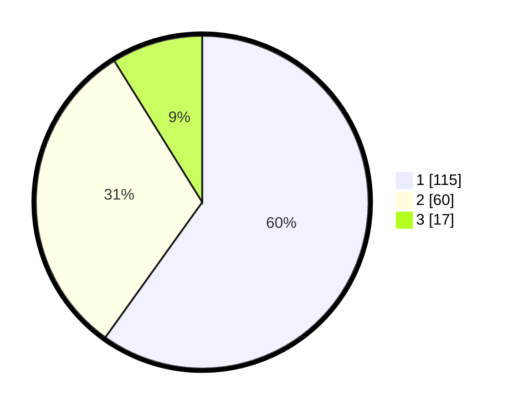

# Hasil

## Grafik

## Tabel

| No.    | Nama Paslon    | Suara | Suara (raw) | Persentase |
|:------ |:-------------- | -----:| -----------:| ----------:|
| 100025 | ANIES MUHAIMIN | 115   | [115][p-1]  | 59,90      |
| 100026 | PRABOWO GIBRAN | 60    | [60][p-2]   | 31,25      |
| 100027 | GANJAR MAHFUD  | 17    | [17][p-3]   | 8,85       |

[p-1]: https://github.com/gigit-pemilu/pemilu-2024/blob/main/pilpres/hitung-suara/sub/31-dki-jakarta/sub/74-jakarta-selatan/sub/04-pasar-minggu/sub/1006-pejaten-barat/sub/101-tps/sub/paslon-1.txt
[p-2]: https://github.com/gigit-pemilu/pemilu-2024/blob/main/pilpres/hitung-suara/sub/31-dki-jakarta/sub/74-jakarta-selatan/sub/04-pasar-minggu/sub/1006-pejaten-barat/sub/101-tps/sub/paslon-2.txt
[p-3]: https://github.com/gigit-pemilu/pemilu-2024/blob/main/pilpres/hitung-suara/sub/31-dki-jakarta/sub/74-jakarta-selatan/sub/04-pasar-minggu/sub/1006-pejaten-barat/sub/101-tps/sub/paslon-3.txt

## Foto C Plano

https://sirekap-obj-formc.kpu.go.id/6536/pemilu/ppwp/31/74/04/10/06/3174041006101-20240214-213709--8f3439fe-d947-462a-9c51-5942587cff38.jpg

https://sirekap-obj-formc.kpu.go.id/6536/pemilu/ppwp/31/74/04/10/06/3174041006101-20240214-204532--e7c0a118-822a-4366-8056-db6f1a57b574.jpg

https://sirekap-obj-formc.kpu.go.id/6536/pemilu/ppwp/31/74/04/10/06/3174041006101-20240214-204039--f2511462-c951-4eaf-87a5-84e8d1ed3a19.jpg

## Metadata

| Key        | Value               |
| ---------- | ------------------- |
| Time Stamp | 2024-02-26 09:00:00 |

