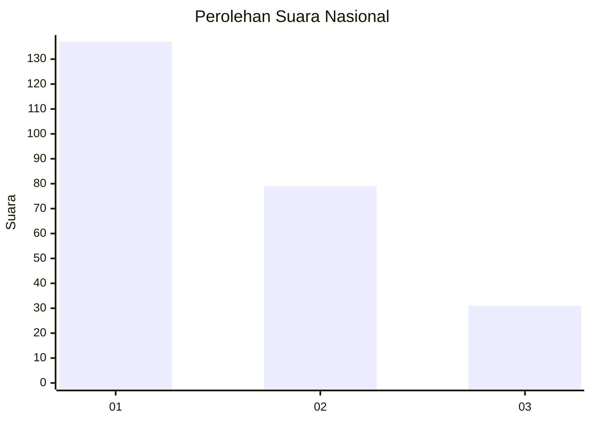
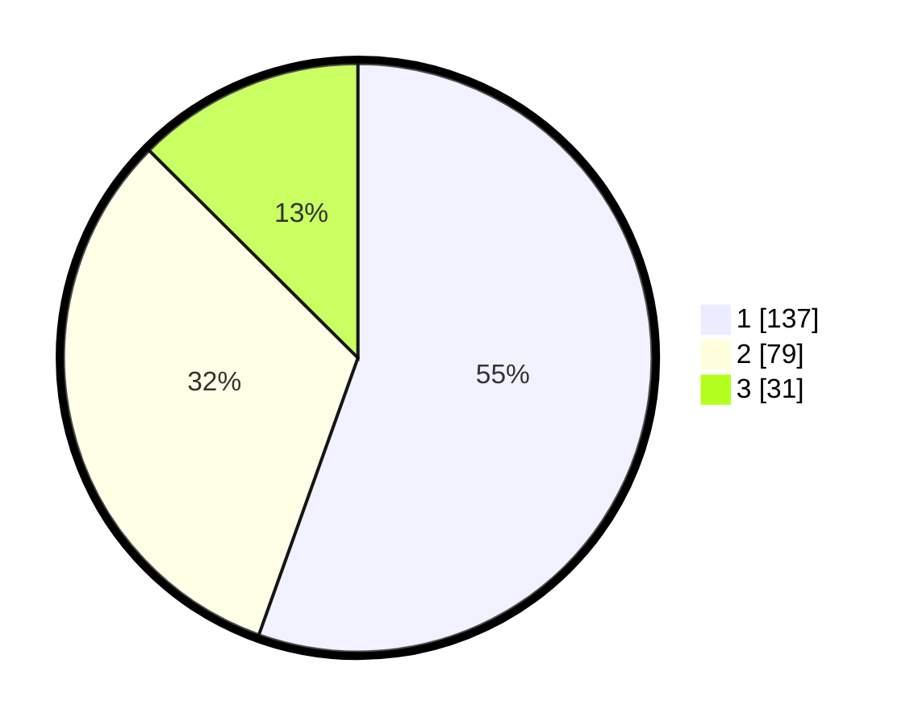

# Hasil

## Grafik

## Tabel

| No.    | Nama Paslon    | Suara | Suara (raw) | Persentase |
|:------ |:-------------- | -----:| -----------:| ----------:|
| 100025 | ANIES MUHAIMIN | 137   | [137][p-1]  | 55,47      |
| 100026 | PRABOWO GIBRAN | 79    | [79][p-2]   | 31,98      |
| 100027 | GANJAR MAHFUD  | 31    | [31][p-3]   | 12,55      |

[p-1]: https://github.com/gigit-pemilu/pemilu-2024/blob/main/pilpres/hitung-suara/sub/31-dki-jakarta/sub/74-jakarta-selatan/sub/04-pasar-minggu/sub/1006-pejaten-barat/sub/103-tps/sub/paslon-1.txt
[p-2]: https://github.com/gigit-pemilu/pemilu-2024/blob/main/pilpres/hitung-suara/sub/31-dki-jakarta/sub/74-jakarta-selatan/sub/04-pasar-minggu/sub/1006-pejaten-barat/sub/103-tps/sub/paslon-2.txt
[p-3]: https://github.com/gigit-pemilu/pemilu-2024/blob/main/pilpres/hitung-suara/sub/31-dki-jakarta/sub/74-jakarta-selatan/sub/04-pasar-minggu/sub/1006-pejaten-barat/sub/103-tps/sub/paslon-3.txt

## Foto C Plano

https://sirekap-obj-formc.kpu.go.id/5acf/pemilu/ppwp/31/74/04/10/06/3174041006103-20240214-224540--3b0a2813-ed6a-4727-8a8f-0d4a138c9df1.jpg

https://sirekap-obj-formc.kpu.go.id/5acf/pemilu/ppwp/31/74/04/10/06/3174041006103-20240214-195649--30c9fcde-2778-4c9a-82d1-0c92e0f660a9.jpg

https://sirekap-obj-formc.kpu.go.id/5acf/pemilu/ppwp/31/74/04/10/06/3174041006103-20240214-195706--3dafe224-5b2a-4ebb-85ca-b37f553129ed.jpg

## Metadata

| Key        | Value               |
| ---------- | ------------------- |
| Time Stamp | 2024-02-24 22:31:28 |

