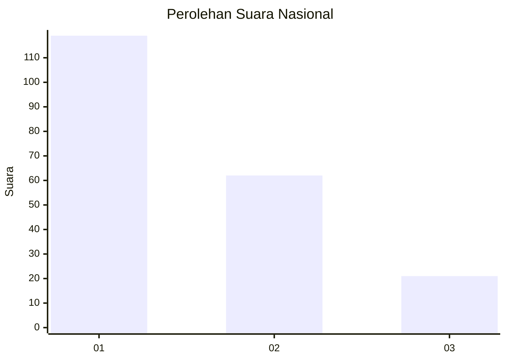
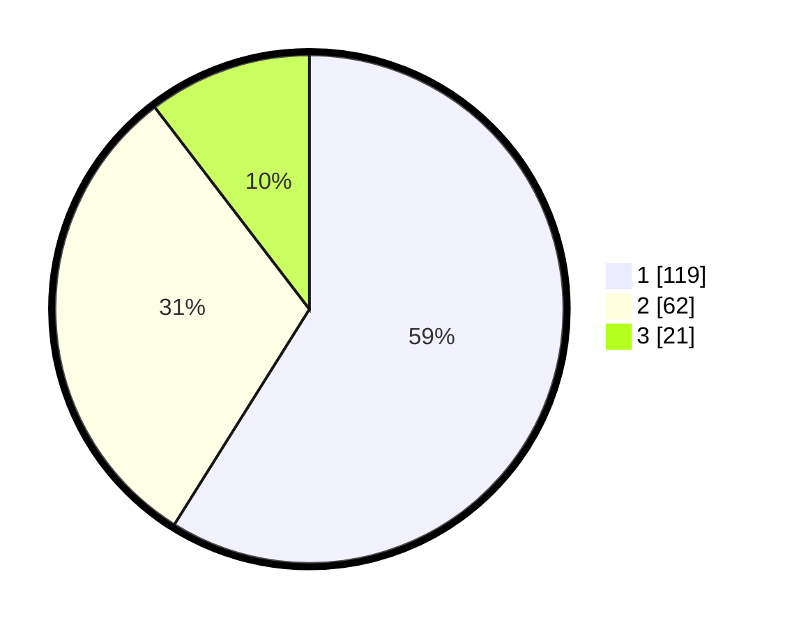

# Hasil

## Grafik

## Tabel

| No.    | Nama Paslon    | Suara | Suara (raw) | Persentase |
|:------ |:-------------- | -----:| -----------:| ----------:|
| 100025 | ANIES MUHAIMIN | 119   | [119][p-1]  | 58,91      |
| 100026 | PRABOWO GIBRAN | 62    | [62][p-2]   | 30,69      |
| 100027 | GANJAR MAHFUD  | 21    | [21][p-3]   | 10,40      |

[p-1]: https://github.com/gigit-pemilu/pemilu-2024/blob/main/pilpres/hitung-suara/sub/31-dki-jakarta/sub/74-jakarta-selatan/sub/04-pasar-minggu/sub/1006-pejaten-barat/sub/107-tps/sub/paslon-1.txt
[p-2]: https://github.com/gigit-pemilu/pemilu-2024/blob/main/pilpres/hitung-suara/sub/31-dki-jakarta/sub/74-jakarta-selatan/sub/04-pasar-minggu/sub/1006-pejaten-barat/sub/107-tps/sub/paslon-2.txt
[p-3]: https://github.com/gigit-pemilu/pemilu-2024/blob/main/pilpres/hitung-suara/sub/31-dki-jakarta/sub/74-jakarta-selatan/sub/04-pasar-minggu/sub/1006-pejaten-barat/sub/107-tps/sub/paslon-3.txt

## Foto C Plano

https://sirekap-obj-formc.kpu.go.id/b0dc/pemilu/ppwp/31/74/04/10/06/3174041006107-20240214-211038--3a4b0b2f-4a70-4b9e-8842-034d74416507.jpg

https://sirekap-obj-formc.kpu.go.id/b0dc/pemilu/ppwp/31/74/04/10/06/3174041006107-20240214-211333--1d149af5-c4f0-43fb-9229-2a2edeaf6754.jpg

https://sirekap-obj-formc.kpu.go.id/b0dc/pemilu/ppwp/31/74/04/10/06/3174041006107-20240214-211510--9086ad35-3d0a-48fe-8206-ed89fa0976c4.jpg

## Metadata

| Key        | Value               |
| ---------- | ------------------- |
| Time Stamp | 2024-02-24 22:31:28 |

