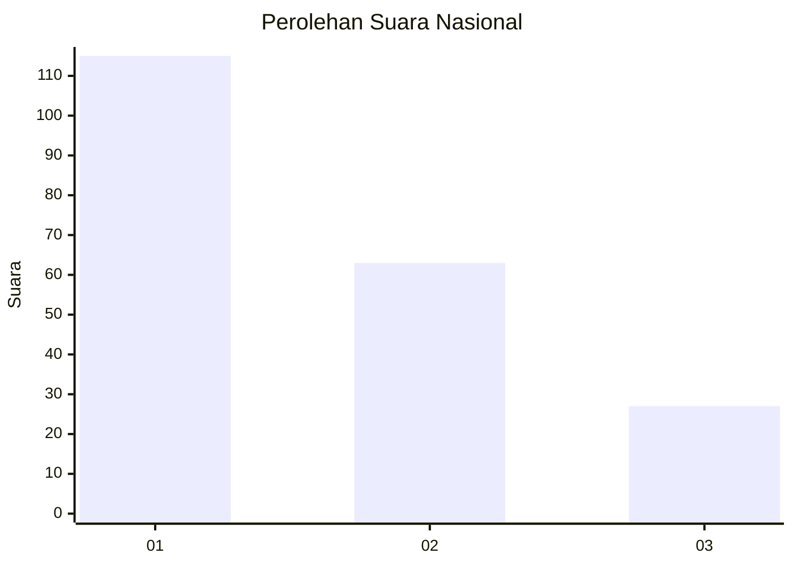
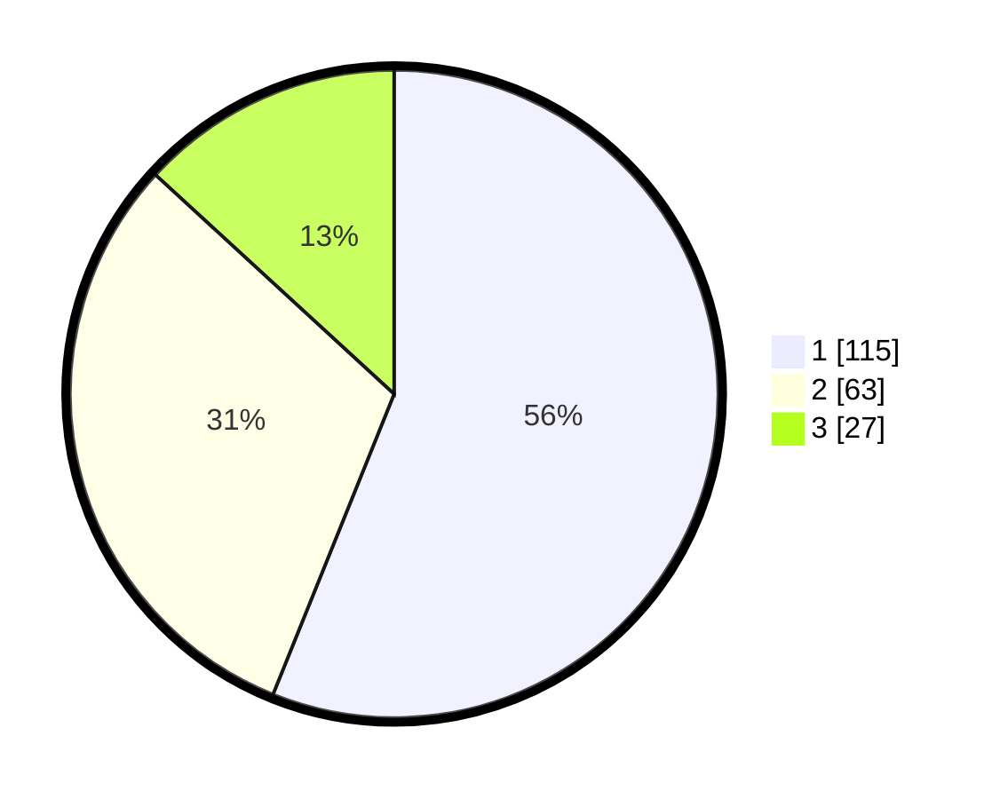

# Hasil

## Grafik

## Tabel

| No.    | Nama Paslon    | Suara | Suara (raw) | Persentase |
|:------ |:-------------- | -----:| -----------:| ----------:|
| 100025 | ANIES MUHAIMIN | 115   | [115][p-1]  | 56,10      |
| 100026 | PRABOWO GIBRAN | 63    | [63][p-2]   | 30,73      |
| 100027 | GANJAR MAHFUD  | 27    | [27][p-3]   | 13,17      |

[p-1]: https://github.com/gigit-pemilu/pemilu-2024/blob/main/pilpres/hitung-suara/sub/31-dki-jakarta/sub/74-jakarta-selatan/sub/04-pasar-minggu/sub/1006-pejaten-barat/sub/108-tps/sub/paslon-1.txt
[p-2]: https://github.com/gigit-pemilu/pemilu-2024/blob/main/pilpres/hitung-suara/sub/31-dki-jakarta/sub/74-jakarta-selatan/sub/04-pasar-minggu/sub/1006-pejaten-barat/sub/108-tps/sub/paslon-2.txt
[p-3]: https://github.com/gigit-pemilu/pemilu-2024/blob/main/pilpres/hitung-suara/sub/31-dki-jakarta/sub/74-jakarta-selatan/sub/04-pasar-minggu/sub/1006-pejaten-barat/sub/108-tps/sub/paslon-3.txt

## Foto C Plano

https://sirekap-obj-formc.kpu.go.id/3c3d/pemilu/ppwp/31/74/04/10/06/3174041006108-20240214-233500--84b569e0-01cb-4696-ae27-634e50919594.jpg

https://sirekap-obj-formc.kpu.go.id/3c3d/pemilu/ppwp/31/74/04/10/06/3174041006108-20240214-234101--86ef0948-978b-4892-b9ae-6533ece3d78e.jpg

https://sirekap-obj-formc.kpu.go.id/3c3d/pemilu/ppwp/31/74/04/10/06/3174041006108-20240214-234311--90019645-c40d-4f4b-915e-a5bf2cb3a054.jpg

## Metadata

| Key        | Value               |
| ---------- | ------------------- |
| Time Stamp | 2024-02-24 22:31:28 |

