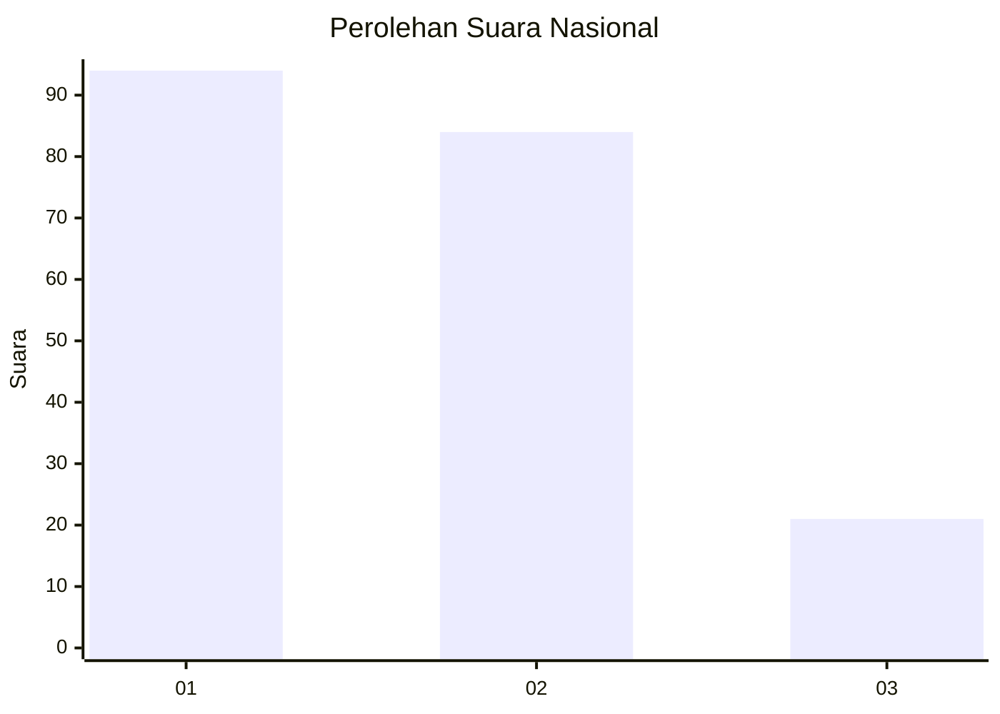
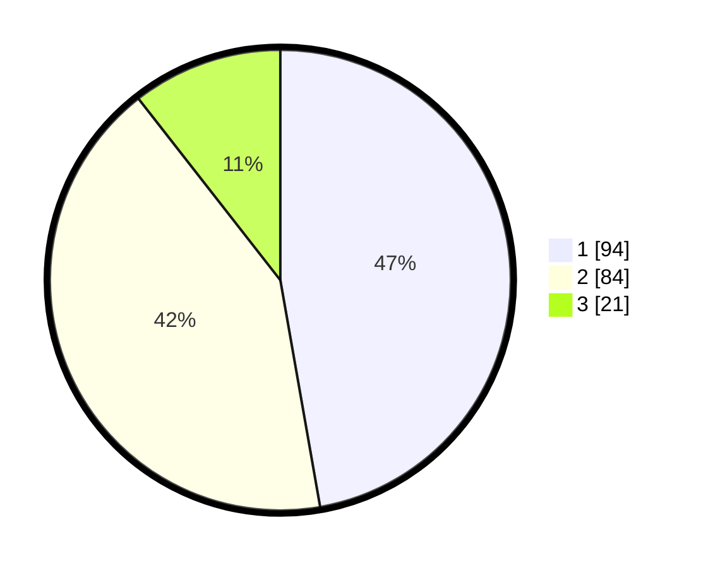

# Hasil

## Grafik

## Tabel

| No.    | Nama Paslon    | Suara | Suara (raw) | Persentase |
|:------ |:-------------- | -----:| -----------:| ----------:|
| 100025 | ANIES MUHAIMIN | 94    | [94][p-1]   | 47,24      |
| 100026 | PRABOWO GIBRAN | 84    | [84][p-2]   | 42,21      |
| 100027 | GANJAR MAHFUD  | 21    | [21][p-3]   | 10,55      |

[p-1]: https://github.com/gigit-pemilu/pemilu-2024/blob/main/pilpres/hitung-suara/sub/31-dki-jakarta/sub/74-jakarta-selatan/sub/04-pasar-minggu/sub/1006-pejaten-barat/sub/109-tps/sub/paslon-1.txt
[p-2]: https://github.com/gigit-pemilu/pemilu-2024/blob/main/pilpres/hitung-suara/sub/31-dki-jakarta/sub/74-jakarta-selatan/sub/04-pasar-minggu/sub/1006-pejaten-barat/sub/109-tps/sub/paslon-2.txt
[p-3]: https://github.com/gigit-pemilu/pemilu-2024/blob/main/pilpres/hitung-suara/sub/31-dki-jakarta/sub/74-jakarta-selatan/sub/04-pasar-minggu/sub/1006-pejaten-barat/sub/109-tps/sub/paslon-3.txt

## Foto C Plano

https://sirekap-obj-formc.kpu.go.id/4a7c/pemilu/ppwp/31/74/04/10/06/3174041006109-20240214-224357--1f6258a7-f06e-4a95-beb9-ac83c0f29bdd.jpg

https://sirekap-obj-formc.kpu.go.id/4a7c/pemilu/ppwp/31/74/04/10/06/3174041006109-20240214-224450--3fdd5430-2127-4e94-8b14-e6f7e2ce042c.jpg

https://sirekap-obj-formc.kpu.go.id/4a7c/pemilu/ppwp/31/74/04/10/06/3174041006109-20240214-224544--5d09869f-8fd8-4671-bd10-7fea1b723851.jpg

## Metadata

| Key        | Value               |
| ---------- | ------------------- |
| Time Stamp | 2024-02-24 22:31:28 |

