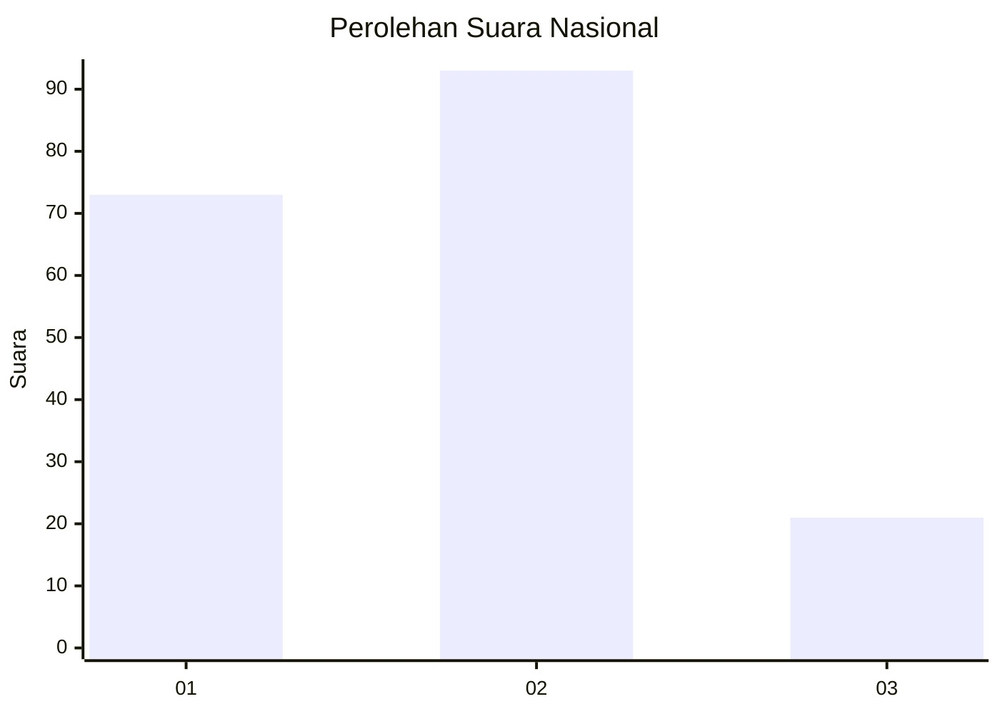
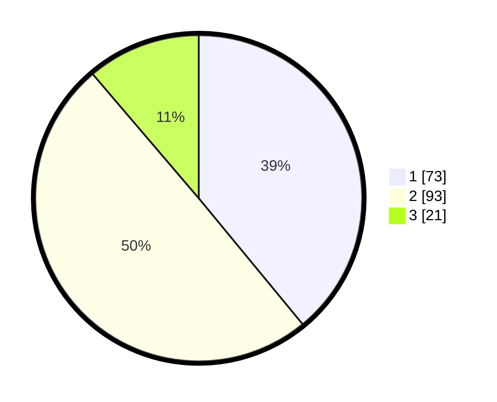

# Hasil

## Grafik

## Tabel

| No.    | Nama Paslon    | Suara | Suara (raw) | Persentase |
|:------ |:-------------- | -----:| -----------:| ----------:|
| 100025 | ANIES MUHAIMIN | 73    | [73][p-1]   | 39,04      |
| 100026 | PRABOWO GIBRAN | 93    | [93][p-2]   | 49,73      |
| 100027 | GANJAR MAHFUD  | 21    | [21][p-3]   | 11,23      |

[p-1]: https://github.com/gigit-pemilu/pemilu-2024/blob/main/pilpres/hitung-suara/sub/31-dki-jakarta/sub/74-jakarta-selatan/sub/04-pasar-minggu/sub/1006-pejaten-barat/sub/124-tps/sub/paslon-1.txt
[p-2]: https://github.com/gigit-pemilu/pemilu-2024/blob/main/pilpres/hitung-suara/sub/31-dki-jakarta/sub/74-jakarta-selatan/sub/04-pasar-minggu/sub/1006-pejaten-barat/sub/124-tps/sub/paslon-2.txt
[p-3]: https://github.com/gigit-pemilu/pemilu-2024/blob/main/pilpres/hitung-suara/sub/31-dki-jakarta/sub/74-jakarta-selatan/sub/04-pasar-minggu/sub/1006-pejaten-barat/sub/124-tps/sub/paslon-3.txt

## Foto C Plano

https://sirekap-obj-formc.kpu.go.id/8a4d/pemilu/ppwp/31/74/04/10/06/3174041006124-20240214-211615--3549cc2e-e3eb-4184-a697-90c15e8e63d1.jpg

https://sirekap-obj-formc.kpu.go.id/8a4d/pemilu/ppwp/31/74/04/10/06/3174041006124-20240214-211724--4cc21e7e-9933-4db3-83b5-dee1e7f23556.jpg

https://sirekap-obj-formc.kpu.go.id/8a4d/pemilu/ppwp/31/74/04/10/06/3174041006124-20240214-211829--f0f2d9f9-41e2-422f-9908-ce4a776fbf89.jpg

## Metadata

| Key        | Value               |
| ---------- | ------------------- |
| Time Stamp | 2024-02-25 11:00:00 |

