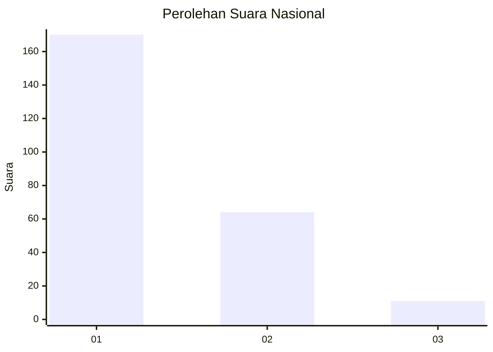
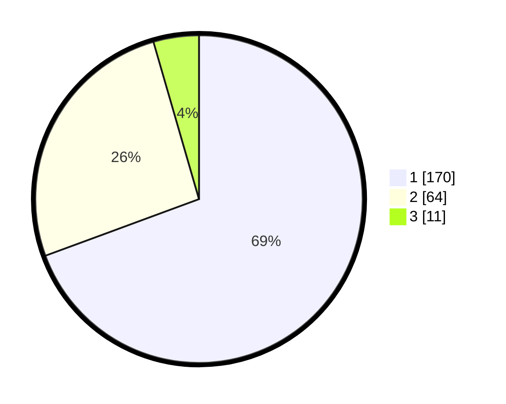

# Hasil

## Grafik

## Tabel

| No.    | Nama Paslon    | Suara | Suara (raw) | Persentase |
|:------ |:-------------- | -----:| -----------:| ----------:|
| 100025 | ANIES MUHAIMIN | 170   | [170][p-1]  | 69,39      |
| 100026 | PRABOWO GIBRAN | 64    | [64][p-2]   | 26,12      |
| 100027 | GANJAR MAHFUD  | 11    | [11][p-3]   | 4,49       |

[p-1]: https://github.com/gigit-pemilu/pemilu-2024/blob/main/pilpres/hitung-suara/sub/31-dki-jakarta/sub/74-jakarta-selatan/sub/04-pasar-minggu/sub/1006-pejaten-barat/sub/126-tps/sub/paslon-1.txt
[p-2]: https://github.com/gigit-pemilu/pemilu-2024/blob/main/pilpres/hitung-suara/sub/31-dki-jakarta/sub/74-jakarta-selatan/sub/04-pasar-minggu/sub/1006-pejaten-barat/sub/126-tps/sub/paslon-2.txt
[p-3]: https://github.com/gigit-pemilu/pemilu-2024/blob/main/pilpres/hitung-suara/sub/31-dki-jakarta/sub/74-jakarta-selatan/sub/04-pasar-minggu/sub/1006-pejaten-barat/sub/126-tps/sub/paslon-3.txt

## Foto C Plano

https://sirekap-obj-formc.kpu.go.id/ffbc/pemilu/ppwp/31/74/04/10/06/3174041006126-20240217-101143--e684b202-b0f1-4d58-b046-d9a432b0cca3.jpg

https://sirekap-obj-formc.kpu.go.id/ffbc/pemilu/ppwp/31/74/04/10/06/3174041006126-20240215-020259--ce1c2bf7-1b9a-48d5-ad4f-51666326a46d.jpg

https://sirekap-obj-formc.kpu.go.id/ffbc/pemilu/ppwp/31/74/04/10/06/3174041006126-20240215-020408--82d73d69-f443-4c5b-84d3-8ebe78612208.jpg

## Metadata

| Key        | Value               |
| ---------- | ------------------- |
| Time Stamp | 2024-02-19 06:16:00 |

