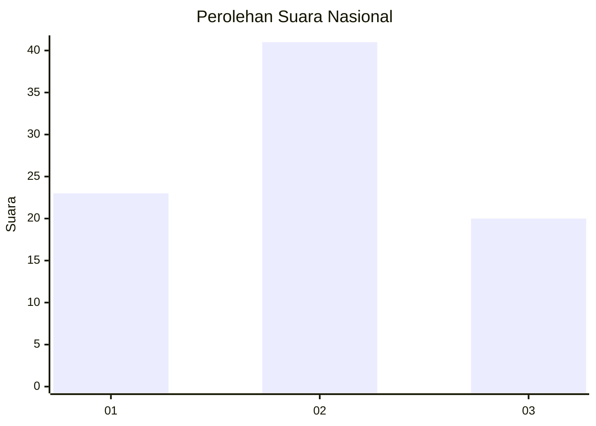
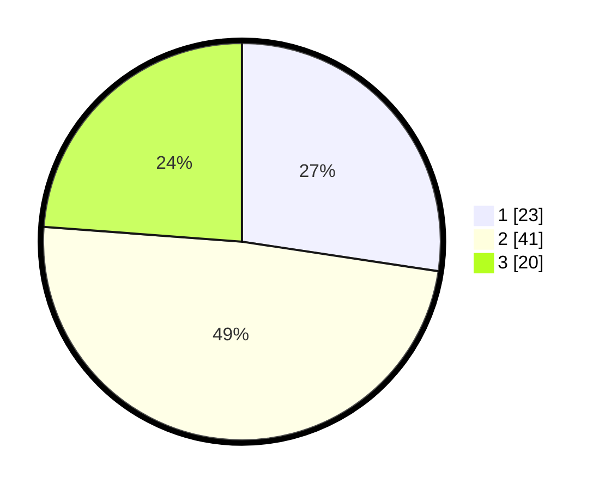

# Hasil

## Grafik

## Tabel

| No.    | Nama Paslon    | Suara | Suara (raw) | Persentase |
|:------ |:-------------- | -----:| -----------:| ----------:|
| 100025 | ANIES MUHAIMIN | 23    | [23][p-1]   | 27,38      |
| 100026 | PRABOWO GIBRAN | 41    | [41][p-2]   | 48,81      |
| 100027 | GANJAR MAHFUD  | 20    | [20][p-3]   | 23,81      |

[p-1]: https://github.com/gigit-pemilu/pemilu-2024/blob/main/pilpres/hitung-suara/sub/31-dki-jakarta/sub/74-jakarta-selatan/sub/04-pasar-minggu/sub/1007-kebagusan/sub/003-tps/sub/paslon-1.txt
[p-2]: https://github.com/gigit-pemilu/pemilu-2024/blob/main/pilpres/hitung-suara/sub/31-dki-jakarta/sub/74-jakarta-selatan/sub/04-pasar-minggu/sub/1007-kebagusan/sub/003-tps/sub/paslon-2.txt
[p-3]: https://github.com/gigit-pemilu/pemilu-2024/blob/main/pilpres/hitung-suara/sub/31-dki-jakarta/sub/74-jakarta-selatan/sub/04-pasar-minggu/sub/1007-kebagusan/sub/003-tps/sub/paslon-3.txt

## Foto C Plano

https://sirekap-obj-formc.kpu.go.id/c7d9/pemilu/ppwp/31/74/04/10/07/3174041007003-20240214-212314--fb38c8cf-2312-45bc-b5d9-07127bb4209b.jpg

https://sirekap-obj-formc.kpu.go.id/c7d9/pemilu/ppwp/31/74/04/10/07/3174041007003-20240214-212718--6bd696c3-e117-4c69-b428-9f2bfc83edf2.jpg

https://sirekap-obj-formc.kpu.go.id/c7d9/pemilu/ppwp/31/74/04/10/07/3174041007003-20240214-214446--e2fff76f-dc92-4d65-85a7-d8696cb34daf.jpg

## Metadata

| Key        | Value               |
| ---------- | ------------------- |
| Time Stamp | 2024-02-24 22:31:28 |

