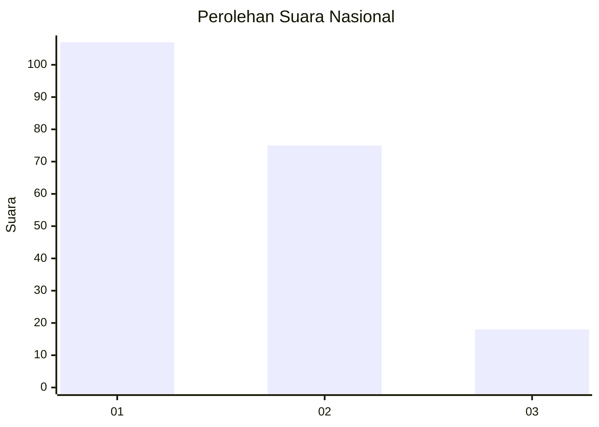
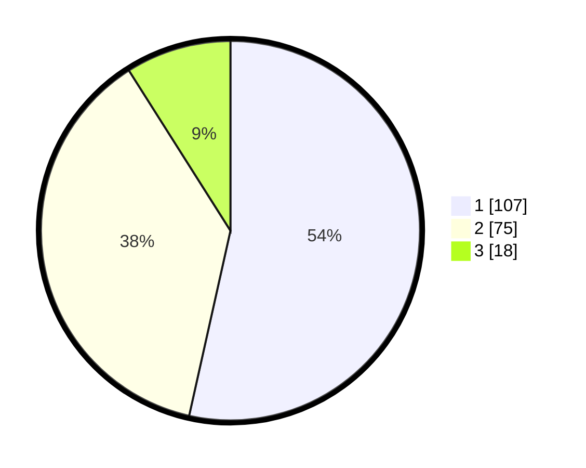

# Hasil

## Grafik

## Tabel

| No.    | Nama Paslon    | Suara | Suara (raw) | Persentase |
|:------ |:-------------- | -----:| -----------:| ----------:|
| 100025 | ANIES MUHAIMIN | 107   | [107][p-1]  | 53,50      |
| 100026 | PRABOWO GIBRAN | 75    | [75][p-2]   | 37,50      |
| 100027 | GANJAR MAHFUD  | 18    | [18][p-3]   | 9,00       |

[p-1]: https://github.com/gigit-pemilu/pemilu-2024/blob/main/pilpres/hitung-suara/sub/31-dki-jakarta/sub/74-jakarta-selatan/sub/04-pasar-minggu/sub/1007-kebagusan/sub/007-tps/sub/paslon-1.txt
[p-2]: https://github.com/gigit-pemilu/pemilu-2024/blob/main/pilpres/hitung-suara/sub/31-dki-jakarta/sub/74-jakarta-selatan/sub/04-pasar-minggu/sub/1007-kebagusan/sub/007-tps/sub/paslon-2.txt
[p-3]: https://github.com/gigit-pemilu/pemilu-2024/blob/main/pilpres/hitung-suara/sub/31-dki-jakarta/sub/74-jakarta-selatan/sub/04-pasar-minggu/sub/1007-kebagusan/sub/007-tps/sub/paslon-3.txt

## Foto C Plano

https://sirekap-obj-formc.kpu.go.id/36c9/pemilu/ppwp/31/74/04/10/07/3174041007007-20240214-224920--f380a6ef-b945-4eab-8b1d-4ac7ee6bb1f2.jpg

https://sirekap-obj-formc.kpu.go.id/36c9/pemilu/ppwp/31/74/04/10/07/3174041007007-20240214-224834--7bdc2df5-58b4-4648-a6d3-506232b44ea7.jpg

https://sirekap-obj-formc.kpu.go.id/36c9/pemilu/ppwp/31/74/04/10/07/3174041007007-20240214-225008--7e7dfcb2-dc44-4979-9893-c6e0f4095550.jpg

## Metadata

| Key        | Value               |
| ---------- | ------------------- |
| Time Stamp | 2024-02-24 22:31:28 |

