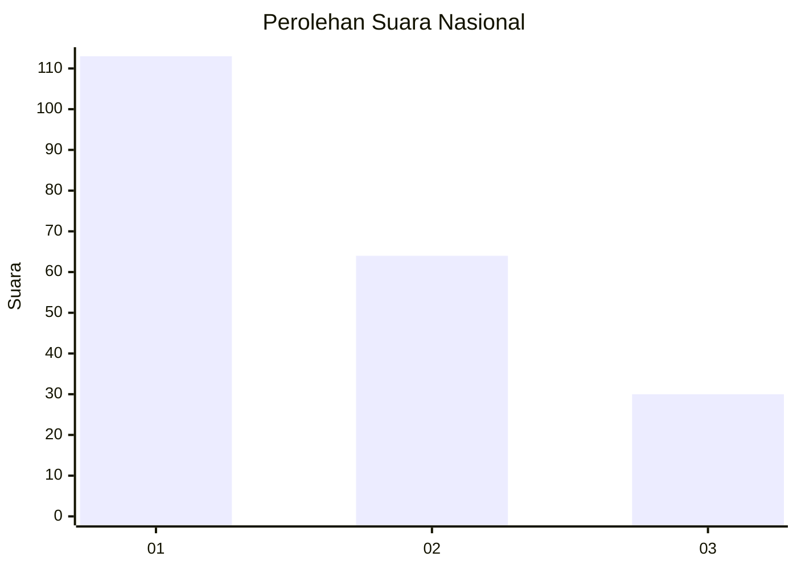
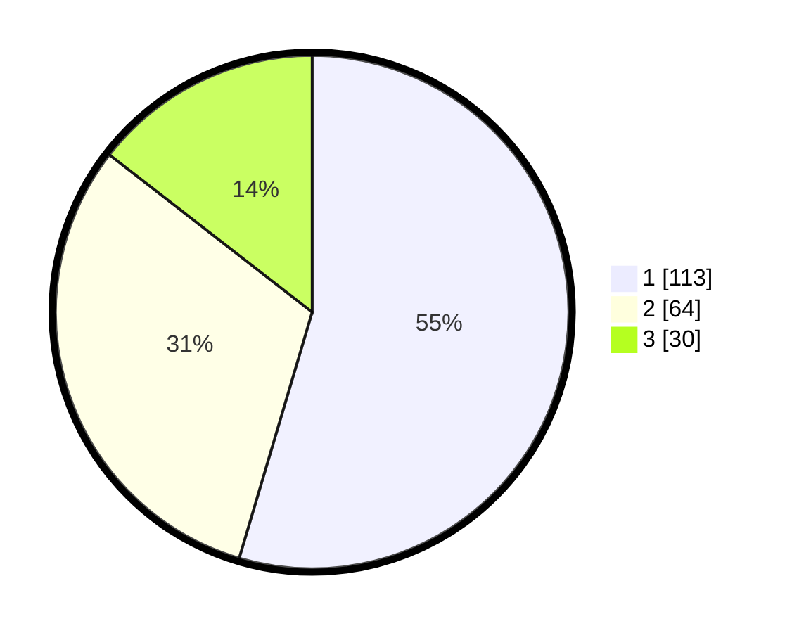

# Hasil

## Grafik

## Tabel

| No.    | Nama Paslon    | Suara | Suara (raw) | Persentase |
|:------ |:-------------- | -----:| -----------:| ----------:|
| 100025 | ANIES MUHAIMIN | 113   | [113][p-1]  | 54,59      |
| 100026 | PRABOWO GIBRAN | 64    | [64][p-2]   | 30,92      |
| 100027 | GANJAR MAHFUD  | 30    | [30][p-3]   | 14,49      |

[p-1]: https://github.com/gigit-pemilu/pemilu-2024/blob/main/pilpres/hitung-suara/sub/31-dki-jakarta/sub/74-jakarta-selatan/sub/04-pasar-minggu/sub/1007-kebagusan/sub/008-tps/sub/paslon-1.txt
[p-2]: https://github.com/gigit-pemilu/pemilu-2024/blob/main/pilpres/hitung-suara/sub/31-dki-jakarta/sub/74-jakarta-selatan/sub/04-pasar-minggu/sub/1007-kebagusan/sub/008-tps/sub/paslon-2.txt
[p-3]: https://github.com/gigit-pemilu/pemilu-2024/blob/main/pilpres/hitung-suara/sub/31-dki-jakarta/sub/74-jakarta-selatan/sub/04-pasar-minggu/sub/1007-kebagusan/sub/008-tps/sub/paslon-3.txt

## Foto C Plano

https://sirekap-obj-formc.kpu.go.id/ac76/pemilu/ppwp/31/74/04/10/07/3174041007008-20240214-221632--1779c85f-6844-49ce-af82-e0245c7526bc.jpg

https://sirekap-obj-formc.kpu.go.id/ac76/pemilu/ppwp/31/74/04/10/07/3174041007008-20240214-193639--53107373-64a6-4fb0-839e-8a3e2022efd7.jpg

https://sirekap-obj-formc.kpu.go.id/ac76/pemilu/ppwp/31/74/04/10/07/3174041007008-20240214-221838--e50a30ca-40ff-4b04-9ddd-bdea04886803.jpg

## Metadata

| Key        | Value               |
| ---------- | ------------------- |
| Time Stamp | 2024-02-15 17:30:25 |

