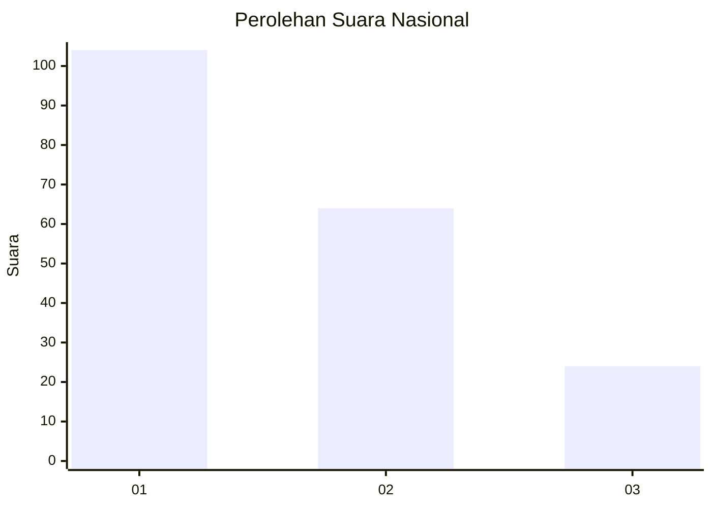
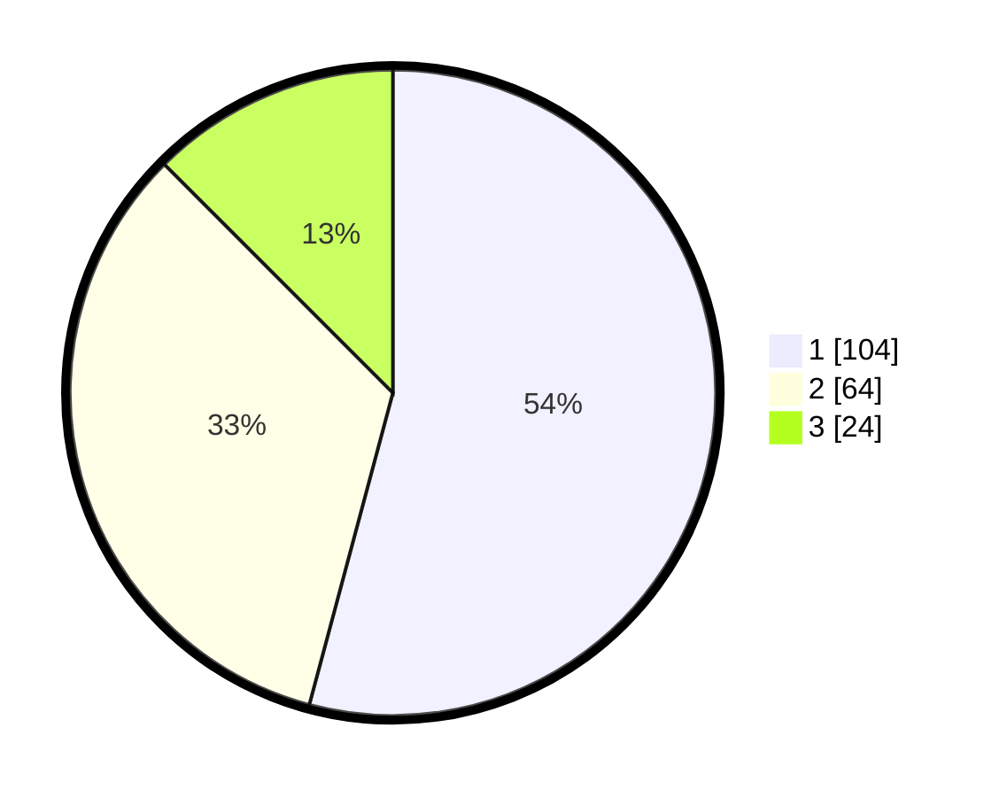

# Hasil

## Grafik

## Tabel

| No.    | Nama Paslon    | Suara | Suara (raw) | Persentase |
|:------ |:-------------- | -----:| -----------:| ----------:|
| 100025 | ANIES MUHAIMIN | 104   | [104][p-1]  | 54,17      |
| 100026 | PRABOWO GIBRAN | 64    | [64][p-2]   | 33,33      |
| 100027 | GANJAR MAHFUD  | 24    | [24][p-3]   | 12,50      |

[p-1]: https://github.com/gigit-pemilu/pemilu-2024/blob/main/pilpres/hitung-suara/sub/31-dki-jakarta/sub/74-jakarta-selatan/sub/04-pasar-minggu/sub/1007-kebagusan/sub/014-tps/sub/paslon-1.txt
[p-2]: https://github.com/gigit-pemilu/pemilu-2024/blob/main/pilpres/hitung-suara/sub/31-dki-jakarta/sub/74-jakarta-selatan/sub/04-pasar-minggu/sub/1007-kebagusan/sub/014-tps/sub/paslon-2.txt
[p-3]: https://github.com/gigit-pemilu/pemilu-2024/blob/main/pilpres/hitung-suara/sub/31-dki-jakarta/sub/74-jakarta-selatan/sub/04-pasar-minggu/sub/1007-kebagusan/sub/014-tps/sub/paslon-3.txt

## Foto C Plano

https://sirekap-obj-formc.kpu.go.id/2ae8/pemilu/ppwp/31/74/04/10/07/3174041007014-20240214-215754--6ff65652-823e-4378-97aa-db17c80dc24b.jpg

https://sirekap-obj-formc.kpu.go.id/2ae8/pemilu/ppwp/31/74/04/10/07/3174041007014-20240214-220013--2ea38c00-a6ae-4744-8647-bd1b41186a25.jpg

https://sirekap-obj-formc.kpu.go.id/2ae8/pemilu/ppwp/31/74/04/10/07/3174041007014-20240214-220213--a58823e6-dea5-4540-8bb5-d88f37baa55d.jpg

## Metadata

| Key        | Value               |
| ---------- | ------------------- |
| Time Stamp | 2024-02-24 22:31:28 |

