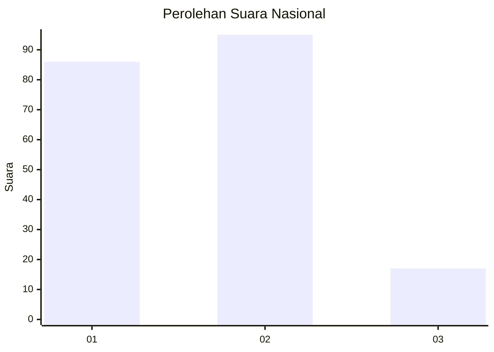
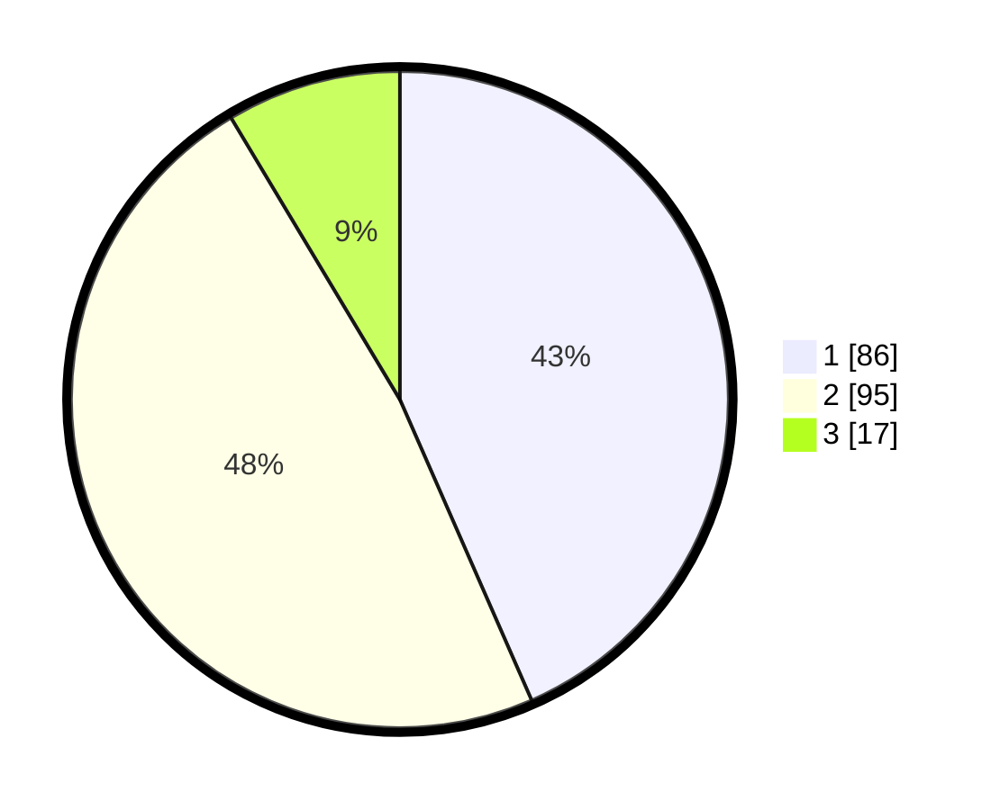

# Hasil

## Grafik

## Tabel

| No.    | Nama Paslon    | Suara | Suara (raw) | Persentase |
|:------ |:-------------- | -----:| -----------:| ----------:|
| 100025 | ANIES MUHAIMIN | 86    | [86][p-1]   | 43,43      |
| 100026 | PRABOWO GIBRAN | 95    | [95][p-2]   | 47,98      |
| 100027 | GANJAR MAHFUD  | 17    | [17][p-3]   | 8,59       |

[p-1]: https://github.com/gigit-pemilu/pemilu-2024/blob/main/pilpres/hitung-suara/sub/31-dki-jakarta/sub/74-jakarta-selatan/sub/04-pasar-minggu/sub/1007-kebagusan/sub/044-tps/sub/paslon-1.txt
[p-2]: https://github.com/gigit-pemilu/pemilu-2024/blob/main/pilpres/hitung-suara/sub/31-dki-jakarta/sub/74-jakarta-selatan/sub/04-pasar-minggu/sub/1007-kebagusan/sub/044-tps/sub/paslon-2.txt
[p-3]: https://github.com/gigit-pemilu/pemilu-2024/blob/main/pilpres/hitung-suara/sub/31-dki-jakarta/sub/74-jakarta-selatan/sub/04-pasar-minggu/sub/1007-kebagusan/sub/044-tps/sub/paslon-3.txt

## Foto C Plano

https://sirekap-obj-formc.kpu.go.id/6ef1/pemilu/ppwp/31/74/04/10/07/3174041007044-20240214-223404--ca37f089-5e96-4e58-85d9-47e84dc82124.jpg

https://sirekap-obj-formc.kpu.go.id/6ef1/pemilu/ppwp/31/74/04/10/07/3174041007044-20240214-223549--561a7965-eb79-435e-ab2b-b35c2e9608d8.jpg

https://sirekap-obj-formc.kpu.go.id/6ef1/pemilu/ppwp/31/74/04/10/07/3174041007044-20240214-223846--b7cb766b-0ef3-4df9-9a17-298c2ad00964.jpg

## Metadata

| Key        | Value               |
| ---------- | ------------------- |
| Time Stamp | 2024-02-24 22:31:28 |

