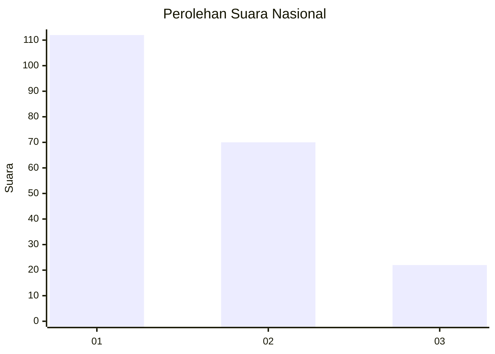
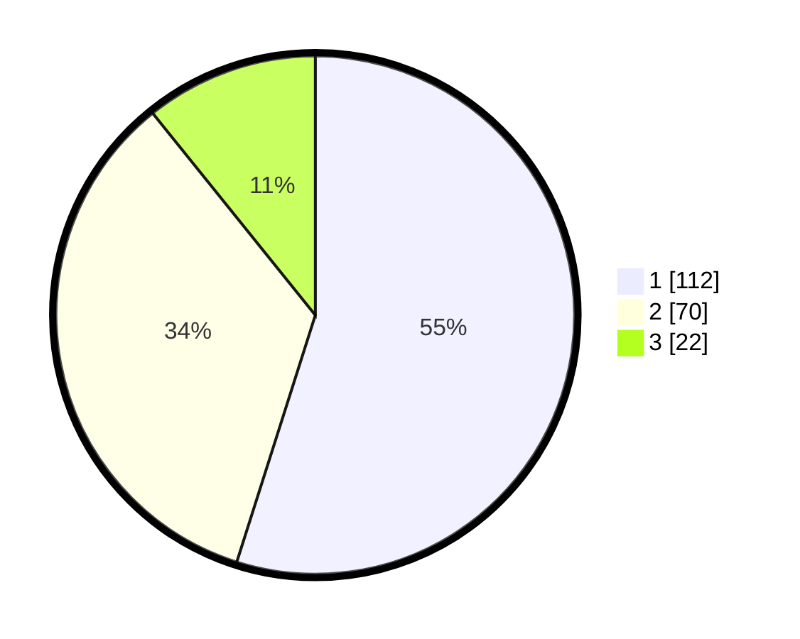

# Hasil

## Grafik

## Tabel

| No.    | Nama Paslon    | Suara | Suara (raw) | Persentase |
|:------ |:-------------- | -----:| -----------:| ----------:|
| 100025 | ANIES MUHAIMIN | 112   | [112][p-1]  | 54,90      |
| 100026 | PRABOWO GIBRAN | 70    | [70][p-2]   | 34,31      |
| 100027 | GANJAR MAHFUD  | 22    | [22][p-3]   | 10,78      |

[p-1]: https://github.com/gigit-pemilu/pemilu-2024/blob/main/pilpres/hitung-suara/sub/31-dki-jakarta/sub/74-jakarta-selatan/sub/04-pasar-minggu/sub/1007-kebagusan/sub/049-tps/sub/paslon-1.txt
[p-2]: https://github.com/gigit-pemilu/pemilu-2024/blob/main/pilpres/hitung-suara/sub/31-dki-jakarta/sub/74-jakarta-selatan/sub/04-pasar-minggu/sub/1007-kebagusan/sub/049-tps/sub/paslon-2.txt
[p-3]: https://github.com/gigit-pemilu/pemilu-2024/blob/main/pilpres/hitung-suara/sub/31-dki-jakarta/sub/74-jakarta-selatan/sub/04-pasar-minggu/sub/1007-kebagusan/sub/049-tps/sub/paslon-3.txt

## Foto C Plano

https://sirekap-obj-formc.kpu.go.id/eaf4/pemilu/ppwp/31/74/04/10/07/3174041007049-20240214-215738--9d119cdd-ac90-4960-824b-cb01dd716ad0.jpg

https://sirekap-obj-formc.kpu.go.id/eaf4/pemilu/ppwp/31/74/04/10/07/3174041007049-20240214-215905--da775e47-49aa-40eb-8c62-7787ca21efc9.jpg

https://sirekap-obj-formc.kpu.go.id/eaf4/pemilu/ppwp/31/74/04/10/07/3174041007049-20240214-220009--2a9d08a7-17fe-4c74-aff9-5808b31abfaa.jpg

## Metadata

| Key        | Value               |
| ---------- | ------------------- |
| Time Stamp | 2024-02-19 13:00:00 |

