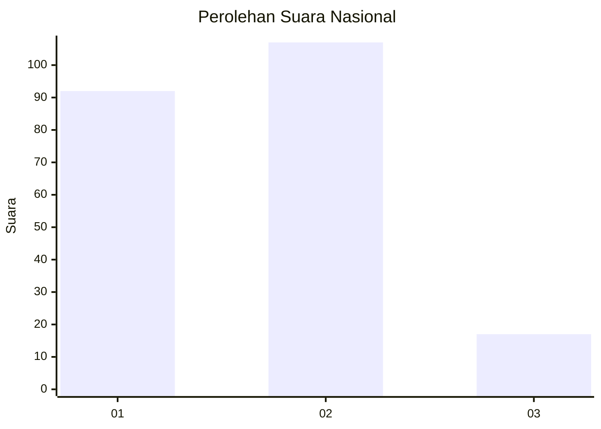
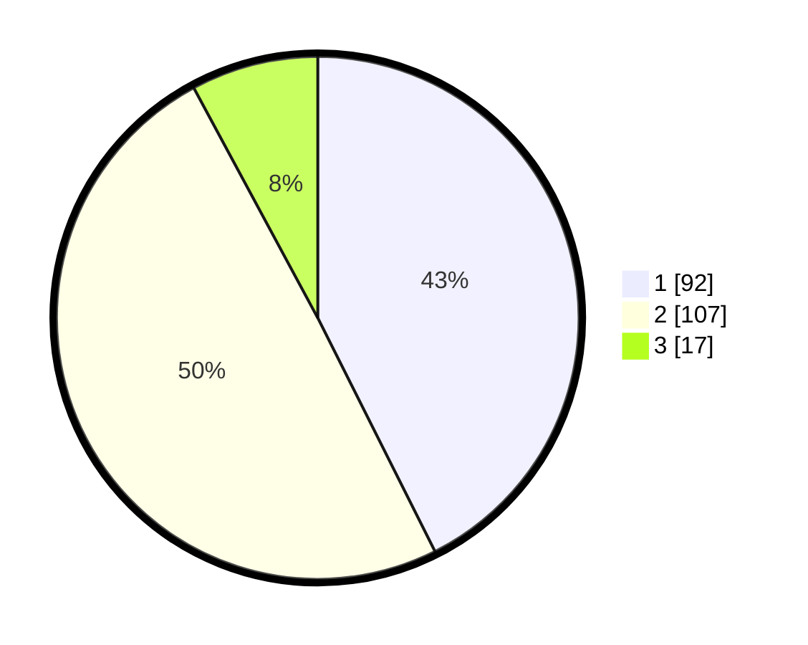

# Hasil

## Grafik

## Tabel

| No.    | Nama Paslon    | Suara | Suara (raw) | Persentase |
|:------ |:-------------- | -----:| -----------:| ----------:|
| 100025 | ANIES MUHAIMIN | 92    | [92][p-1]   | 42,59      |
| 100026 | PRABOWO GIBRAN | 107   | [107][p-2]  | 49,54      |
| 100027 | GANJAR MAHFUD  | 17    | [17][p-3]   | 7,87       |

[p-1]: https://github.com/gigit-pemilu/pemilu-2024/blob/main/pilpres/hitung-suara/sub/31-dki-jakarta/sub/74-jakarta-selatan/sub/04-pasar-minggu/sub/1007-kebagusan/sub/050-tps/sub/paslon-1.txt
[p-2]: https://github.com/gigit-pemilu/pemilu-2024/blob/main/pilpres/hitung-suara/sub/31-dki-jakarta/sub/74-jakarta-selatan/sub/04-pasar-minggu/sub/1007-kebagusan/sub/050-tps/sub/paslon-2.txt
[p-3]: https://github.com/gigit-pemilu/pemilu-2024/blob/main/pilpres/hitung-suara/sub/31-dki-jakarta/sub/74-jakarta-selatan/sub/04-pasar-minggu/sub/1007-kebagusan/sub/050-tps/sub/paslon-3.txt

## Foto C Plano

https://sirekap-obj-formc.kpu.go.id/0e99/pemilu/ppwp/31/74/04/10/07/3174041007050-20240215-025646--521824d8-cd8d-4d0c-a540-57778b39caed.jpg

https://sirekap-obj-formc.kpu.go.id/0e99/pemilu/ppwp/31/74/04/10/07/3174041007050-20240215-025729--7ec49c96-7c19-4fc4-84c7-883fdf378af9.jpg

https://sirekap-obj-formc.kpu.go.id/0e99/pemilu/ppwp/31/74/04/10/07/3174041007050-20240215-025821--676c0793-a964-478f-ad28-9ab3c084b8e1.jpg

## Metadata

| Key        | Value               |
| ---------- | ------------------- |
| Time Stamp | 2024-02-24 22:31:28 |

