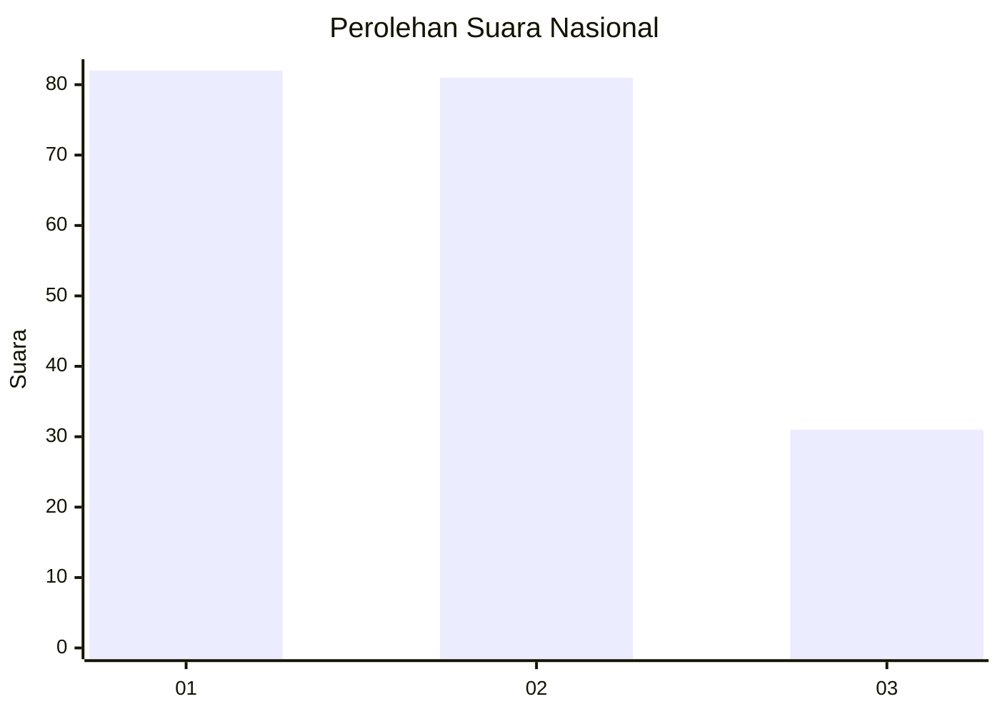
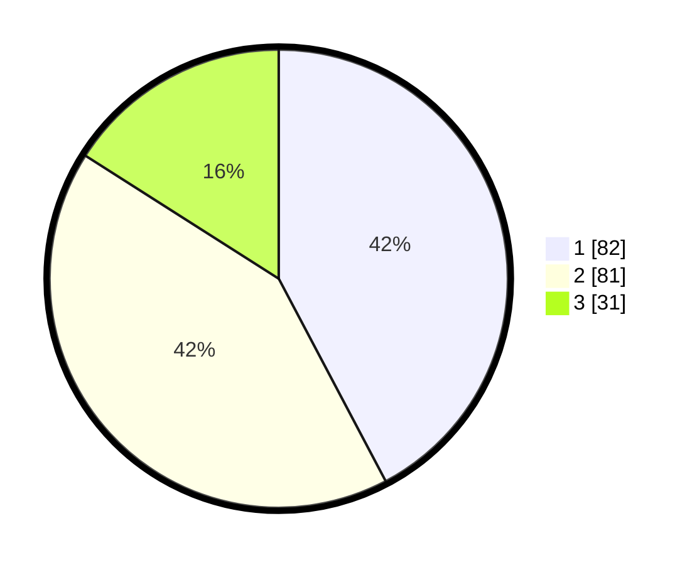

# Hasil

## Grafik

## Tabel

| No.    | Nama Paslon    | Suara | Suara (raw) | Persentase |
|:------ |:-------------- | -----:| -----------:| ----------:|
| 100025 | ANIES MUHAIMIN | 82    | [82][p-1]   | 42,27      |
| 100026 | PRABOWO GIBRAN | 81    | [81][p-2]   | 41,75      |
| 100027 | GANJAR MAHFUD  | 31    | [31][p-3]   | 15,98      |

[p-1]: https://github.com/gigit-pemilu/pemilu-2024/blob/main/pilpres/hitung-suara/sub/31-dki-jakarta/sub/74-jakarta-selatan/sub/04-pasar-minggu/sub/1007-kebagusan/sub/051-tps/sub/paslon-1.txt
[p-2]: https://github.com/gigit-pemilu/pemilu-2024/blob/main/pilpres/hitung-suara/sub/31-dki-jakarta/sub/74-jakarta-selatan/sub/04-pasar-minggu/sub/1007-kebagusan/sub/051-tps/sub/paslon-2.txt
[p-3]: https://github.com/gigit-pemilu/pemilu-2024/blob/main/pilpres/hitung-suara/sub/31-dki-jakarta/sub/74-jakarta-selatan/sub/04-pasar-minggu/sub/1007-kebagusan/sub/051-tps/sub/paslon-3.txt

## Foto C Plano

https://sirekap-obj-formc.kpu.go.id/804d/pemilu/ppwp/31/74/04/10/07/3174041007051-20240214-233120--4826f1ab-df87-4834-98ba-f0ee3410f8d2.jpg

https://sirekap-obj-formc.kpu.go.id/804d/pemilu/ppwp/31/74/04/10/07/3174041007051-20240214-185025--5958b4ba-ddb5-4ad8-97dc-98f0dd39a293.jpg

https://sirekap-obj-formc.kpu.go.id/804d/pemilu/ppwp/31/74/04/10/07/3174041007051-20240214-185159--bd895457-6471-4e8e-a257-5ca32b87ce7d.jpg

## Metadata

| Key        | Value               |
| ---------- | ------------------- |
| Time Stamp | 2024-02-15 17:30:25 |

