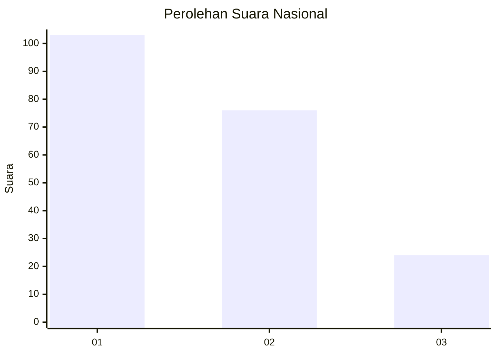
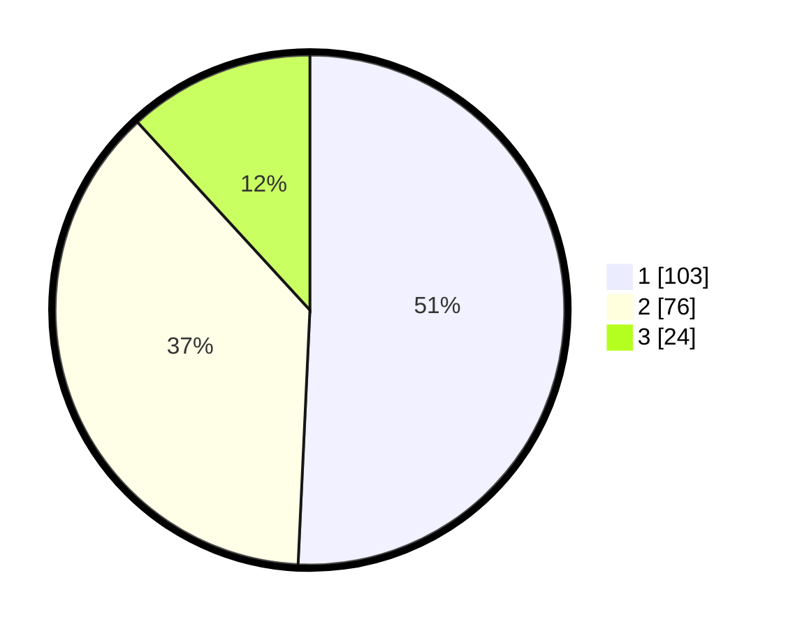

# Hasil

## Grafik

## Tabel

| No.    | Nama Paslon    | Suara | Suara (raw) | Persentase |
|:------ |:-------------- | -----:| -----------:| ----------:|
| 100025 | ANIES MUHAIMIN | 103   | [103][p-1]  | 50,74      |
| 100026 | PRABOWO GIBRAN | 76    | [76][p-2]   | 37,44      |
| 100027 | GANJAR MAHFUD  | 24    | [24][p-3]   | 11,82      |

[p-1]: https://github.com/gigit-pemilu/pemilu-2024/blob/main/pilpres/hitung-suara/sub/31-dki-jakarta/sub/74-jakarta-selatan/sub/04-pasar-minggu/sub/1007-kebagusan/sub/063-tps/sub/paslon-1.txt
[p-2]: https://github.com/gigit-pemilu/pemilu-2024/blob/main/pilpres/hitung-suara/sub/31-dki-jakarta/sub/74-jakarta-selatan/sub/04-pasar-minggu/sub/1007-kebagusan/sub/063-tps/sub/paslon-2.txt
[p-3]: https://github.com/gigit-pemilu/pemilu-2024/blob/main/pilpres/hitung-suara/sub/31-dki-jakarta/sub/74-jakarta-selatan/sub/04-pasar-minggu/sub/1007-kebagusan/sub/063-tps/sub/paslon-3.txt

## Foto C Plano

https://sirekap-obj-formc.kpu.go.id/4ed6/pemilu/ppwp/31/74/04/10/07/3174041007063-20240215-011935--90a58ed5-60f5-4492-8390-ea8414d12414.jpg

https://sirekap-obj-formc.kpu.go.id/4ed6/pemilu/ppwp/31/74/04/10/07/3174041007063-20240214-230724--c9614b9e-d276-4f89-a433-180492d9ba23.jpg

https://sirekap-obj-formc.kpu.go.id/4ed6/pemilu/ppwp/31/74/04/10/07/3174041007063-20240215-011822--a74c11f1-cc23-4d26-bd8b-a33d3ab05040.jpg

## Metadata

| Key        | Value               |
| ---------- | ------------------- |
| Time Stamp | 2024-02-27 15:00:00 |

