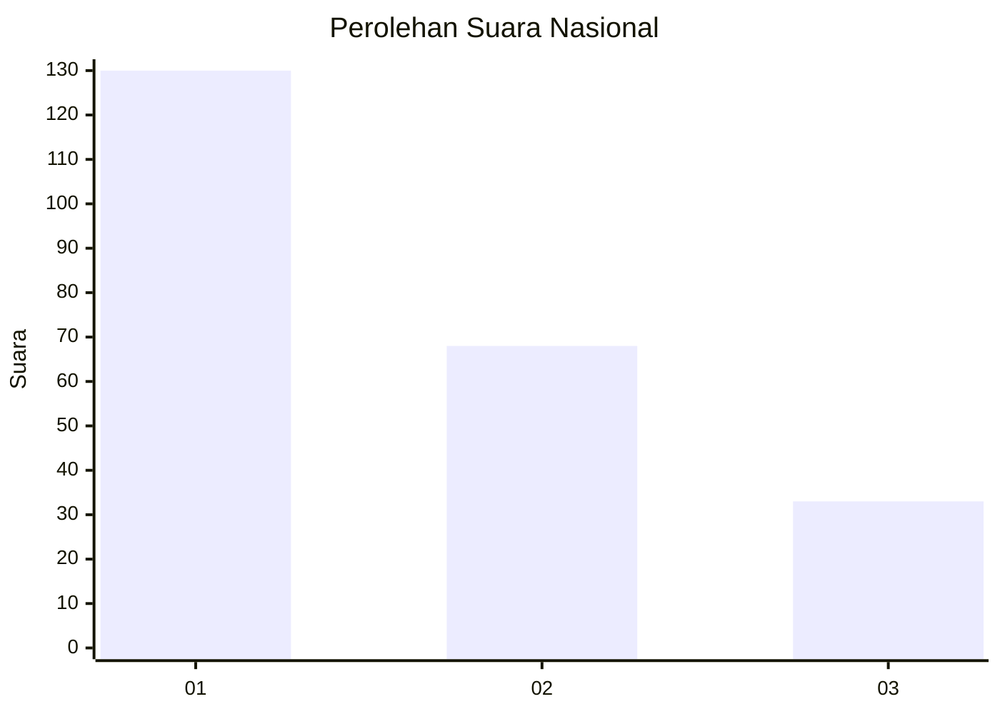
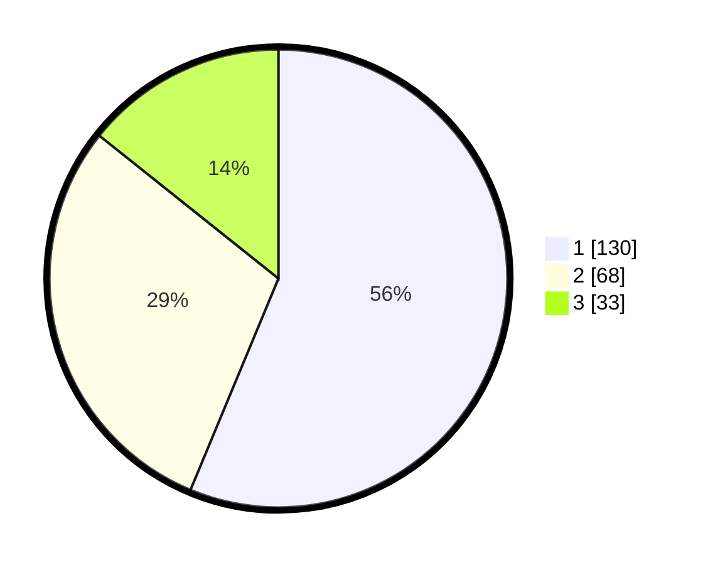

# Hasil

## Grafik

## Tabel

| No.    | Nama Paslon    | Suara | Suara (raw) | Persentase |
|:------ |:-------------- | -----:| -----------:| ----------:|
| 100025 | ANIES MUHAIMIN | 130   | [130][p-1]  | 56,28      |
| 100026 | PRABOWO GIBRAN | 68    | [68][p-2]   | 29,44      |
| 100027 | GANJAR MAHFUD  | 33    | [33][p-3]   | 14,29      |

[p-1]: https://github.com/gigit-pemilu/pemilu-2024/blob/main/pilpres/hitung-suara/sub/31-dki-jakarta/sub/74-jakarta-selatan/sub/04-pasar-minggu/sub/1007-kebagusan/sub/073-tps/sub/paslon-1.txt
[p-2]: https://github.com/gigit-pemilu/pemilu-2024/blob/main/pilpres/hitung-suara/sub/31-dki-jakarta/sub/74-jakarta-selatan/sub/04-pasar-minggu/sub/1007-kebagusan/sub/073-tps/sub/paslon-2.txt
[p-3]: https://github.com/gigit-pemilu/pemilu-2024/blob/main/pilpres/hitung-suara/sub/31-dki-jakarta/sub/74-jakarta-selatan/sub/04-pasar-minggu/sub/1007-kebagusan/sub/073-tps/sub/paslon-3.txt

## Foto C Plano

https://sirekap-obj-formc.kpu.go.id/4d5e/pemilu/ppwp/31/74/04/10/07/3174041007073-20240214-232307--680723ac-a559-45a0-b901-afb477d15ff6.jpg

https://sirekap-obj-formc.kpu.go.id/4d5e/pemilu/ppwp/31/74/04/10/07/3174041007073-20240214-232552--c4792f7e-a31c-4a5c-b277-ee43c17b3d92.jpg

https://sirekap-obj-formc.kpu.go.id/4d5e/pemilu/ppwp/31/74/04/10/07/3174041007073-20240214-232725--13d7b24d-3f57-419b-a48f-c931b068c215.jpg

## Metadata

| Key        | Value               |
| ---------- | ------------------- |
| Time Stamp | 2024-02-26 18:00:00 |

