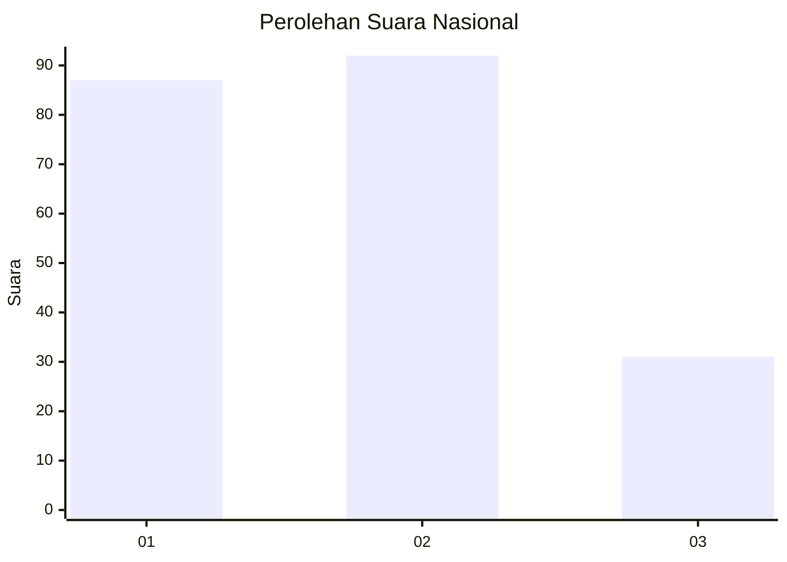
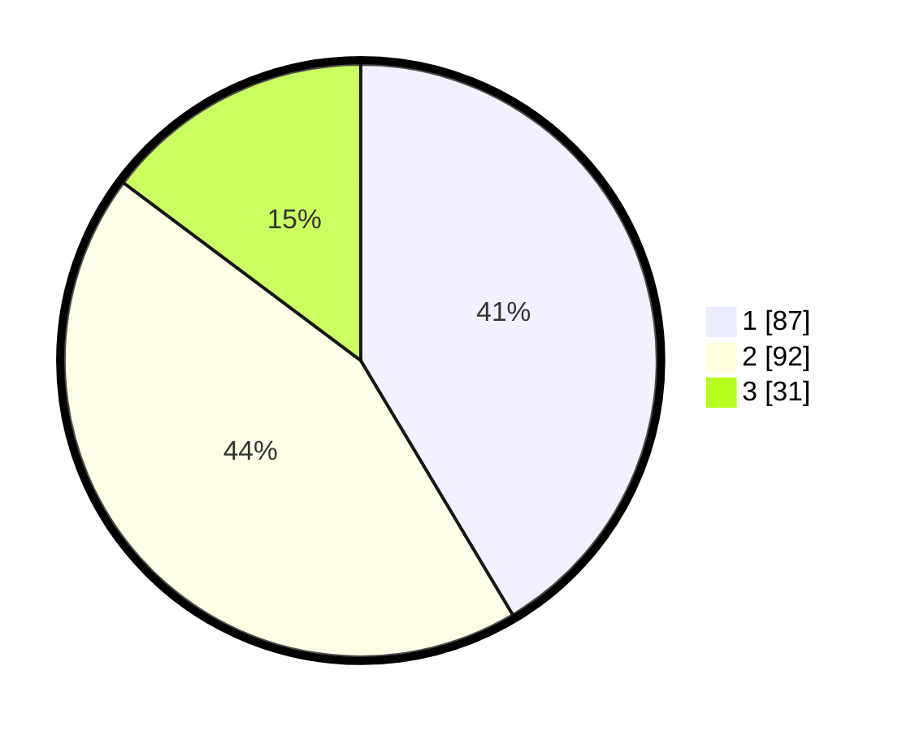

# Hasil

## Grafik

## Tabel

| No.    | Nama Paslon    | Suara | Suara (raw) | Persentase |
|:------ |:-------------- | -----:| -----------:| ----------:|
| 100025 | ANIES MUHAIMIN | 87    | [87][p-1]   | 41,43      |
| 100026 | PRABOWO GIBRAN | 92    | [92][p-2]   | 43,81      |
| 100027 | GANJAR MAHFUD  | 31    | [31][p-3]   | 14,76      |

[p-1]: https://github.com/gigit-pemilu/pemilu-2024/blob/main/pilpres/hitung-suara/sub/31-dki-jakarta/sub/74-jakarta-selatan/sub/04-pasar-minggu/sub/1007-kebagusan/sub/082-tps/sub/paslon-1.txt
[p-2]: https://github.com/gigit-pemilu/pemilu-2024/blob/main/pilpres/hitung-suara/sub/31-dki-jakarta/sub/74-jakarta-selatan/sub/04-pasar-minggu/sub/1007-kebagusan/sub/082-tps/sub/paslon-2.txt
[p-3]: https://github.com/gigit-pemilu/pemilu-2024/blob/main/pilpres/hitung-suara/sub/31-dki-jakarta/sub/74-jakarta-selatan/sub/04-pasar-minggu/sub/1007-kebagusan/sub/082-tps/sub/paslon-3.txt

## Foto C Plano

https://sirekap-obj-formc.kpu.go.id/4047/pemilu/ppwp/31/74/04/10/07/3174041007082-20240214-200925--772f9bf6-e7f3-4e20-8fad-d2a6762a2436.jpg

https://sirekap-obj-formc.kpu.go.id/4047/pemilu/ppwp/31/74/04/10/07/3174041007082-20240214-200958--7e44e96f-ce97-4b2f-ad7b-e249178d7b09.jpg

https://sirekap-obj-formc.kpu.go.id/4047/pemilu/ppwp/31/74/04/10/07/3174041007082-20240214-201030--3fb5f0f2-69c5-471a-acb8-44ac53e51f52.jpg

## Metadata

| Key        | Value               |
| ---------- | ------------------- |
| Time Stamp | 2024-02-24 22:31:28 |

