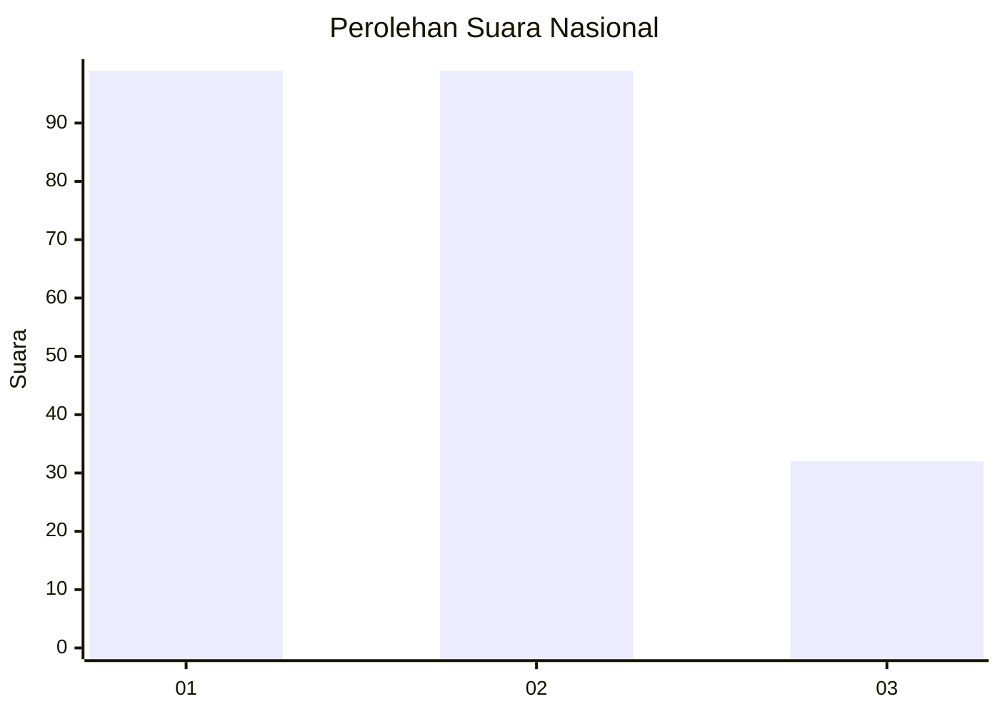
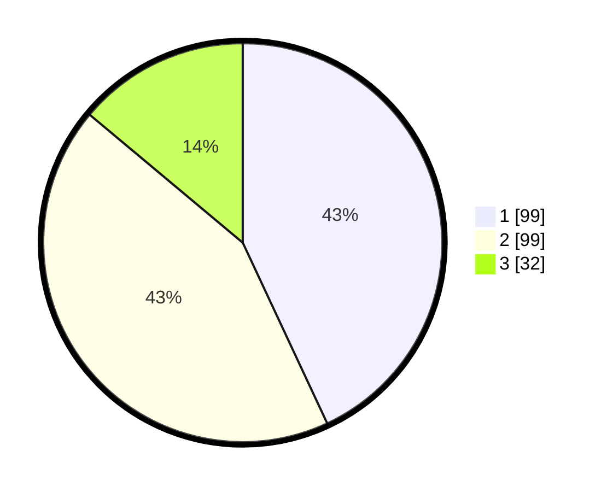

# Hasil

## Grafik

## Tabel

| No.    | Nama Paslon    | Suara | Suara (raw) | Persentase |
|:------ |:-------------- | -----:| -----------:| ----------:|
| 100025 | ANIES MUHAIMIN | 99    | [99][p-1]   | 43,04      |
| 100026 | PRABOWO GIBRAN | 99    | [99][p-2]   | 43,04      |
| 100027 | GANJAR MAHFUD  | 32    | [32][p-3]   | 13,91      |

[p-1]: https://github.com/gigit-pemilu/pemilu-2024/blob/main/pilpres/hitung-suara/sub/31-dki-jakarta/sub/74-jakarta-selatan/sub/04-pasar-minggu/sub/1007-kebagusan/sub/086-tps/sub/paslon-1.txt
[p-2]: https://github.com/gigit-pemilu/pemilu-2024/blob/main/pilpres/hitung-suara/sub/31-dki-jakarta/sub/74-jakarta-selatan/sub/04-pasar-minggu/sub/1007-kebagusan/sub/086-tps/sub/paslon-2.txt
[p-3]: https://github.com/gigit-pemilu/pemilu-2024/blob/main/pilpres/hitung-suara/sub/31-dki-jakarta/sub/74-jakarta-selatan/sub/04-pasar-minggu/sub/1007-kebagusan/sub/086-tps/sub/paslon-3.txt

## Foto C Plano

https://sirekap-obj-formc.kpu.go.id/e142/pemilu/ppwp/31/74/04/10/07/3174041007086-20240214-222012--626c1927-2dc6-4f4f-952c-301c7cbfb2d1.jpg

https://sirekap-obj-formc.kpu.go.id/e142/pemilu/ppwp/31/74/04/10/07/3174041007086-20240214-222108--6a9803aa-4a19-4ff5-9ba2-797ec3895650.jpg

https://sirekap-obj-formc.kpu.go.id/e142/pemilu/ppwp/31/74/04/10/07/3174041007086-20240214-222210--e3bec6a0-b2bd-49f7-864d-9832780d441c.jpg

## Metadata

| Key        | Value               |
| ---------- | ------------------- |
| Time Stamp | 2024-02-25 10:00:00 |

