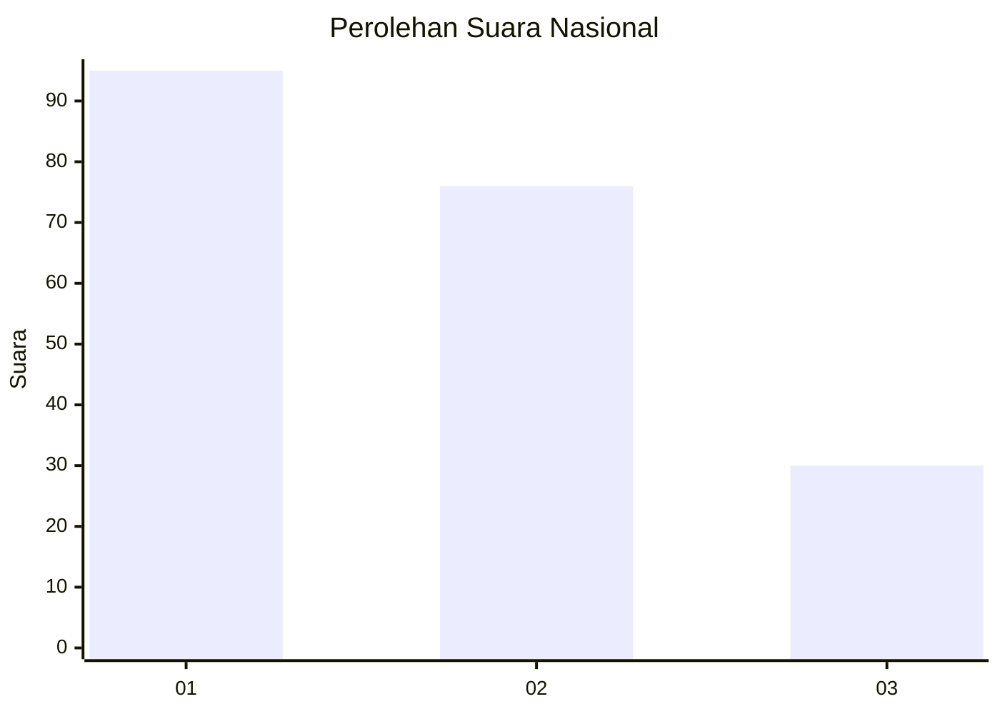
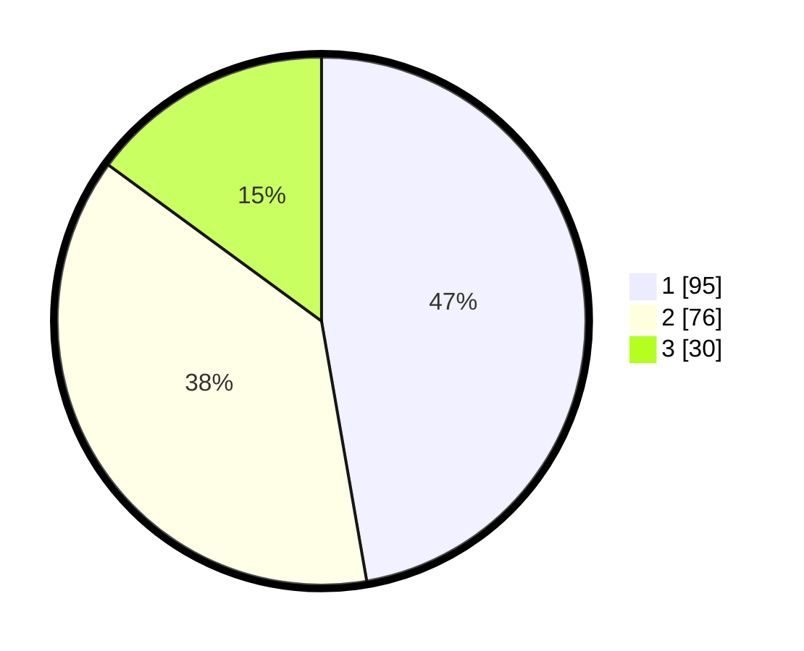

# Hasil

## Grafik

## Tabel

| No.    | Nama Paslon    | Suara | Suara (raw) | Persentase |
|:------ |:-------------- | -----:| -----------:| ----------:|
| 100025 | ANIES MUHAIMIN | 95    | [95][p-1]   | 47,26      |
| 100026 | PRABOWO GIBRAN | 76    | [76][p-2]   | 37,81      |
| 100027 | GANJAR MAHFUD  | 30    | [30][p-3]   | 14,93      |

[p-1]: https://github.com/gigit-pemilu/pemilu-2024/blob/main/pilpres/hitung-suara/sub/31-dki-jakarta/sub/74-jakarta-selatan/sub/04-pasar-minggu/sub/1007-kebagusan/sub/099-tps/sub/paslon-1.txt
[p-2]: https://github.com/gigit-pemilu/pemilu-2024/blob/main/pilpres/hitung-suara/sub/31-dki-jakarta/sub/74-jakarta-selatan/sub/04-pasar-minggu/sub/1007-kebagusan/sub/099-tps/sub/paslon-2.txt
[p-3]: https://github.com/gigit-pemilu/pemilu-2024/blob/main/pilpres/hitung-suara/sub/31-dki-jakarta/sub/74-jakarta-selatan/sub/04-pasar-minggu/sub/1007-kebagusan/sub/099-tps/sub/paslon-3.txt

## Foto C Plano

https://sirekap-obj-formc.kpu.go.id/8bd6/pemilu/ppwp/31/74/04/10/07/3174041007099-20240214-215608--24ceec2f-9be7-45b6-9baf-cea676051a17.jpg

https://sirekap-obj-formc.kpu.go.id/8bd6/pemilu/ppwp/31/74/04/10/07/3174041007099-20240214-214843--d4c5da1b-ef7f-4107-8429-f245740edddb.jpg

https://sirekap-obj-formc.kpu.go.id/8bd6/pemilu/ppwp/31/74/04/10/07/3174041007099-20240214-215013--5c518bd0-0c81-4cb7-be98-6e44db250289.jpg

## Metadata

| Key        | Value               |
| ---------- | ------------------- |
| Time Stamp | 2024-02-25 18:00:00 |

