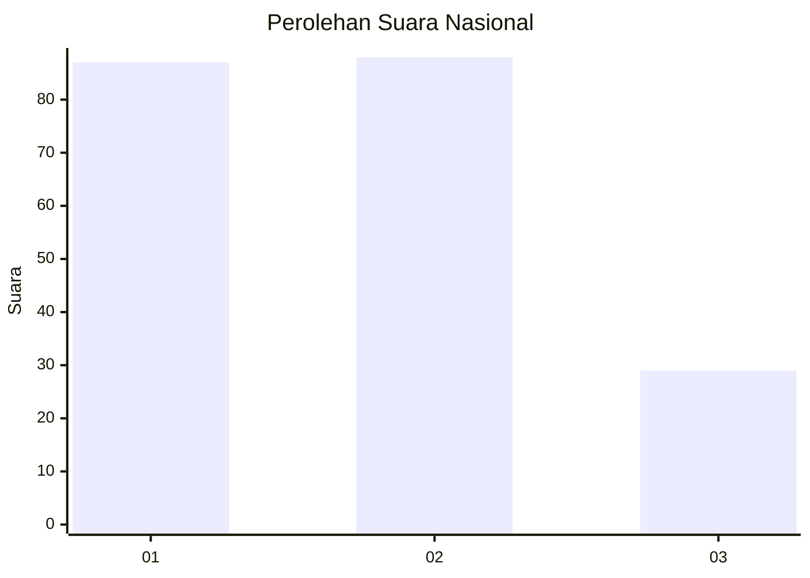
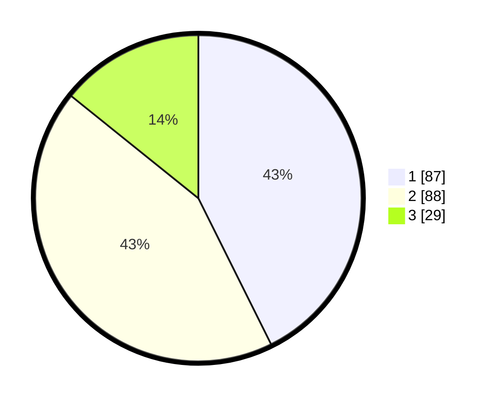

# Hasil

## Grafik

## Tabel

| No.    | Nama Paslon    | Suara | Suara (raw) | Persentase |
|:------ |:-------------- | -----:| -----------:| ----------:|
| 100025 | ANIES MUHAIMIN | 87    | [87][p-1]   | 42,65      |
| 100026 | PRABOWO GIBRAN | 88    | [88][p-2]   | 43,14      |
| 100027 | GANJAR MAHFUD  | 29    | [29][p-3]   | 14,22      |

[p-1]: https://github.com/gigit-pemilu/pemilu-2024/blob/main/pilpres/hitung-suara/sub/31-dki-jakarta/sub/74-jakarta-selatan/sub/04-pasar-minggu/sub/1007-kebagusan/sub/101-tps/sub/paslon-1.txt
[p-2]: https://github.com/gigit-pemilu/pemilu-2024/blob/main/pilpres/hitung-suara/sub/31-dki-jakarta/sub/74-jakarta-selatan/sub/04-pasar-minggu/sub/1007-kebagusan/sub/101-tps/sub/paslon-2.txt
[p-3]: https://github.com/gigit-pemilu/pemilu-2024/blob/main/pilpres/hitung-suara/sub/31-dki-jakarta/sub/74-jakarta-selatan/sub/04-pasar-minggu/sub/1007-kebagusan/sub/101-tps/sub/paslon-3.txt

## Foto C Plano

https://sirekap-obj-formc.kpu.go.id/d486/pemilu/ppwp/31/74/04/10/07/3174041007101-20240214-225729--d43d5c60-54f8-46af-81a0-c07150b2615d.jpg

https://sirekap-obj-formc.kpu.go.id/d486/pemilu/ppwp/31/74/04/10/07/3174041007101-20240214-225759--7e4842c2-fe76-436d-aa27-e0a8505f2e5c.jpg

https://sirekap-obj-formc.kpu.go.id/d486/pemilu/ppwp/31/74/04/10/07/3174041007101-20240214-225816--31c577c6-d02e-4c0e-b74e-c71cf0bce191.jpg

## Metadata

| Key        | Value               |
| ---------- | ------------------- |
| Time Stamp | 2024-02-25 12:00:00 |

