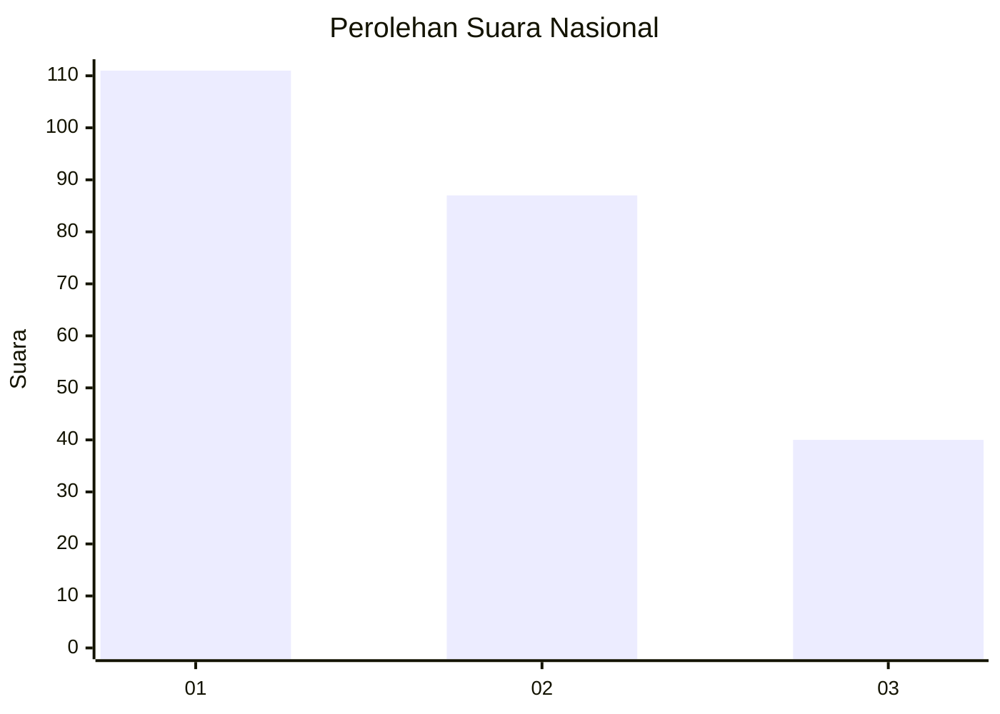
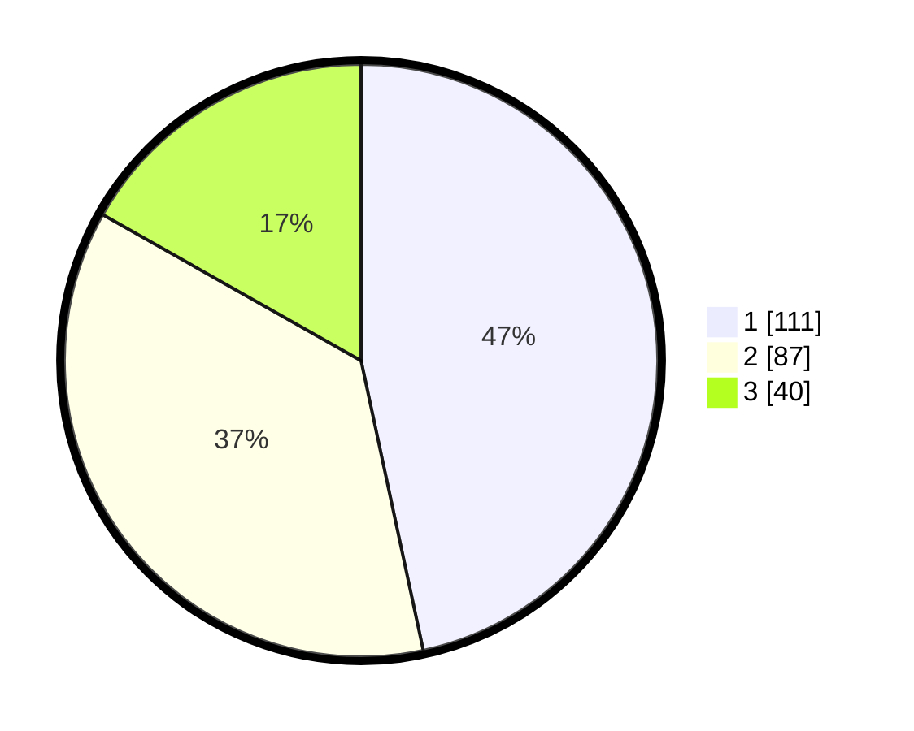

# Hasil

## Grafik

## Tabel

| No.    | Nama Paslon    | Suara | Suara (raw) | Persentase |
|:------ |:-------------- | -----:| -----------:| ----------:|
| 100025 | ANIES MUHAIMIN | 111   | [111][p-1]  | 46,64      |
| 100026 | PRABOWO GIBRAN | 87    | [87][p-2]   | 36,55      |
| 100027 | GANJAR MAHFUD  | 40    | [40][p-3]   | 16,81      |

[p-1]: https://github.com/gigit-pemilu/pemilu-2024/blob/main/pilpres/hitung-suara/sub/31-dki-jakarta/sub/74-jakarta-selatan/sub/04-pasar-minggu/sub/1007-kebagusan/sub/129-tps/sub/paslon-1.txt
[p-2]: https://github.com/gigit-pemilu/pemilu-2024/blob/main/pilpres/hitung-suara/sub/31-dki-jakarta/sub/74-jakarta-selatan/sub/04-pasar-minggu/sub/1007-kebagusan/sub/129-tps/sub/paslon-2.txt
[p-3]: https://github.com/gigit-pemilu/pemilu-2024/blob/main/pilpres/hitung-suara/sub/31-dki-jakarta/sub/74-jakarta-selatan/sub/04-pasar-minggu/sub/1007-kebagusan/sub/129-tps/sub/paslon-3.txt

## Foto C Plano

https://sirekap-obj-formc.kpu.go.id/10c5/pemilu/ppwp/31/74/04/10/07/3174041007129-20240215-003421--338f6459-1550-4f22-868d-3dfa0a941686.jpg

https://sirekap-obj-formc.kpu.go.id/10c5/pemilu/ppwp/31/74/04/10/07/3174041007129-20240215-003541--f35c75dd-c9dd-457e-bc7c-1d3b69637683.jpg

https://sirekap-obj-formc.kpu.go.id/10c5/pemilu/ppwp/31/74/04/10/07/3174041007129-20240215-003829--58c609c7-391a-4031-b974-2bb9fa51fd04.jpg

## Metadata

| Key        | Value               |
| ---------- | ------------------- |
| Time Stamp | 2024-02-25 11:00:00 |

