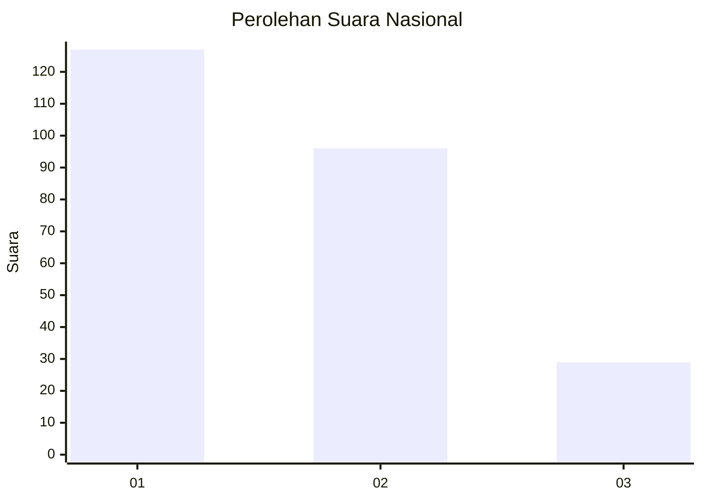
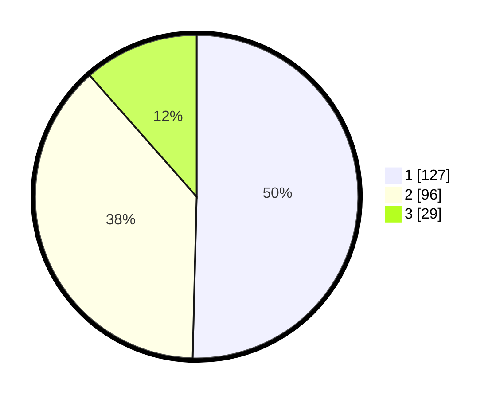

# Hasil

## Grafik

## Tabel

| No.    | Nama Paslon    | Suara | Suara (raw) | Persentase |
|:------ |:-------------- | -----:| -----------:| ----------:|
| 100025 | ANIES MUHAIMIN | 127   | [127][p-1]  | 50,40      |
| 100026 | PRABOWO GIBRAN | 96    | [96][p-2]   | 38,10      |
| 100027 | GANJAR MAHFUD  | 29    | [29][p-3]   | 11,51      |

[p-1]: https://github.com/gigit-pemilu/pemilu-2024/blob/main/pilpres/hitung-suara/sub/31-dki-jakarta/sub/74-jakarta-selatan/sub/04-pasar-minggu/sub/1007-kebagusan/sub/138-tps/sub/paslon-1.txt
[p-2]: https://github.com/gigit-pemilu/pemilu-2024/blob/main/pilpres/hitung-suara/sub/31-dki-jakarta/sub/74-jakarta-selatan/sub/04-pasar-minggu/sub/1007-kebagusan/sub/138-tps/sub/paslon-2.txt
[p-3]: https://github.com/gigit-pemilu/pemilu-2024/blob/main/pilpres/hitung-suara/sub/31-dki-jakarta/sub/74-jakarta-selatan/sub/04-pasar-minggu/sub/1007-kebagusan/sub/138-tps/sub/paslon-3.txt

## Foto C Plano

https://sirekap-obj-formc.kpu.go.id/04c7/pemilu/ppwp/31/74/04/10/07/3174041007138-20240215-002857--3a20c8a6-d1df-47f5-9029-88dde9775dcb.jpg

https://sirekap-obj-formc.kpu.go.id/04c7/pemilu/ppwp/31/74/04/10/07/3174041007138-20240215-002942--12de4379-ee62-44d5-a65a-c97319a1dc8e.jpg

https://sirekap-obj-formc.kpu.go.id/04c7/pemilu/ppwp/31/74/04/10/07/3174041007138-20240215-003035--ff32be74-c49b-46a1-9d53-c5c39e4065e9.jpg

## Metadata

| Key        | Value               |
| ---------- | ------------------- |
| Time Stamp | 2024-02-24 22:31:28 |

