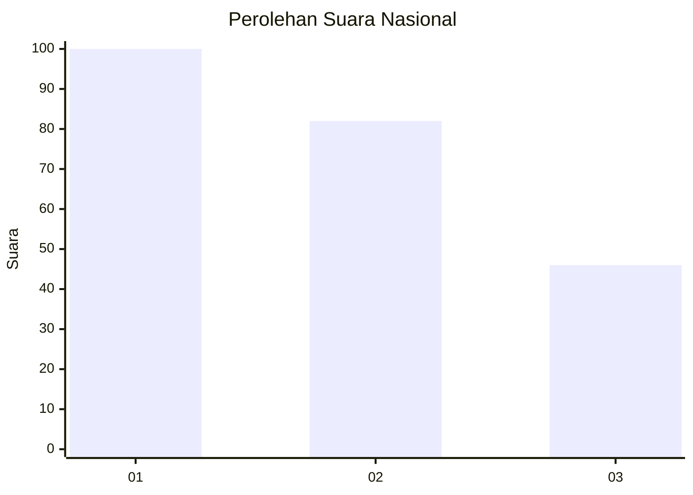
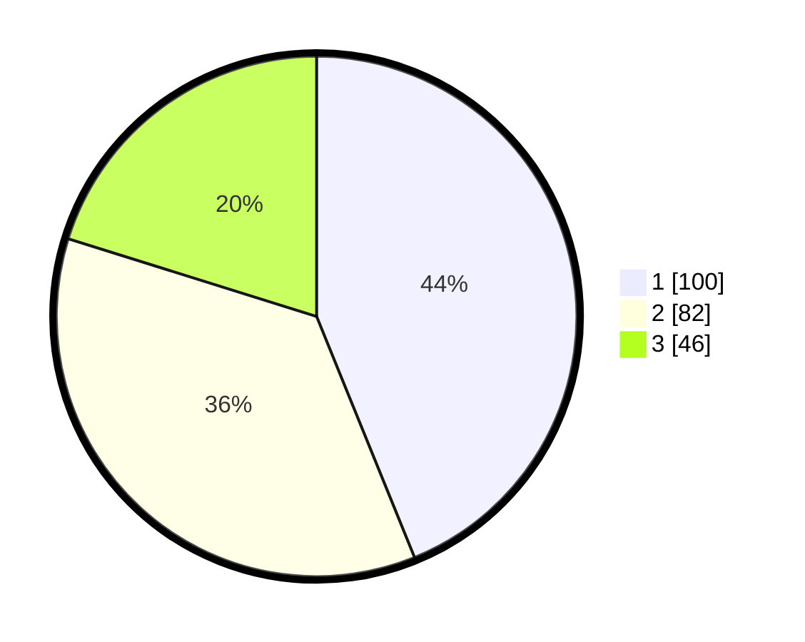

# Hasil

## Grafik

## Tabel

| No.    | Nama Paslon    | Suara | Suara (raw) | Persentase |
|:------ |:-------------- | -----:| -----------:| ----------:|
| 100025 | ANIES MUHAIMIN | 100   | [100][p-1]  | 43,86      |
| 100026 | PRABOWO GIBRAN | 82    | [82][p-2]   | 35,96      |
| 100027 | GANJAR MAHFUD  | 46    | [46][p-3]   | 20,18      |

[p-1]: https://github.com/gigit-pemilu/pemilu-2024/blob/main/pilpres/hitung-suara/sub/31-dki-jakarta/sub/74-jakarta-selatan/sub/04-pasar-minggu/sub/1007-kebagusan/sub/144-tps/sub/paslon-1.txt
[p-2]: https://github.com/gigit-pemilu/pemilu-2024/blob/main/pilpres/hitung-suara/sub/31-dki-jakarta/sub/74-jakarta-selatan/sub/04-pasar-minggu/sub/1007-kebagusan/sub/144-tps/sub/paslon-2.txt
[p-3]: https://github.com/gigit-pemilu/pemilu-2024/blob/main/pilpres/hitung-suara/sub/31-dki-jakarta/sub/74-jakarta-selatan/sub/04-pasar-minggu/sub/1007-kebagusan/sub/144-tps/sub/paslon-3.txt

## Foto C Plano

https://sirekap-obj-formc.kpu.go.id/9de7/pemilu/ppwp/31/74/04/10/07/3174041007144-20240214-224902--f2d52301-a855-4c6f-a2e3-0921cfed5d32.jpg

https://sirekap-obj-formc.kpu.go.id/9de7/pemilu/ppwp/31/74/04/10/07/3174041007144-20240214-225005--23df37e3-1202-48d2-b730-693d150cdb0b.jpg

https://sirekap-obj-formc.kpu.go.id/9de7/pemilu/ppwp/31/74/04/10/07/3174041007144-20240214-225159--8a5a78fb-c26b-43f4-b71a-002e0444cc09.jpg

## Metadata

| Key        | Value               |
| ---------- | ------------------- |
| Time Stamp | 2024-02-25 12:00:00 |

