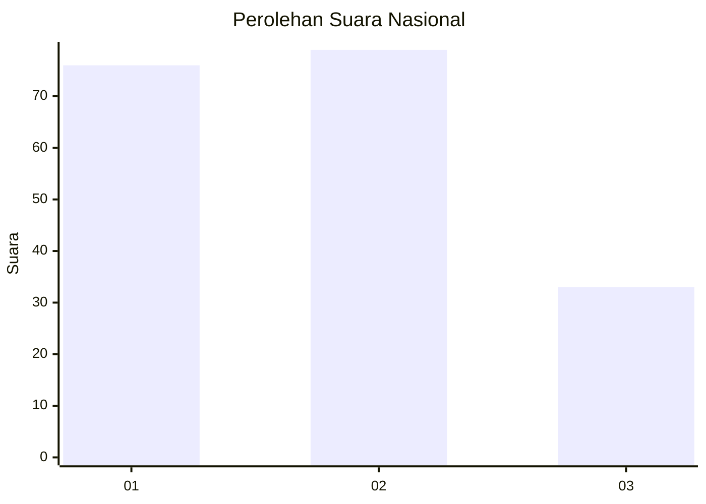
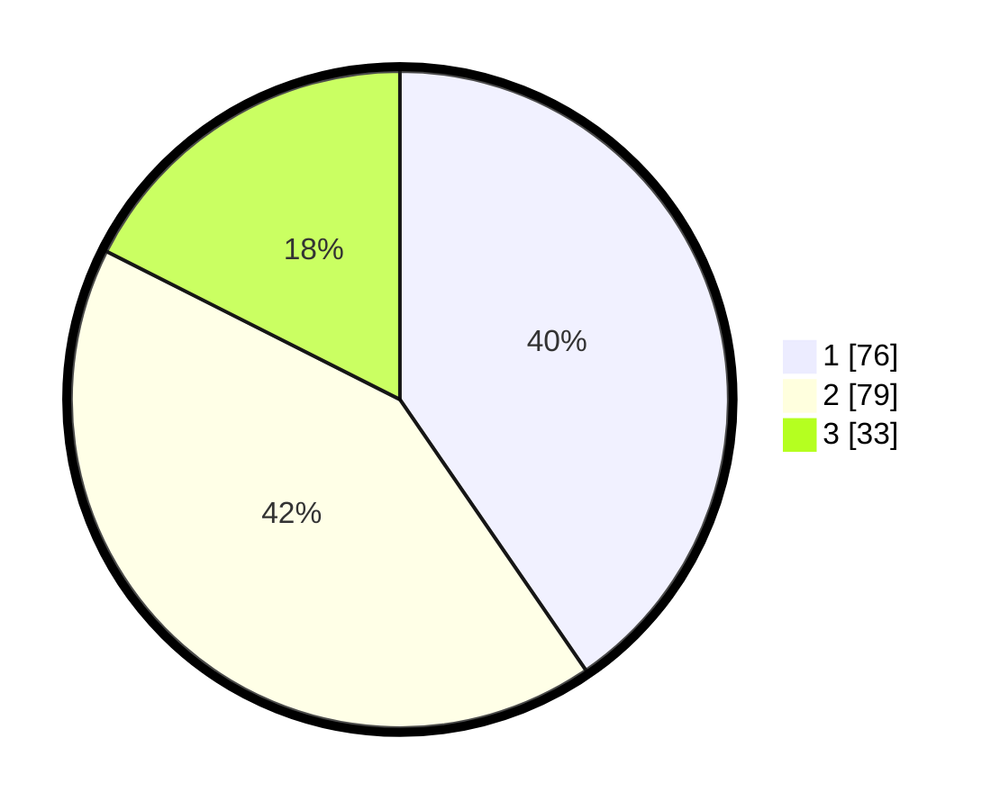

# Hasil

## Grafik

## Tabel

| No.    | Nama Paslon    | Suara | Suara (raw) | Persentase |
|:------ |:-------------- | -----:| -----------:| ----------:|
| 100025 | ANIES MUHAIMIN | 76    | [76][p-1]   | 40,43      |
| 100026 | PRABOWO GIBRAN | 79    | [79][p-2]   | 42,02      |
| 100027 | GANJAR MAHFUD  | 33    | [33][p-3]   | 17,55      |

[p-1]: https://github.com/gigit-pemilu/pemilu-2024/blob/main/pilpres/hitung-suara/sub/31-dki-jakarta/sub/74-jakarta-selatan/sub/05-kebayoran-lama/sub/1001-kebayoran-lama-utara/sub/002-tps/sub/paslon-1.txt
[p-2]: https://github.com/gigit-pemilu/pemilu-2024/blob/main/pilpres/hitung-suara/sub/31-dki-jakarta/sub/74-jakarta-selatan/sub/05-kebayoran-lama/sub/1001-kebayoran-lama-utara/sub/002-tps/sub/paslon-2.txt
[p-3]: https://github.com/gigit-pemilu/pemilu-2024/blob/main/pilpres/hitung-suara/sub/31-dki-jakarta/sub/74-jakarta-selatan/sub/05-kebayoran-lama/sub/1001-kebayoran-lama-utara/sub/002-tps/sub/paslon-3.txt

## Foto C Plano

https://sirekap-obj-formc.kpu.go.id/332e/pemilu/ppwp/31/74/05/10/01/3174051001002-20240218-120503--b2b750b1-0c1b-4851-82e5-6b646f8214c4.jpg

https://sirekap-obj-formc.kpu.go.id/332e/pemilu/ppwp/31/74/05/10/01/3174051001002-20240218-120659--0887ae08-4f75-4cbc-bd29-474e52b0d631.jpg

https://sirekap-obj-formc.kpu.go.id/332e/pemilu/ppwp/31/74/05/10/01/3174051001002-20240218-120748--2ec5b7ae-8204-4f87-a9df-04c21dcecb59.jpg

## Metadata

| Key        | Value               |
| ---------- | ------------------- |
| Time Stamp | 2024-02-24 22:31:28 |

