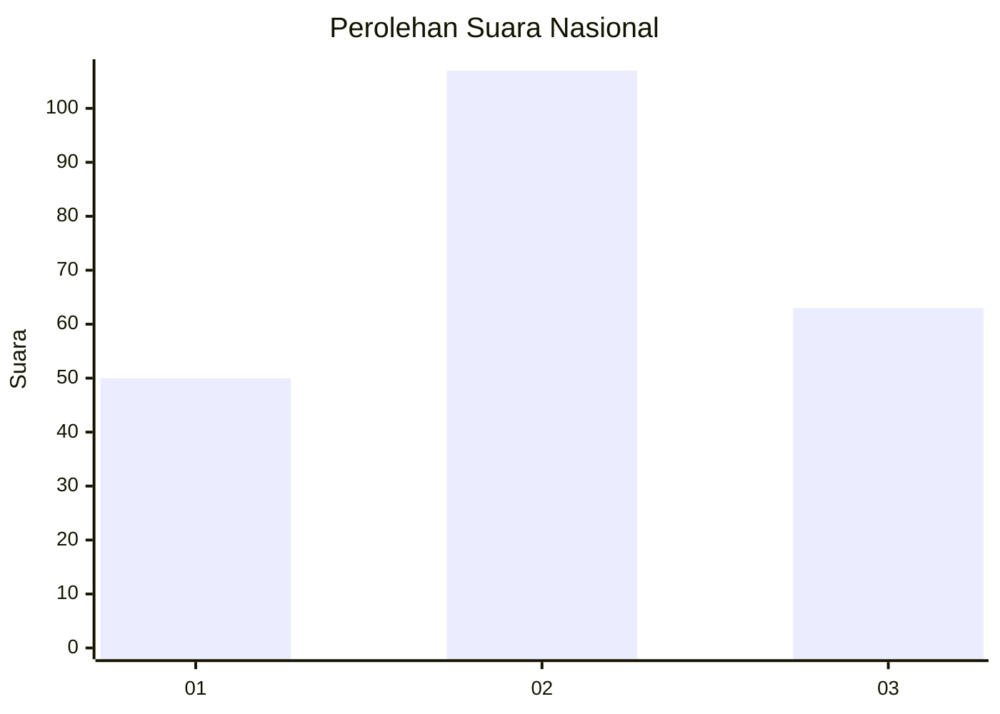
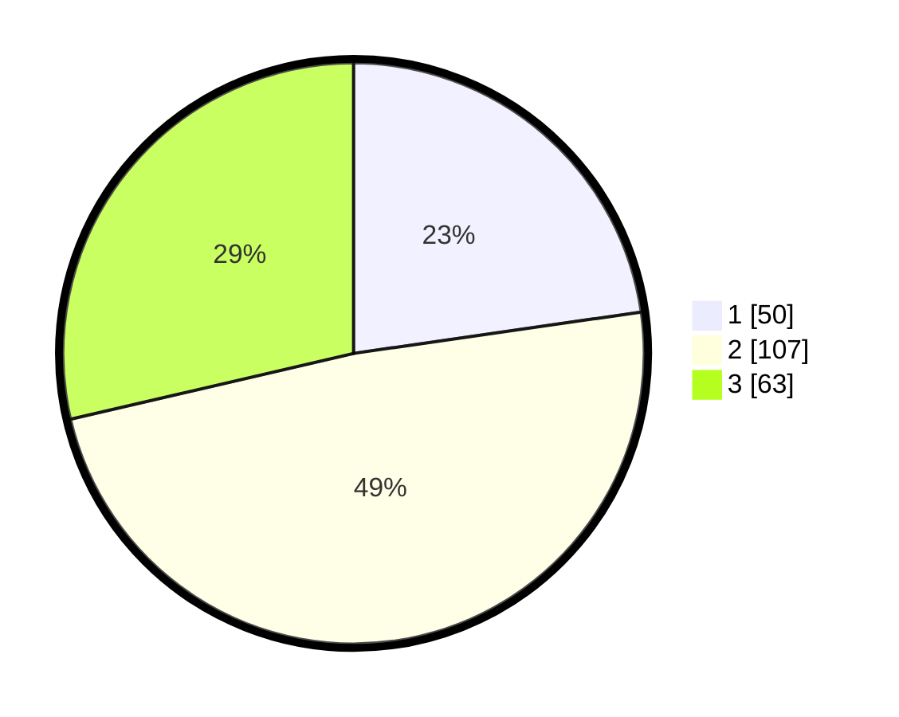

# Hasil

## Grafik

## Tabel

| No.    | Nama Paslon    | Suara | Suara (raw) | Persentase |
|:------ |:-------------- | -----:| -----------:| ----------:|
| 100025 | ANIES MUHAIMIN | 50    | [50][p-1]   | 22,73      |
| 100026 | PRABOWO GIBRAN | 107   | [107][p-2]  | 48,64      |
| 100027 | GANJAR MAHFUD  | 63    | [63][p-3]   | 28,64      |

[p-1]: https://github.com/gigit-pemilu/pemilu-2024/blob/main/pilpres/hitung-suara/sub/31-dki-jakarta/sub/74-jakarta-selatan/sub/05-kebayoran-lama/sub/1001-kebayoran-lama-utara/sub/007-tps/sub/paslon-1.txt
[p-2]: https://github.com/gigit-pemilu/pemilu-2024/blob/main/pilpres/hitung-suara/sub/31-dki-jakarta/sub/74-jakarta-selatan/sub/05-kebayoran-lama/sub/1001-kebayoran-lama-utara/sub/007-tps/sub/paslon-2.txt
[p-3]: https://github.com/gigit-pemilu/pemilu-2024/blob/main/pilpres/hitung-suara/sub/31-dki-jakarta/sub/74-jakarta-selatan/sub/05-kebayoran-lama/sub/1001-kebayoran-lama-utara/sub/007-tps/sub/paslon-3.txt

## Foto C Plano

https://sirekap-obj-formc.kpu.go.id/a231/pemilu/ppwp/31/74/05/10/01/3174051001007-20240214-221454--33d8237e-dcd3-481f-811d-72b99afb55ce.jpg

https://sirekap-obj-formc.kpu.go.id/a231/pemilu/ppwp/31/74/05/10/01/3174051001007-20240214-221721--e6d551ef-9e7b-429d-b1a1-3db9c66a619a.jpg

https://sirekap-obj-formc.kpu.go.id/a231/pemilu/ppwp/31/74/05/10/01/3174051001007-20240214-222137--629cb87a-24cd-4fbb-a4a1-16db56580fc4.jpg

## Metadata

| Key        | Value               |
| ---------- | ------------------- |
| Time Stamp | 2024-02-24 22:31:28 |

