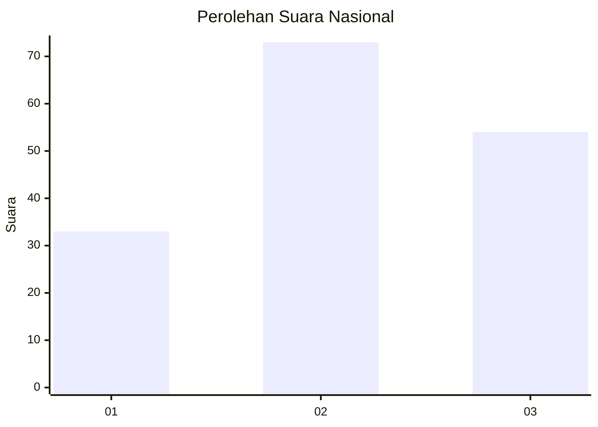
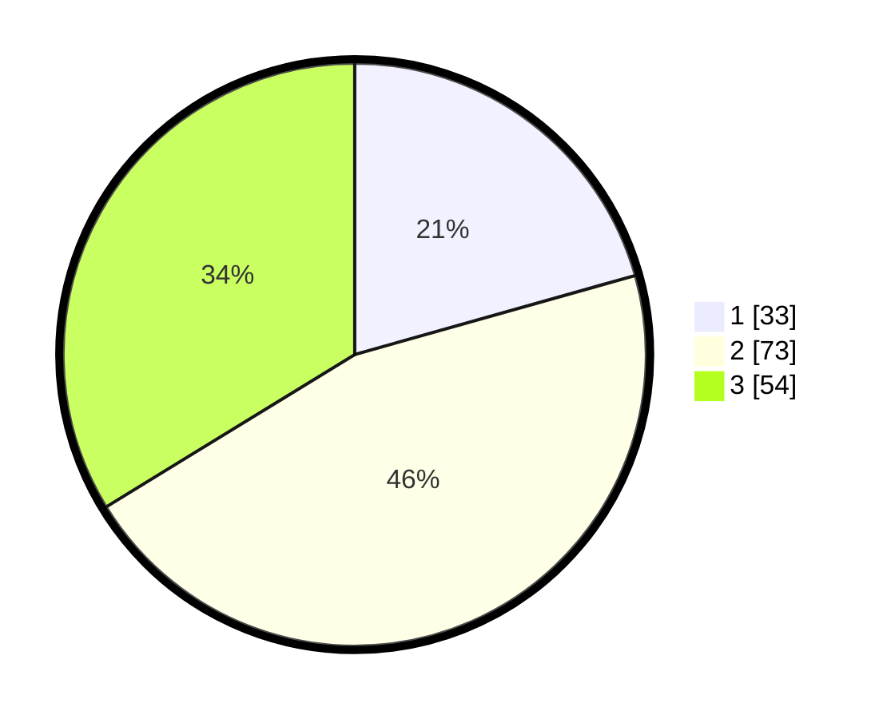

# Hasil

## Grafik

## Tabel

| No.    | Nama Paslon    | Suara | Suara (raw) | Persentase |
|:------ |:-------------- | -----:| -----------:| ----------:|
| 100025 | ANIES MUHAIMIN | 33    | [33][p-1]   | 20,63      |
| 100026 | PRABOWO GIBRAN | 73    | [73][p-2]   | 45,63      |
| 100027 | GANJAR MAHFUD  | 54    | [54][p-3]   | 33,75      |

[p-1]: https://github.com/gigit-pemilu/pemilu-2024/blob/main/pilpres/hitung-suara/sub/31-dki-jakarta/sub/74-jakarta-selatan/sub/05-kebayoran-lama/sub/1001-kebayoran-lama-utara/sub/009-tps/sub/paslon-1.txt
[p-2]: https://github.com/gigit-pemilu/pemilu-2024/blob/main/pilpres/hitung-suara/sub/31-dki-jakarta/sub/74-jakarta-selatan/sub/05-kebayoran-lama/sub/1001-kebayoran-lama-utara/sub/009-tps/sub/paslon-2.txt
[p-3]: https://github.com/gigit-pemilu/pemilu-2024/blob/main/pilpres/hitung-suara/sub/31-dki-jakarta/sub/74-jakarta-selatan/sub/05-kebayoran-lama/sub/1001-kebayoran-lama-utara/sub/009-tps/sub/paslon-3.txt

## Foto C Plano

https://sirekap-obj-formc.kpu.go.id/ea53/pemilu/ppwp/31/74/05/10/01/3174051001009-20240215-060949--9f2a9db2-ad70-4ca4-83e2-302f207d6709.jpg

https://sirekap-obj-formc.kpu.go.id/ea53/pemilu/ppwp/31/74/05/10/01/3174051001009-20240215-010256--76825abb-4183-4ada-addd-59a13d40fc23.jpg

https://sirekap-obj-formc.kpu.go.id/ea53/pemilu/ppwp/31/74/05/10/01/3174051001009-20240215-010412--a4b9dc20-e8cc-4fc8-b079-ed4a64010029.jpg

## Metadata

| Key        | Value               |
| ---------- | ------------------- |
| Time Stamp | 2024-02-24 22:31:28 |

