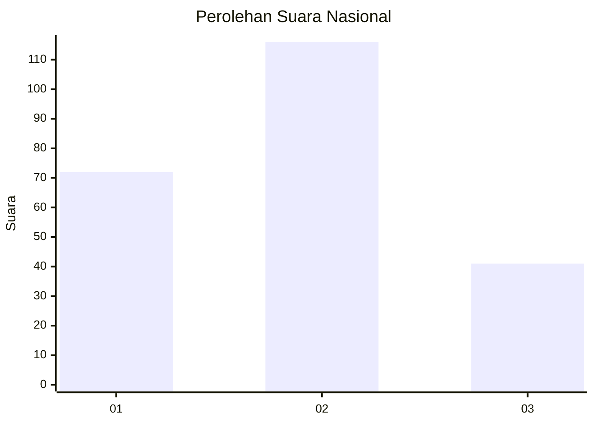
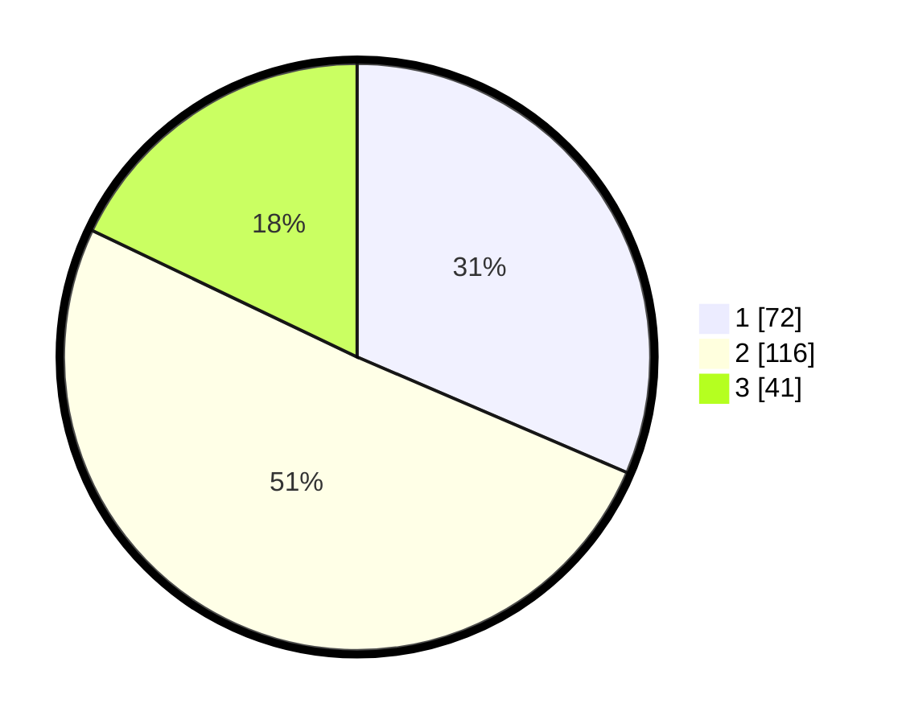

# Hasil

## Grafik

## Tabel

| No.    | Nama Paslon    | Suara | Suara (raw) | Persentase |
|:------ |:-------------- | -----:| -----------:| ----------:|
| 100025 | ANIES MUHAIMIN | 72    | [72][p-1]   | 31,44      |
| 100026 | PRABOWO GIBRAN | 116   | [116][p-2]  | 50,66      |
| 100027 | GANJAR MAHFUD  | 41    | [41][p-3]   | 17,90      |

[p-1]: https://github.com/gigit-pemilu/pemilu-2024/blob/main/pilpres/hitung-suara/sub/31-dki-jakarta/sub/74-jakarta-selatan/sub/05-kebayoran-lama/sub/1001-kebayoran-lama-utara/sub/026-tps/sub/paslon-1.txt
[p-2]: https://github.com/gigit-pemilu/pemilu-2024/blob/main/pilpres/hitung-suara/sub/31-dki-jakarta/sub/74-jakarta-selatan/sub/05-kebayoran-lama/sub/1001-kebayoran-lama-utara/sub/026-tps/sub/paslon-2.txt
[p-3]: https://github.com/gigit-pemilu/pemilu-2024/blob/main/pilpres/hitung-suara/sub/31-dki-jakarta/sub/74-jakarta-selatan/sub/05-kebayoran-lama/sub/1001-kebayoran-lama-utara/sub/026-tps/sub/paslon-3.txt

## Foto C Plano

https://sirekap-obj-formc.kpu.go.id/4dce/pemilu/ppwp/31/74/05/10/01/3174051001026-20240214-224038--026fba5a-9436-4d9a-b58e-117fc74ee307.jpg

https://sirekap-obj-formc.kpu.go.id/4dce/pemilu/ppwp/31/74/05/10/01/3174051001026-20240214-213633--81dd3c17-c1a2-43f8-a5cb-a243ff687b26.jpg

https://sirekap-obj-formc.kpu.go.id/4dce/pemilu/ppwp/31/74/05/10/01/3174051001026-20240214-213935--622a5384-9d14-4273-909d-81b706d10387.jpg

## Metadata

| Key        | Value               |
| ---------- | ------------------- |
| Time Stamp | 2024-02-25 15:00:00 |

