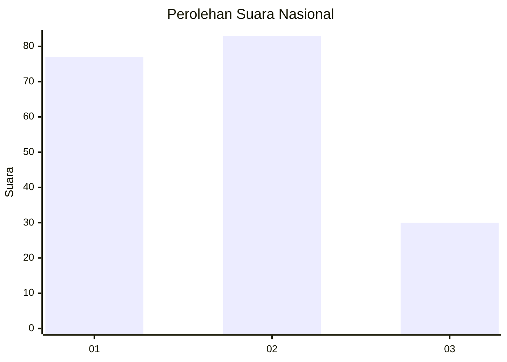
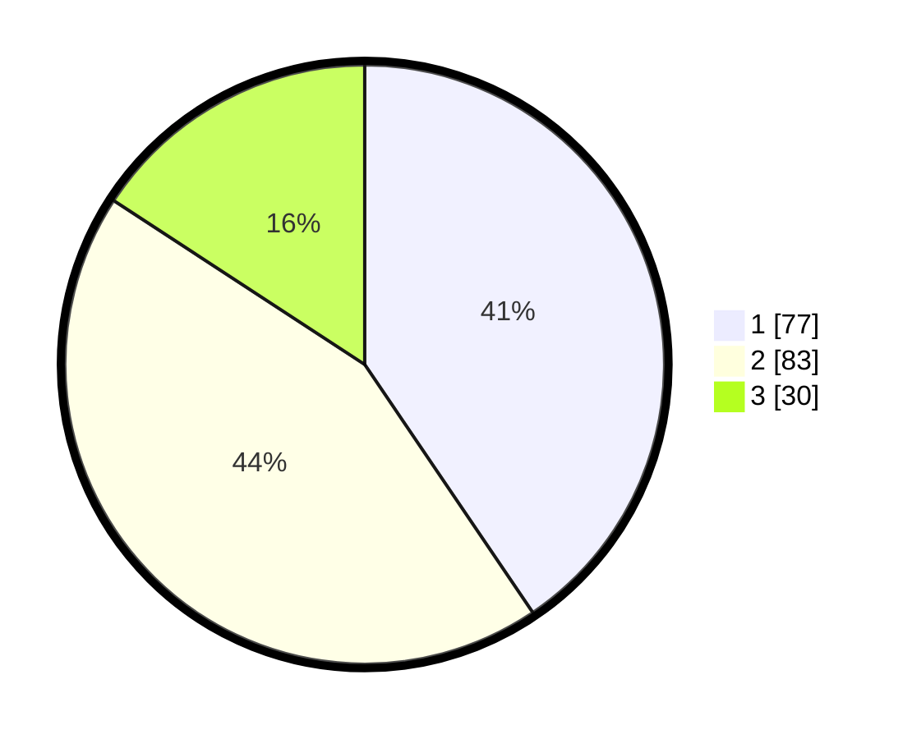

# Hasil

## Grafik

## Tabel

| No.    | Nama Paslon    | Suara | Suara (raw) | Persentase |
|:------ |:-------------- | -----:| -----------:| ----------:|
| 100025 | ANIES MUHAIMIN | 77    | [77][p-1]   | 40,53      |
| 100026 | PRABOWO GIBRAN | 83    | [83][p-2]   | 43,68      |
| 100027 | GANJAR MAHFUD  | 30    | [30][p-3]   | 15,79      |

[p-1]: https://github.com/gigit-pemilu/pemilu-2024/blob/main/pilpres/hitung-suara/sub/31-dki-jakarta/sub/74-jakarta-selatan/sub/05-kebayoran-lama/sub/1001-kebayoran-lama-utara/sub/030-tps/sub/paslon-1.txt
[p-2]: https://github.com/gigit-pemilu/pemilu-2024/blob/main/pilpres/hitung-suara/sub/31-dki-jakarta/sub/74-jakarta-selatan/sub/05-kebayoran-lama/sub/1001-kebayoran-lama-utara/sub/030-tps/sub/paslon-2.txt
[p-3]: https://github.com/gigit-pemilu/pemilu-2024/blob/main/pilpres/hitung-suara/sub/31-dki-jakarta/sub/74-jakarta-selatan/sub/05-kebayoran-lama/sub/1001-kebayoran-lama-utara/sub/030-tps/sub/paslon-3.txt

## Foto C Plano

https://sirekap-obj-formc.kpu.go.id/a9a1/pemilu/ppwp/31/74/05/10/01/3174051001030-20240215-004126--66799966-ae0f-4336-ba40-1a0ac4a3bc60.jpg

https://sirekap-obj-formc.kpu.go.id/a9a1/pemilu/ppwp/31/74/05/10/01/3174051001030-20240215-004156--4390cbfe-f500-495b-8365-c36351b84c06.jpg

https://sirekap-obj-formc.kpu.go.id/a9a1/pemilu/ppwp/31/74/05/10/01/3174051001030-20240215-004239--e94733a1-8a48-4188-9dba-f38a3d89f807.jpg

## Metadata

| Key        | Value               |
| ---------- | ------------------- |
| Time Stamp | 2024-02-24 22:31:28 |

