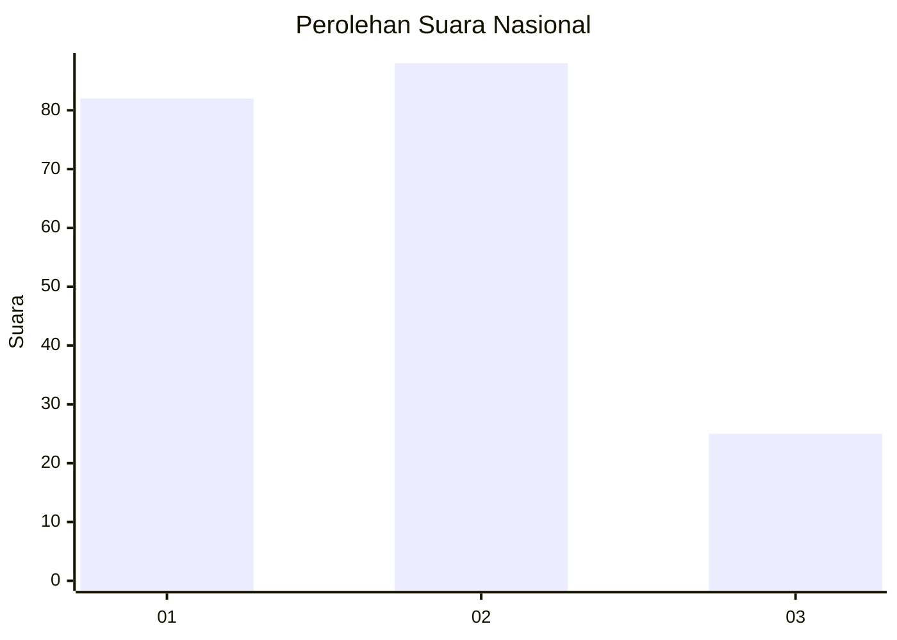
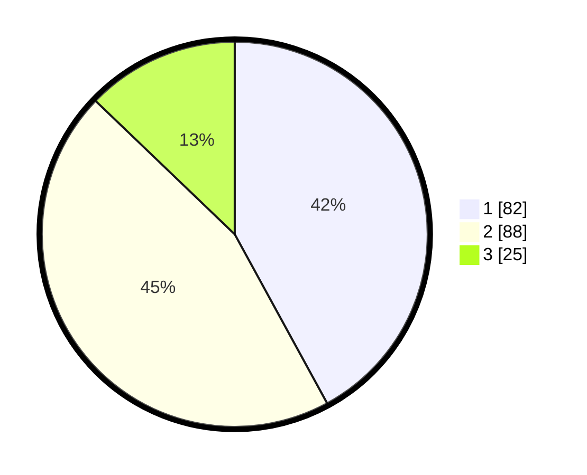

# Hasil

## Grafik

## Tabel

| No.    | Nama Paslon    | Suara | Suara (raw) | Persentase |
|:------ |:-------------- | -----:| -----------:| ----------:|
| 100025 | ANIES MUHAIMIN | 82    | [82][p-1]   | 42,05      |
| 100026 | PRABOWO GIBRAN | 88    | [88][p-2]   | 45,13      |
| 100027 | GANJAR MAHFUD  | 25    | [25][p-3]   | 12,82      |

[p-1]: https://github.com/gigit-pemilu/pemilu-2024/blob/main/pilpres/hitung-suara/sub/31-dki-jakarta/sub/74-jakarta-selatan/sub/05-kebayoran-lama/sub/1001-kebayoran-lama-utara/sub/042-tps/sub/paslon-1.txt
[p-2]: https://github.com/gigit-pemilu/pemilu-2024/blob/main/pilpres/hitung-suara/sub/31-dki-jakarta/sub/74-jakarta-selatan/sub/05-kebayoran-lama/sub/1001-kebayoran-lama-utara/sub/042-tps/sub/paslon-2.txt
[p-3]: https://github.com/gigit-pemilu/pemilu-2024/blob/main/pilpres/hitung-suara/sub/31-dki-jakarta/sub/74-jakarta-selatan/sub/05-kebayoran-lama/sub/1001-kebayoran-lama-utara/sub/042-tps/sub/paslon-3.txt

## Foto C Plano

https://sirekap-obj-formc.kpu.go.id/745a/pemilu/ppwp/31/74/05/10/01/3174051001042-20240214-210226--7742b582-42ac-464a-976f-f6d3d8873669.jpg

https://sirekap-obj-formc.kpu.go.id/745a/pemilu/ppwp/31/74/05/10/01/3174051001042-20240214-210423--a2ac865d-0a2f-455b-a2ce-0c6fab16953d.jpg

https://sirekap-obj-formc.kpu.go.id/745a/pemilu/ppwp/31/74/05/10/01/3174051001042-20240214-210527--5e158828-8544-40ad-b84b-55ad213f7ba4.jpg

## Metadata

| Key        | Value               |
| ---------- | ------------------- |
| Time Stamp | 2024-02-24 22:31:28 |

